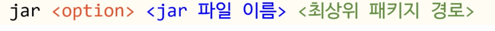
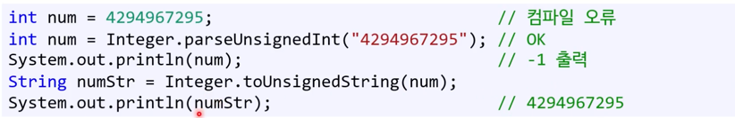

## 1. 메인 함수
한 .java 파일에는 최고 레벨 public class 하나만 들어가야한다. 
내포클래스는 가능하다. 
- main 함수는 프로그램의 시작점. 
  - 따라서 반드시 public static void main(String[] args) 순서대로! args는 커맨드라인으로 받은 인자.

## 2. 출력문과 가변인자
System.out.println에서
- System - 클래스
- out - member 변수.
- println - 함수 오버로딩
- printf 가 추가되었다. 포맷팅이 가능하다. 가변인자 !가 들어올 수 있다.  (String...<매개변수명)
- 올바르게 줄바꾸려면 System.linespreator

## 3. 패키지
package: 연관된 클래스끼리 묶는 기법. 
마치 디스크 상의 폴더와 같은 역할을 한다. 
- 자바 기본 패키지
- 프로그래머가 직접 만든 패키지 

패키지는 이름 충돌 문제를 피할 수 있게 해준다. 

이름 중복을 최소화해야한다. 보통 회사의 도메인명을 패키지 이름에 역순으로 사용한다. ex. package com.damsung..

## 4. 빌드 및 실행
### 컴파일

- javac (compile)
똑같은 패키지가 생긴다. 
무사히 컴파일 되면 .class 파일이 나오게된다.
옵션: -d : .class 파일을 저장할 경로
### 실행
어떤 폴더 안에서도 실행이 가능하다. java -classpath(파일의 위치를 알려주는 옵션. 클래스 이름 앞에 반드시 패키지 이름을 붙여야한다. )

.class 파일에는 반드시 main 함수가 들어가 있어야한다. 

### 배포
.jar 파일을 만든다. 
lib폴더를 보통 만든다.

.jar는 사실 zip 같은 것이다. 
패키지 정보가 들어있는 Manifest file을 제공해야한다. src 내부에! 
따라서 -m 옵션도 추가해서, manifest file도 함께 제공해야 실행 가능하다.

## 5. 패키지 사용하기
외부 패키지 안에 있는 클래스를 사용하기 위해서는 import를 해야한다. 
다른 패키지 내의 클래스에 접근하기 위해 사용한다. 
### java.lang
기본 패키지. import 하지 않아도 된다. 임포트없이 println()을 사용할 수 있는 이유가 된다. 

## 6. 실행 모델
자바의 장점으로 항상 언급되는 크로스 플랫폼. 그게 뭔가? 
- 특정 언어로 작성한 코드를 여러 플랫폼에서 실행할 수 있다는 의미. 
- 근데 정말로 크로스 플랫폼인가? 
  - 그럴수도 아닐수도! 
  - 전통적 컴파일 방식을 통해 결국 실행 파일이 나오는데, 그런데 실행파일 자체는 크로스 플랫폼이 아니지만 c를 실행해주는 운영체제가 많기 때문에 크로스플랫폼이라 할 수 있다.
  - 그런데 자바는 ? 컴파일 해도 실행 파일이 아니고 바이트 코드다. 이는 운영체제가 이해하는 게 아니고, JVM이라는 특수 프로그램이 이해하는 명령어다. 
    - 실행 중에 최종 플랫폼에 맞는 명령어로 바꾸어서 실행해준다. 
    - 기계어보다는 느리다. 바꾸어주기때문에. 
    - JVM은 운영체제나 디바이스마다 다른 버전이다. 운영체제나 디바이스의 영향을 받지않는다. 그런 의미에서 크로스 플랫폼.
    - JVM이 설치 안 되어 있으면 자바 프로그램 실행 불가. 
    - 그런 관점에서는 크로스 플랫폼이라 하기엔 어폐가 있다. 
    - 과거에는 인터프리터, 최근에는 런타임 방식. 버전마다 다르다. 

## 7. 자바가 인기있는 이유? 
예전에 자바 애플릿이라는 게 있었다. 브라우저에서도 운용되었기 때문에 인기있었다. (지금 안씀)

## 8. 구조적 프로그래밍 요소
모든 프로그래밍 언어는 구조적 프로그래밍 요소를 포함한다.
- 명령어를 위에서 아래로 순차 실행
- 조건문 반복문
- 함수 호출 등..

### 자료형
byte, short, int, long  / 1 2 4 8

float, double / 4 8

boolean
char(2byte)

- 자료형 크기가 고정! 
- 부호 있는 자료형만 존재한다. 
  - 수십년 간 비판을 받았다. 
  - 이 때문에 개발자가 고통받는다. 부호를 예방하기 위해서 코드를 방어적으로 작성해야만 한다. 
  - 양의 정수는 사람에게 가장 익숙한 숫자인데도 불구. 
  - 컴퓨터에서 색상 저장할 때 8비트를 사용해서 사용하는데 byte로 불가한다. short으로 읽어야한다. 
  - 데이터와 프로그램 미스매치! 이를 해결하겠다고 Integer 클래스를 지원하는데. 
  - 
  - 오히려 불편
- 유니코드인데 16비트인 char
  - java의 유일한 부호없는 자료형. char로는 모든 유니코드를 표현할 수 없다. 
  - 왜 16비트일까? 
  - 탄생 당시 유니코드의 최댓값은 U+FFFF
  - 이보다 큰 유니토드 표현시 String을 사용해야한다. 
- 기본 자료형은 모두 값형이다!

- String은 클래스형. 언제나 참조형. new 키워드로 개체 생성 가능.
- java의 String 변경 불가. 컴파일 오류난다. 바꾸고 싶다면 새로운 문자열 만들어야한다. 

### 리터럴
int는 리터럴 없고, long은 L or l (생략 가능. 그런데 int의 범위보다 큰 수일 때 생략하면 컴파일 오류)

- null 참조형에 사용 가능한 리터럴. 참조하는 대상이 없다는 뜻. 
- _: 큰 숫자의 가독성을 높이기 위해 사용. 
### final 키워드
const 대신 final 키워드를 사용한다. 변수 값 변경을 금지한다. 

- 지역변수
- 클래스 멤버 변수
- 메서드 매개변수
- 클래스와 메서드

에 사용 가능!
 C 처럼 메서드 매개변수의 값 변경을 막을 수 있다. final로!

final 변수의 초기화
1. 선언과 동시에 
2. 사용하기 전에만 
   - (지역 변수일 경우 실제로 그 final 변수를 사용하기 전에만 초기화해주면 된다.)
   - 멤버 변수인 경우 생성자에서 초기화 가능. 그 외에는 컴파일 오

### 주석, 연산자 우선순위, 산술 연산자
특별한 주석이 있는데 /** */ <- Javadoc 주석!  해당 주석으로부터 html 문서도 뽑을 수 있다. 클래스나 메서드, 멤버변수, 인터페이스 위에 위치
@param, @return 같은 것들

- 산술 연산자는 불리언 형에 사용 불가! 

### 대입 연산자, 논리 연산자, 캐스팅
값형의 경우 값을 복사.
참조형의 경우 주소값을 복사. 
캐스팅은 자료형 간의 변환. 크기가 작은 자료형에서 큰 자료형으로 바꿀 수 있다. 

### 문자열 비교
문자열은 참조형. 문자열 변수에는 값이 아니라 메모리 주소다. 근데 주소를 공유하는 경우가 잇다. 
- String을 new로 생성하지 않은 경우! 
- 내부적으로 같은 값일 때, string constant pool -> 같은 주소를 공유한다. 
- 그럼 문자열 자체는 어떻게 비교해야 할까? 
- equals() 메서드를 사용한다. 두 String 을 비교하는 함수다.

### 비트 이동 연산자
자바만의 비트연산자가 있는데, >>> 다. 
- 부호가 없는 비트 이동 연산자. 
- 오른쪽으로 이동 후, 남는 공간을 '0'으로 채운다. 
- 부호 없는 자료형이 없기에 따로 연산자를 만듦 
### 조건문
- switch 문은 break; 무조건 넣어야한다. 

### 반복문
- goto 는 없다. 비슷한 게 있다. 
- break <라벨 >
- 라벨 아래에 있어야한다. 

### 참조형 인자, 열거형
- 참조형을 인자로 넘길 때 조심해야한다. c에서 포인터를 넘기는 것과 마찬가지기 때문이다. 
- 메서드 안에서 참조형 인자의 값을 바꾸면 원본이 바뀜.
- final을 붙여도, 주소 변경이 안될 뿐이지 값은 여전히 바꿀 수 있다. 

JAVa의 열거형은 원하는 값을 대입 불가. 열거형은 클래스형이다. 멤버 변수와 메서드를 가질 수 있다. 굳이 할 필요없음.
- 생성자를 추가한다면 할 수는 있다. 언제나 private
- 열거형 개체는 new 안씀!

### var 
컴파일러가 알아서 자료형을 추론해준다. 선언과 동시에 값을 대입해야한다. 안하면 컴파일 오류

### 람다
이름 없는 함수. 내포 함수라고도 부른다.
(name) -> System.out.println()

### 모듈
시간이 지나며 패키지의 제약이 보이기 시작했다. 
효율적으로 배포하거나 하기위해 모듈 시스템을 지원하기 시작했다. 

기존 패키지 시스템은 애플리케이션이 사용하는 클래스 목록을 찾는 공식적 방법을 가지고 있지 않았다. 
- 누락된 클래스가 있다면 런타임에 오류가 생겼다. 
- 따라서 사용 중인 패키지에 있는 모든 클래스를 같이 배포하는 것이 일반적이었다. 

또, 패키지 안에 있는 모든 public 클래스를 아무나 사용할 수 있다. 때로는 그 중 일부만 외부에 노출하고 싶음. 

이를 해결하고자 모듈이 생김. 
- 패키지를 내포한다. 
- 정말 필요한 패키지만 포함할 수 있다. 
- 프로그램 시작 시 누락된 무듈을 확인할 수 있다. 
- module-info.java를 통해 확인~ 컴파일 과정에서 .class file로 바뀐다. 
