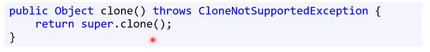

ex UI : User Interface
### interface: inter + face = 접해 있는 두 물체나 공간 사이의 경계.

소통 경로! ex 휴대폰, 스위치

사용자는 내부를 신경쓸 필요가 없다. = 함수와 같다.
- 함수 시그니처가 곧 인터페이스
- 함수 포인터 매개변수는 시그니처만 지정.
- java에서는 이 함수 포인터를 순수 추상클래스로 만들어 활용. 이를 인터페이스라고 한다. 

> public abstract class LoggerBase{
>   public abstract void log(String message);
>}
>
> 둘은 동일하다
> 
> public interface ILoggable{
>   void log(String message);
>}

- 클래스를 인터페이스로 변경
- 인터페이스 메서드는 public

### extends -> implements

## 인터페이스 미구현과 컴파일 오류
만약 인터페이스를 가져와서 구현을 하지 않았을 때 컴파일 오류가 난다. 
- 추상 클래스와 다를바가 없다. 
- 상속시, 오타를 내어서 메서드가 원하는대로 오버라이딩되지 못하는 문제를 해결한다. 

## Java 어노테이션
그래도 인터페이스로 모든 걸 바꿀 수는 없다. 
- 자식 클래스에서 그 의도를 명백히 적어줄 수 있으면 된다. 
  - 그래서 c#, C++은 override라는 키워드를 쓰지만
  - 자바에서는 @Override를 메서드 위에 적어준다. 
    - 컴파일러에게 정보를 제공
    - 컴파일 또는 배포 중에 어노테이션을 기반으로 어떤 처리를 할 수 있다.
    - 코드 실행과는 관계가 없다. 
    - 실행 중에도, 어노테이션을 기반으로 어떤 처리를 할 수 있다. 

## 인터페이스의 접근 제어자
인터페이스는 public 메서드만 가능하다. C의 헤더 파일과 비슷하다고 보면 이해가 쉽다. 
인터페이스가 패키지 범위일지라도 메서드는 public이다. 
- 이 경우 패키지 범위가 아닌 곳에서 인터페이스는 사용할 수 없다.

### 인터페이스 이름
- 앞에는 I
- 이름 뒤에 -able이 붙기도 한다. 

## 인터페이스 구현하기
인터페이스는 다중 상속이 가능하다. 
> public final class ConsoleLogger implements ILoggable, ISavable{
> }

근데 왜 되지? 
다중 상속은 상속할 클래스들이 서로 상태와 메서드값이 다를 때, 상태와 메서드 구현이 중복되는 문제가 있다. 

- 인터페이스는 실체가 없기 때문에, 겹칠 위험이 아예 없다.
- 그러나 반환형만 다르면 컴파일 오류가 난다. 

## 인터페이스와 다중 상속
어떻게 상속해도 인터페이스의 구현은 하나뿐이다. 
인터페이스를 사용하면 다중 상속을 흉내낼 수 있다. 

## Object.clone()
- java에서 클래스형은 다 참조형이라 포인터 개념이다. 
- 대입만으로는 같은 곳을 가리키기 때문에, 복사를 원할 경우 clone() 메서드를 사용해야한다. 

- 클래스가 알아서 구현해주어야한다.
- Object 를 반환하기 때문에 캐스팅이 다로 필요하다.
- 더불어, 얕은 복사의 문제가 남아있어서 객체 내 원본이 복사되지는 않는다. 
- 복사 생성자를 사용하기도 (깊은 복사하기위해)

## 구체 클래스 vs 인터페이스
- 상태와 동작 모두 포함
- 접근권한
- 개체 생성 가능 
- 다중상속의 부모가 될 수 없다. 
-> 구체 클래스

- 동작 설명만 포함
- 모든 동작 public
- 개체 생성 불가
- 다중 상속의 부모가 될 수 있음
- 