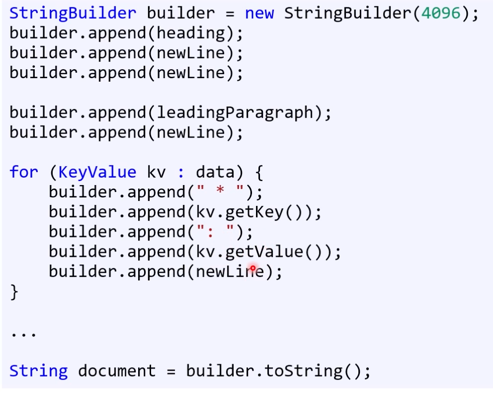
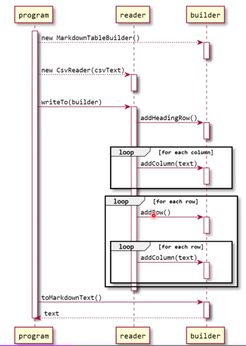

## 팩토리 메서드
팩토리는 공장이라는 뜻. 무엇인가를 만들어내는 패턴
- 사용할 클래스를 정확히 몰라도 개체 생성을 가능하게 하는 패턴
- 정적 메서드를 통해서 생성한다. 생성자 대신! 
- 정적 메서드를 사용하면 뭔가 잘못될 때 null을 반환이 가능하다. 
  - 생성자는 생성이 불가능한 경우 예외를 던질 수밖에 없다. 반환형이 없기 때문이다. 
- 다형적으로 개체 생성 가능 = 가상 생성자 패턴이라고도 한다. 

```java
public final class Cup {
  private int sizeMl;
  private Cup(int sizeMl){
    this.sizeMl = sizeMl;
  }
  
  public static Cup createOrNull(CupSize size){
    switch(size){
      case SMALL: 
        return new Cup(355);
      case MEDIUM: 
        return new Cup(473);
      case LARGE: 
        return new Cup(651);
      default:
        assert(false): "Unhandled cupsize:" size;
        return null;
    }
  }
}
```
아래와 같이 사용한다.
```java
final Cupsize cupSize = ui.promptCupSizeSelection();
order.add(Cup.createOrNull(cupSize));
```
### 다형적인 팩토리 메서드 패턴
여러 나라에서 컵을 다양한 사이즈로 생성하고 싶다면? 
createOrNull()을 다형적으로 만든다! 
- 추상 클래스를 생성하고, 그 하단에 자식을 생성
- 물론 위의 코드 내에서처럼 컵사이즈와 국가도 넣으면 쉽지만, OO적 사고방식은 아니다!
- 조금 바꿔보면

```java
public final class Cup {
  private int sizeMl;
  Cup(int sizeMl){ // 패키지 접근 제어자로, 같은 패키지에 있는 누군가가 new를 해준다. 
    this.sizeMl = sizeMl;
  }
  public int getSize(){
    return this.sizeMl;
  } 
}

public abstract class Menu { // 데이터 멤버가 들어갈 수 있기 때문에, 인터페이스로 만들지 않는다. 
  public abstract Cup createCupOrNull(CupSize size);
}

public final class KoreanMenu extends Menu {
  @Override 
  public Cup createCupOrNull(CupSize size){
    switch (size){
      case SMALL: 
        return new Cup(355);
      case MEDIUM: 
        return new Cup(473);
      case LARGE: 
        return new Cup(651);
      default:
        assert(false): "Unhandled cupsize:" size;
        return null;    
    }
  }
}
```
사용할 때는 아래와 같이 사용한다. 
```java
Menu menu = new KoreanMenu();
Cup cup = menu.createCupOrNull(CupSize.LARGE);

System.out.println(cup.getSize());
```

### 다형적인 팩토리 메서드 패턴 2
위에서 더 확장을 시킨다면? cup 자체에서 파생되는 재료 등의 정보와 사이즈를 결합시킬수도 있다. 
```java
public abstract class Cup {
  private int sizeMl;
  protected Cup(int sizeMl){
    this.sizeMl = sizeMl;
  }
  public int getSize(){
    return this.sizeMl;
  } 
}
public final GlassCup extends Cup {
  GlassCup(int sizeMl){
    super(sizeMl);
  }
}
public abstract class Menu { 
  public abstract Cup createCupOrNull(CupSize size);
}
public final class KoreanMenu extends Menu {
  @Override 
  public Cup createCupOrNull(CupSize size){
    switch (size){
      case SMALL: 
        return new GlassCup(355);
      case MEDIUM: 
        return new GlassCup(473);
      case LARGE: 
        return new GlassCup(651);
      default:
        assert(false): "Unhandled cupsize:" size;
        return null;    
    }
  }
}
```
계속 복잡해지는 느낌! 
추상적으로 계속 확장하는 것이 필요하다. 처음부터 추상적 패턴을 사용하면서 맞추려고 하지 않는 게 중요하다.

해당 패턴의 장점은 
- 클라이언트가 본인에 익숙한 인자를 통해 개체 생성이 가능하다는 점.
- 다형적으로 생성. 이를 생성자 패턴이라고도 한다. 
- 생성자에서 생성 못할 오류 감지시 null 반환

## 빌더 패턴
개체의 생성과정을 그 개체의 클래스로부터 분리하는 방법. 개체의 부분부분을 만들어 나가다 준비되면 그제서야 개체를 생성한다. 
- 대표적인 예시: StringBuilder 
  - 글을 string으로 변환하기란 쉽지가 않다. StringBuilder를 통하여 좀 편하게 만들어낼 수가 있다. 

    - overloading된 덕분에 알아서 내부에서 효율적으로 문자열을 합쳐준다.

그런데 해당 방식은 코드에서 의도가 정확히 보이지 않는 문제가 잇다. 
- 제목을 추가하는 것과 줄 바꿈을 하는 것에서 코드적 차이가 없어서, 의도가 명확히 보이지 않는다. 
- 그래서 최근에는 플루언트 인터페이스라는 게 있다. 빌더 패턴을 구현하는 방법 중에 하나로!

- 이 경우 좀 더 명확하게 보여줄 수 있다. 자기 자신을 반환하기 때문에 가능한 것. 
- 개체 지향적인 측면이나 함수 설계적으로는 말이 안된다. 클라이언트가 그 개체를 들고있는데 왜 this로 반환하지? 와 같은 생각들!
- 엄밀히 말하면 꼼수. 그러나 워낙 많이 사용한다. 가독성을 높이기 위한 방법.
- 그러나 이는 패턴이 제대로 돌고있는지를 알기에는 조금 부족하다. 
- 아래의 예시로 더 보충! 


```java
public final class Employee {
  private String firstName;
  private String lastName;
  private int id;
  private int yearStarted;
  private int age;
  
  public Employee(String firstName, String lastName, int id, int yearStarted, int age){
    this.firstName = firstName;
    this.lastName =lastName;
    this.id = id;
    this.yearStarted = yearStarted;
    this.age = age;
  }
}
```
이 경우, 사용할 때 내용이 잘못될 수 있다. 컴파일러가 잡아줄 수 있는 문제가 아닐 경우 (ex. firstname과 lastname이 뒤바뀌는 등)

```java
Employee robert = new EmployeeBuilder(1)
         .withAge(31)
         .withStartingyesr(2020)
         .withName("Robert", "Lee")
         .build();
```

그러나, 생성부터 유효한 상태여야한다는 원칙이 어긋날 수도 있다. (만약 withStartingYear 가 실수로 빠질경우.)
```java
Employee robert = new EmployeeBuilder(1)
         .withAge(31)
         .withName("Robert", "Lee")
         .build();
```

실수하기가 너무 쉽다!
이를 해결하기위한 방법은 두가지인데, 
1. 매개변수를 구조체처럼 만들어서 전달. 매개변수 클래스를 만들면 된다.
```java
public final class Employee {
  private String firstName;
  private String lastName;
  private int id;
  private int yearStarted;
  private int age;
  
  public Employee(CreateEmployeeParams params){
    this.firstName = params.firstName;
    this.lastName = params.lastName;
    this.id = params.id;
    this.yearStarted = params.yearStarted;
    this.age = params.age;
  }
}
CreateEmployeeParams params = new CreateEmployeeParams();
params.firstName = "robert";
...
```

2. C#에서만 사용하는 named parameter
```java
Employee employee = new Employee(firstname:"robert",...)
```
사실 이를 사용하면 패턴을 사용할 이유가 전혀 없다. 

### 다형적인 빌더패턴
빌더 패턴이 다형적으로 도는 예시: csv파일을 HTML 표와 markdown 포맷 표로 변환! 


TableBuilder 상속 
- Markdown
- Htmlbuilder

```java
CsvReader reader = new CsvReder(csvText);
HtmlTable Builder builder = new HtmlTableBuilder();

reader.writeTo(builder);

HtmlDocument html = builder.toHtmlDocument();
```
```java
CsvReader reader = new CsvReder(csvText);
MarkdownTableBuilder builder = new MarkdownTableBuilder();

reader.writeTo(builder);

String mdText = builder.toMarkDownText();
```
원하는 포맷에 맞게 구체 빌더 클래스의 개체를 생성한다. 

writeTo() 메서드의 의사 코드
1. 첫 줄을 읽고
2. 빌더의 addHeadingRow() 메서드를 호출
3. 1번에서 읽은 줄을 쉼표에 따라 토큰화
4. 토큰 배열을 foreach 문으로 돌면서 빌더의 addColumn(token)을 호출
5. 나머지 줄을 한 줄씩 읽으며 다음의 과정을 반복 (빌더의 addRow() 메서드 호출, 각 토큰마다 빌더의 addColumn(token) 호출)


## 시퀀스 다이어그램
코드를 직접 보여주기 어려운 경우들이 있다. 위의 의사코드처럼!
이 때 시퀀스 다이어그램을 사용한다. 

- 개체들이 서로 통신하는 모습을 보여주는 UML 다이어그램
- 동작을 시간 흐름에 따라서 보여줌

- 위의 네모는 참여자
- 세로줄은 수명선
- 세로 직사각형은 실행중인 기간을 표시하는 활성화 상자. 
- 화살표 실선은 동기화 메시지. 
- 오른쪽으로 가는 점선은 참여자 생성 메시지

## 래퍼 패턴
wrapper = adapter pattern
- 어떤 클래스의 메서드 시그내처가 맘에 안 들 때, 다른 것으로 바꾸는 방법.
  - 클래스는 바꾸지않고 시그내처만 바꾸고 싶을 때 사용한다.
  - 근데 직접 변경하지 않는다. 클래스의 소스코드가 없을수도 있고, 그 클래스에 의존하는 다른 코드가 있을수도 있기 때문이다.
  - 따라서 기존 클래스 변경 없이 새로운 클래스를 만들어 기존 클래스를 감싸게 된다. 

- 언제 사용하는가
  - 1. 추후 외부 라이브러리 바꿀 때 클라이언트 코드 변경하지 않기 위해
  - 2. 그냥 사용 중인 메서드가 코딩 표준에 맞지 않아서
  - 3. 기존 클래스에 없는 기능을 추가하기 위해. 
  - 4. 여기서 확장: 내부 개체를 클라이언트에게 노출시키지 않기 위해
    - DTO 만들기
    - client 에게 필요한 정보만 보내주는 (ex.회원 정보에서 필요한 부분만)
    - 타 클래스의 데이터를 내 필요에 맞게 바꾼다는 의미에서 래퍼 패턴의 확장판이라고 할 수 있다. 

### 실례-3D 그래픽 API
두 라이브러리의 같은 기능을 하는 메서드. 다른 시그내처가 있다고 가정을 해보았을 때!

- 다른점은 메서드 이름과 매개변수 형과 유효한 범위다. 
```java
public final class Graphics {
  private OpenGL gl;
  public void clear(float r, float g, float b, float a){
    this.gl.clearScreen(a, r, g, b);
  }
}
```
위의 코드에서 다른 개체를 호출하도록 변경한다.
```java
public final class Graphics {
  private DirectX dx;
  public void clear(float r, float g, float b, float a){
    this.dx.clear((int) (r*255), (int) (g*255), (int) (b*255), (int) (a*255));
  }
}
```
이렇게 하면 클라이언트 코드는 바꿀 필요가 없다. 
### 실례-DTO
간단한 프로그램에서는 상관이없지만, 규모가 커지면 시스템을 여러 하위로 나누게되는데, 클라이언트에게 모든 정보를 보여주는 것이 아닌 일부만 보여주고 싶을 때
- 보안상 문제, 바이트 낭비를 하지 않기 위해.


래퍼 패턴은 아니지만, 타 클래스의 메서드 시그내처를 내 필요에 맞게 바꾼다는 점에서 궁극적 목표는 비슷하다. 
## Proxy 패턴
조심! 클래스가 명확히 안 보일 수 있다.
### 프록시란? 
실제 웹사이트와 사용자 사이 위치하는 중간 서버.
- 인터넷 상의 캐시 메모리처럼 작동한다. 

프록시 패턴이 이루려는 목적 또한
- 데이터가 너무 커서 미리 읽기엔 메모리 부족
- 개체 생성 시 데이터 로딩하면 시간이 꽤 걸림
- 개체는 만들었으나 그 속의 데이터를 사용하지 않을 수도 있음
- 등의 이유로, 클래스 안에서 어떤 상태를 유지하는 게 여의치않다. 

그래서, 불필요한 데이터 로딩을 방지한다. 
- 데이터 로딩에 필요한 정보만 기억해두고
- 클라가 실제 데이터 요청할 때 메모리 로딩한다!!!

### Ex. 이미지 데이터
이미지는 프록시 패턴을 적용하기 적합한 데이터다.
```
public final class Image {
  private ImageData image;
  
  public Image(String filePath){
    
  }

}
```

여기서 생성자에 바로 이미지 읽어오면 메모리를 많이 사용하고 읽어오는 데 시간도 걸린다.

```java
public final class Image {
  private ImageData image;
  private String filePath;
  public Image(String filePath){
    this.filePath = filePath;
  }
  
  public void draw(Canvas canvas, float x, float y){
    if(this.image == null){
      this.image = ImageLoader.getInstance().load(this.filePath);
    }
    canvas.draw(this.image, x, y);
  }

}
```

- 이를 지연로딩이라 한다. 

### 즉시로딩 vs 지연로딩
어느 방법에도 장단점이 있다. 


- 요즘에는 메모리를 많이 장착해서 미리 로딩해놔도 큰 문제가 아닌 경우도 많다. 
- 그런데 한번에 그리는 이미지 수가 많지 않다면? 필요할 때마다 디스크에서 읽을 수 있다. 
- 인터넷에서 다운받을 경우는 더 느릴 수도 있다. 
- 클라이언트 쪽에서는, 빠르게 혹은 느리게 로딩되는지 아닌지 모른다. 캡슐화가 잘 되어있는 것이다. 
- 그런데, 극단적인 쪽에서는 클라이언트가 그걸 알 필요가 없다고 한다. 그러나 이는 사용자 경험에서 문제가 생기면? 내부를 알아야만 한다. 최종고객을 생각해야 하기 때문이다.
- 요즘에는 그래서, 클라이언트에게 조작 권한을 주는 게 좋을 수 있다. 즉 프록시 패턴을 사용하기 보다는 그게 어떻게 동작하고 있는지 알아야한다는 것이다. 

```java
public final class Image {
  private ImageData image;
  private String filePath;
  public Image(String filePath){
    this.filePath = filePath;
  }
  public boolean isLoaded(){ return this.image != null;}
public void load(){
  if(this.image == null){
    this.image = ImageLoader.getInstance().load(this.filePath);
  }
}
public void unload(){this.image = null;}
  public void draw(Canvas canvas, float x, float y){
    canvas.draw(this.image, x, y);
  }

}
```

그래서 프록시 패턴을 현대화한다. 
로딩도 언로딩도 클라이언트가 직접 제어할 수 있게끔 한다. 

## 책임 연쇄 패턴
이름부터 추상적. 
잘못 설명한 예시가 너무 많다. 

### Logger class
```java
public abstract class Logger {
    private EnumSet<LogLevel> logLevels;
    private Logger next;
    
    public Logger(LogLevel[] levels){
      this.logLevels = EnumSet.copyOf(Arrays.asList(levels));
    }
    
    public Logger setNext(Logger next){
      this.next = next;
      
      return this.next;
    }
    
    public final void message(String msg, LogLevel severity){
      if(logLevels.contains(severity)){
        log(msg);
      }
      
      if(this.next != null){
        this.next.message(msg, severity);
      }
    }
    
    protected abstract void log(String msg);
}

public class ConsoleLogger extends Logger {
  public ConsoleLogger(LogLevel[] levels){
    super(levels);
  }
  
  @Override
  protected void log(String msg){
    System.err.println("Writing to console: "+ msg);
  }
}
```

여러 로거들을 호출하여, 연쇄적으로 책임을 할당하는 것.

근데 훨씬 직관적인 방법이 있다. 
LogManager class 추가
logManager.addHandler()
- 이 방법이 훨씬 간단

## 옵저버 패턴
감시자 여럿 -> A를 보며 바뀌면 자신도 바뀌는 패턴

근데 더 많이 쓰는 패턴이 있다. pub-sub 패턴 
둘은 비슷하나 엄밀히 이야기하면 다른 패턴이다. 

그러나 이우려는 목적은 비슷하여 같은 패턴이라 보는 일도 흔하다.

- 위의 logManager가 옵저버 패턴이라 할 수 있다.

### 예: 크라우드 펀딩
- 돈이 들어올 때마다 장부와 noti를 받는다. 

이는 이벤트 드리븐 아키텍처라고도 한다.

```java
public interface IFundingCallback {
    void onMoneyRaised(String backer, int amount);
}

public final class BookkeepingApp implements IFundingCallback {
    
    @Override
  public void onMoneyRaised(String backer, int amount){
        
}}
public final class MobileApp implements IFundingCallback {

  @Override
  public void onMoneyRaised(String backer, int amount){

}

}
public final class CrowdFundingAccount{
    private int balance;
    private ArrayList<IFundingCallback> subscribers;
    
    public CrowdFundingAccount(){
        this.subscribers = new this.ArrayList();
    }
    public void subscribe(IFundingCallback sub){
        subscribers.add(sub);
}
public void support(String backer, int amount){
    this.balance += amount;
    for(IFundingCallback sub: subscribers){
        sub.onMoneyRaised(backer, amount);
  }
    }

    }

```

- pubsub 패턴과 다른 점은 발행자가 다수인지 하나인지 (펍섭은 다대다)
- C의 함수 포인터와 비슷한 느낌이다
- 결국 콜백함수의 목록이다. 그런데 이런 방식이 매니지드 언어에서는 메모리 누수가 많이 생긴다. 실수하기 쉬운 부분.
- 