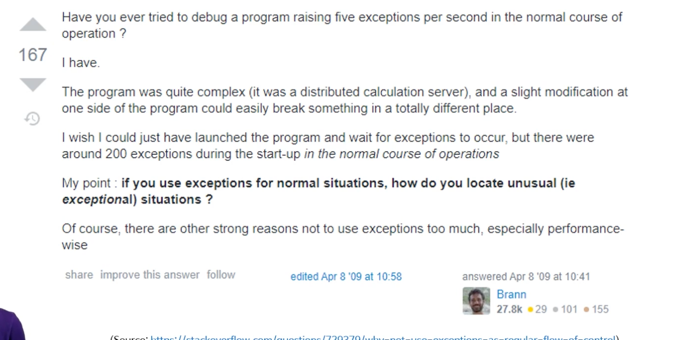

## try/catch/finally
예외는 개체지향은 아니다. 
- try: 시도할 코드들
- catch: 예외가 발생할 경우 해당 예외를 처리할 코드
  - 하나 이상 가능
  - 예외 클래스를 둘 수 있다. IOException, ArithmeticException, IndexOutOfBoundsException...
  - 특정 어렵거나 모든 예외를 잡고 싶으면 Exception class
  - 다중 catch 블록 작성시 주의할 것은 부모 예외 클래스가 자식보다 먼저 나오면 안된다. 
- finally: 예외 발생 여부와 상관없이 항상 실행되는 코드
  - 이건 없어도 된다.

### 사용예
1. try-catch
   - 
2. finally
   - try, catch 모두에 적을 코드가 있다면, finally
   - 정리하거나 해제해야할 코드가 있으면 써야한다.
   - > if(out != null){try{out.close();}catch(){}}

### rethrow
어떤 예외를 잡았지만 다시 호출자에게 던져야할 - 호출 스택을 유지하면서 던져야한다. 
- 위로 던지는 거라서 좋은 습관은 아니다.

### 나만의 예외를 만들 때, 
RuntimeException을 상속 받게 된다. 

예외를 처리하면 JVM에서 프로그램을 종료시켜준다.
근데 예외가 없는 C같은 언어는 OS/기계를 어떤 걸 쓰는지에 따라 다르다. 옛날에는 하드웨어가 멈추기도 했다.

근데 사람의 지속적인 조작없이 알아서 실행돼야하는 프로그램이라면? 웹서버처럼? 크래시가 나면 기계를 재부팅을 할 수 없는 사람들..

요즘은 가상 메모리들이 있어서, cpu에서 인터럽트나 시그널을 보냈을 때 OS가 캐치 후 프로그램 종료, 가상 메모리 해제함

## 예외처리를 제대로 하지 못하는 이유
어느 함수에서 어떤 예외를 던지는지 한 눈에 안 보인다. 알려면 모든 함수의 속을 다 보며 확인해야하는데 너무 함수가 많다.

그래서 모든 것에 대한 예외처리를 제대로 하지 못한다. 

## Java checked 예외
예외를 두 분류로 나누었다. 
checked, unchecked 예외

- unchecked 예외는 C# 예외와 동일하다. (ex. Arithmatic)
  - 어디서 어떤 예외가 나는지 한눈에 안 보인다. 
  - RuntimeException 상속
  - 컴파일러가 따로 검사해주지 않는다. 
- checked 예외는 컴파일러가 예외처리를 제대로 하는지 확인해준다. (ex. IOException) 예외가 발생하는 코드에서 1. 그 메서드 안에서 처리하지않거나 2. 처리 하지않을 경우 메서드 시그내처 옆에 표기하지 않으면 컴파일 오류가 난다. 
> publics final class UserNotFoundException extends Exception

> public User findUser(String username) throws UserNotFoundException{} -> checked 예외를 던지는 메서드다. 다른 메서드에서 발생한 checked 예외를 처리하지 않는다. 
  - try-catch, method 상속
  
  - throw 절 안 넣어주면 컴파일오류 뜬다. 
  - Exception 상속 
  - 예전에는 다 checked로 짜기를 바랐다. 그러나 일종의 실패! 이건 클라이언트가 반드시 처리해야할 예외라고 알려주는 용도인데, 그 처리한다는 의미가 무엇인지 분명하지 않다. 
  - 어떻게든 에러를 고쳐라는 의미! 회복하라는 뜻이다. 

## 예외로부터 안전한 프로그래밍
에러를 회복하는 게 말처럼 쉽지는 않다. 
모든 예외를 고치는 게 안전한 게 아님. 

## 그래서 예외 처리 트렌드가 unchecked
checked 예외를 unchecked 예외로 감싸서 던지자라고 한다. 
1. 그냥 unchecked 예외 사용
2. 예외로부터 안전한 최선의 방법은 재부팅. 대부분은 예외로부터 회복하지않는다. 

- 그래서 얼마나 세분화해서 처리해야하는지에 대한 의견들도 원래는 예외를 종류별로 catch했는데, 요즘은 모든 예외는 한번에 처리하자고 한다.
- 그래서 rethrow도 훨씬 적어졌다. 
- 한번에 예외를 잡자. 로깅도 하는 의미에서.

### 잘못된 예외 처리 가이드를 조심해야한다. 
아직도 모든 예외로부터 회복해야한다는 웹사이트가 많다. 
아무래도 옛날 하드웨어와 OS 문제에 대한 공포가 남아있기 때문인 것으로 추정.

상황에 맞는 예외처리 방법을 택해야한다.

### 제어흐름용으로 예외를 사용하지 말 것!! 
goto와 개념이 같다. 
다음에 실행할 코드를 결정하는 용도로 쓰면 안된다.

왜? 예외를 제어용으로 사용하기 시작하면 goto 보다 나빠진다. 

## 예외적인 상황에서만 예외를 사용해야하는 경우
할 수 있다고 다 해야하는 건 아니다. 
- 내가 모르는 문제에 봉착할 수도 있다.

- 1초마다 예외를 5개 던지고 처리하는 프로그램을 디버깅한다면? 
  - 뭘 조금만 건드려도 여기저기서 쾅쾅 터진다 ^^
  - 예외를 떡칠하면 터지기는 너무 쉽당. 
  - 문제가 생길 때만 중단점으로 볼 수 있는데, 그럼 예외 발생지점을 쉽게 찾을 수 있다. 
  - 근데 프로그램 처음 시작할 때 이미 예외가 200개가 나오는데 어떻게 하나씩 continue 버튼을 누르며 디버깅을 할까? 
  - 즉 실무에서는 말이 안된다. 
  - 혼자 이상하게 사용하면 툴의 혜택을 못 받는 것. 예외는 예외 상황에서만 사용할 것.

## 오류 상황, 예외 상황
프로그램은 기본적으로 아무 오류 없을 거라 가정하고 진행된다. 
그런 경우가 아닐 경우, 
오류 혹은 예외 상황이라한다.

- 오류 상황은 예측 가능한 상황
  - 프로그램 실행 중에 기본적으로 일어나지 않는 일이지만 일어날 수 있는 일
  - 프로그래머가 이를 예측지 못하면, 버그

### 4가지 오류 상황 처리법
1. 무시하고 넘어간다.
2. 문제를 일으킬 수 있는 상황이 있는지 검사하고, 그렇다면 프로그램을 종료한다. (종료)
3. 문제를 일으킬 수 있는 상황이 있는지 검사하고, 그렇다면 실수를 고친 뒤 계속 프로그램을 실행되게 한다. (수정)
4. 문제가 발생하면 예외를 던진다. (예외)

한동안 4만 하면 프로그램 품질이 높아진다고 하던 사람들이 있었다. 개체지향의 본질이라고 말하는 것이다. 

## 오류상황을 피하는 게 최고
일단 내 시스템 안에 들어온 데이터는 언제나 유효하다고 가정하고 예외상황이 발생하면 버그로 처리한다.

그런데 사용자 공간 혹은 운영체제 로부터 받아오는 데이터는 경계에서 반드시 검증해야한다. 
잘못된 데이터를 경계에서 곧]바로 거부하는 것이다. 

- 남에게 문제를 알려주는 방법
1. 참거짓이나 null 반환
2. 오류코드 반환
3. 예외를 던짐

## 오류 무시와 종료하는 방법
- 무시했을 때 
1. 크래시
2. 일단은 작동하나 언젠가는 크래시
3. 안정적이지 못한 상태로 계속 동작 -> 데이터가 망가진 상태라면 올바르지 않은 결과가 나올 수 있다. 

- 미리 검사하고 프로그램을 종료할 때
log 보여주고 정상 종료 
  - 크래시에 비해 나은 점은 시스템 정리하고 종료, 안정적
  - 그보다 더 장점은 작업하던 내용 날리지 않고 저장 가능
  
## 수정과 예외방법
- 수정의 예: 분모가 0일 경우 1로 바꾼다. 
  - UX 고려시 사용자에게 올바른 값을 입력하라 다시 요청한다. 
  - 극단적 개체지향파는 이를 배척하려하는데
  - 굳이 UX를 포기할 필요가 없다.
  - 단점은, 문제가 처음 발생한 곳을 파악하기 쉽지않다는 것이다. 
- 예외: 다른 방법에 비해 성능이 가장 느리다. 
  - 문제가 발생했다는 사실을 알려줄 수 있다.
  - 그 예외를 처리할 수 있음(catch)
- 위 두가지를 포함하는 개념

그러나 예외는 OO의 일부가 아니다. 

왜 OO에 예외가 중요하다고 주장할까? 옛 크래시 공포에 대한 심리적 안정감 때문일지도.

예외 외에는 해결책이 없는 경우는 생성자 생성할 때. 문제가 발생했다는 사실을 알려주려면 예외가 유일하다. 생성자에서 null을 리턴할 수 없기 때문이다. 
이는 C에서 메모리를 할당하고 개체에 배정하고 생성자를 통해 상태 초기화를 하는데, 초기화에 문제가 생기면 메모리를 배정한 것을 되돌릴 방법이 없기 때문에, 예외밖에 답이없다.

## 잘못된 예외처리보다 크래시가 낫다.
잘못된 예외처리가 크래시보다 더 위험하다. 잘못처리하면 크래시가 안 나고 프로그램이 계속 실행되는데, 이 때는 프로그램이 안정적이지 않다.

요즘은 크래시 나게 하고 자동세이브를 한다. 

디버깅 잘하는 프로그래머는 오히려 크래시를 선호하기도. 메모리 덤프 등을 통해 실제 크래시가 발생한 이유를 곧바로 조사 가능
- 개발사에게 인터넷으로 전송되는 그 정보가 바로 메모리덤프
- 근데 그 대신 예외 던지면 호출 스택 정보 (문자열), 메시지, 예외 형 이정도밖에없다. 문서화가 뒷받침되어야하기에 너무 어렵다..^^

### 프로그램 종료도 올바른 방법이다. 
잘못된 예외처리 때문에 이상한 상태에 빠지는 일을 방지한다. 물론 크래시보다도 좋음. 자동세이브 되는 걸로 충분하긴 하지만!

### 4가지 처리법의 순위
1. 수정
2. 종료
3. 예외 : 남에게 폭탄 돌리는 꼴.
4. 무시

오지랖 순위
1. 종료
2. 수정
3. 예외
4. 무시

클라이언트 입장에서 객관성 순위
1. 종료, 수정
2. 무시
3. 예외

## 예측 가능한 상황의 처리법
오류상황을 미리 예측했는지에 따라 사용할 수 있는 방법이 달라진다.

**- 이미 예측한 상황+고치기 쉬운 경우**
  - 고치고 계속 프로그램 진행 (수정 혹은 예외)
    - 내 코드 안에서는 수정이 더 낫다. 
    - 예외는 두 공간 사이의 경계에서만 던지는 것이 더 명백
  - 다른 시스템에서 발생한 예외 역시 경계에서 처리하고 계속 진행
**- 이미 예측한 상황+ 고치기 어려운 경우**
  - 최종 사용자에게 메시지 보여주자고 한다면? 팝업
  - 최상위 함수까지 예외를 전달
  - 최상위 함수에서 팝업창 띄워 메시지를 보여줌. 
  - 어쨋든 종료! 로그를 남기고 종료 혹은 예외를 main()에서 catch
  - 근데 차라리 이경우는 일부러 크래시를 내는게 나을수도. 로그 남기는 걸 개발자가 안할수도 있다 ^^

## 예측 불가능한 상황의 처리법

처리 코드는 당연히 없다. 
그래서 수정하는 방법은 불가하다. 
예측 못했으니 로그도 못 남긴다. 

프로그래밍 언어 따라, 

- 혹시 모를 예외를 main에서 캐치
- 크래시가 나서 곧바로 메모리덤프가 생긴다.

JVM에서도 메모리덤프는 가능하지만, 매우 제한적인 경우만 가능하다. 

실행 중에 문제를 고치려한다고 프로그램의 안정성이 높아지는 건 아니라는 것을 꼭 기억

