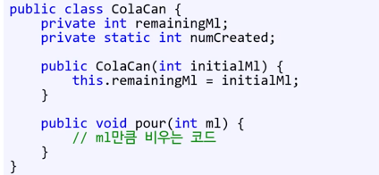

## 모든 것이 개체 속에 있는 불편함
- 절댓값 구하기나 공백 문자 개수 구하기 같은 것들도 개체를 만들어야 하는가?
- 개체 단위가 아니라, 클래스 단위에서 뭔가를 하고 싶을 때는?

> 정적 메서드가 이를 보완해준다. 

### 정적 멤버 함수
- 멤버 함수 시그내처에, static만 붙여주면 된다. 
- 이 멤버 함수의 소유주는 인스턴스가 아니라 클래스다.
- 정적 멤버 함수를 호출할 때는? 
> <클래스>.<함수명>으로 호출

- 클래스 다이어그램은?
정적멤버 함수 아래에 밑줄을 그으면 된다.

- 생성자를 만들어도 된다.
  - 이상한 점은 클래스 아래 있다고 하면서도, 개체를 생성했을 때 개체 아래에 메서드로 이용할수도 있다는 점이다.
    - 이는 특정이 가능해서 가능한 것이다.
    - 생성된 개체 수에 상관없이 클래스는 단 하나만 존재한다. 그래서 특정이 가능하다.
  - 질문: 차라리 그럴거면 개체를 안 만들면 되는 것이 아닌가?
    - 맞다. 그러므로 생성자를 private으로 만들면 된다.  (근데 이것도 꼼수에 가깝다. 그러나 자바의 경우 다른 방법이 없다. )
  
    - 단 static 메서드는 public이기에 호출이 가능하다.

### 정적 멤버 변수
- 개체 단위가 아니라 클래스 단위에서 뭔가를 하고 싶을 때,
- 변수는 개체보다 상위 개념에 있어야한다. 
  - 이는 클래스다. 
  - 클래스에 속하게 하려면 static으로 만들면 된다.
  - 클래스 다이어그램에서도 밑줄을 그으면 된다.

  - 이 변수는 생성자 함수 안에 넣어서, 작동하게 하면 된다. 
  - this 혹은 클래스명.변수명도 가능. 그냥 변수명도 기입 가능

### 정적 메서드에서 멤버 변수 접근하기
- 정적 메서드를 만들어서 정적 멤버 변수에 접근.
- 개체를 통해서도 접근 가능하지만 기본적으로 클래스명.정적 메서드로 호출하는 것이 더 좋다.
- 정적 메서드에서 개체에 속한 멤버에는 접근이 불가하다.
왜? 클래스는 1개지만, 개체는 다수라서, 어떤 개체의 변수인지 클래스에서 특정이 불가하다.

### static 정리
1. static 변수, 함수는 클래스에 속함
2. 아닌 것은 개체에 속함
3. 비정적 -> 정적: 접근 가능
4. 정적 -> 비정적: 접근 불가능

### static에 대한 비판
1. 모든 것은 개체여야 한다고 말하거나
2. 스태틱은 순수한 OO가 아니다~~
3. 개체 지향 이전의 언어를 쓰는 사람들

OO와 멀다고 그게 잘못된 방법은 아니다.
OO와 절차적 개념을 언제, 어디서 각각 써야하는지 아는 것이 중요하다.

그래서, 개체면서도 static과 사실상 똑같이 작동하는 OO 설계법이 만들어졌다.
그것이 바로 싱글턴이다.