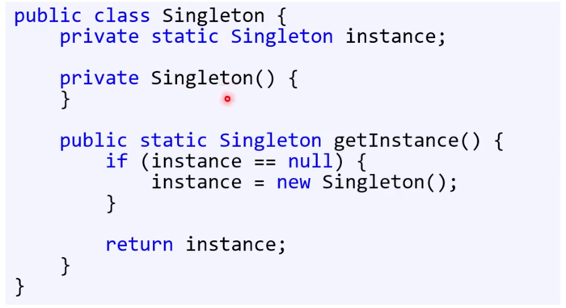

인간은 최고의 패턴인식 머신이다. 머신 러닝도 이런 방법에 기초한다. 

반복을 통해 정형화된 문제 해결을 한다. 패턴을 이용해 많은 문제를 해결했다.
프로그래밍도 다르지않다.

알고리즘이 문제를 해결하는 직접적인 방법이라면,
일반적인 방법론을 말하는 베스트 프랙티스가 있고, 
이를 더 추상화시킨 것이 디자인 패턴이다.

## 디자인 패턴
- 소프트웨어 설계에서 흔히 겪는 문제에 대한 해결책
- 범용적, 반복적
- 완성된 설계가 아니다. 

### 디자인 패턴의 장점
1. 이미 테스트를 마친 검증된 개발 방법을 사용해 개발 속도를 향상한다. 
2. 공통 용어 정립을 통한 개발자들 간의 빠른 의사소통을 촉진 (단, 모든 개발자들이 그 패턴과 용어를 알고 있어야 한다.)

### 디자인 패턴의 단점
1. 고치려는 대상이 잘못되었다. 
   - GoF 책 패턴 중 과반수는 C++ 언어의 미지원 기능에 대한 미봉책이다. 
2. 곧바로 적용할 수 없는 참고 가이드를 패턴이라고 부를 수 없다. 그저 가이드지.
3. 잘못 적용하는 경우가 빈번하여, 오히려 프로그램을 더욱 복잡하게 만들게 된다. (이게 제일 중요하다.)
4. 비효율적인 해법이 되는 경우가 많음 -> 디자인 패턴은 범용적이고 추상적이다. 
5. 다른 추상화 기법과 크게 다르지 않다. -> 이미 프로그래밍 분야에 존재하던 현상인데 괜히 어려운 용어를 끌어들였다.

### 디자인 패턴이 비판받는 실제 이유
기존 책에서 (GoF) 대상 독자는 이미 OO 설계를 해본 프로그래머라고 하였지만, 대학생들에게 가르쳤다.
예전에 그 당시의 생각을 정리한 것인데, 계속해서 악용했던 것이다. 

### 그나마 자주 쓰이는 패턴이 있다. 
다형성에 기반한 추상화에 기초한 것이고, 배웠다고 바로 쓰면 안된다 (주의)

나---중에 ! 코드 구분을 할 수 있을 때에야. 사용할 것

### 디자인 패턴 목록
- 생성
- 구조
- 행위 패턴으로 나뉜다.

잘못 사용하는 것도 있고, 다 배우는 것이 의미도 없다. 

## 디자인 패턴 1: 싱글턴 패턴
- 어떤 클래스에서 만들 수 있는 인스턴스 수를 하나로 제한하는 패턴

- 프로그램 실행 중에 최대 하나만 있어야 한다.
- 이 개체에 전역적으로 접근이 가능해야한다.

이 조건을 충족하는 개체에 적합한다. 
딱 하나만 존재해야하니 이름도 싱글턴이다.

### 싱글턴 패턴의 클래스 다이어그램
- private 생성자
- static 메서드를 통해서만 개체를 얻어올 수 있다. 

### 싱글턴과 static의 차이점
static에서 사용하지 못하는 다형성을 싱글턴은 사용할 수 있다. 

시그니처를 그대로 둔 채 멀티턴 패턴으로 바꿀 수 있다 (싱글턴이)

개체의 생성 시점을 제어할 수 없다 (static이)
- static은 프로그램 실행 시에 초기화된다.

#### 싱글턴 개체의 생성시기: 처음으로 getInstance()가 호출될 때
하지만 그것도 언제일지 모른다. (여러 개의 클래스가 있을 때)

### 싱글턴 패턴의 응용
- 싱글턴 생성 시 인자가 필요한 경우
  - 조금 다른 클래스에서 사용하기 어렵다.
  - 현재의 구현으로는 표현이 어렵다. 
- 그래서 싱글턴을 변형한다.
  - 프로그램 실행시, getInstance()말고 createInstance()호출
  - 인스턴스가 필요할 때, 매개변수가 없는 getInstance 호출
  - 프로그램 종료시, 더 이상 사용하지 않는 싱글턴 인스턴스를 삭제
  - 이런 것은 간단한 규칙들이라, 까먹기 쉽지 않다. 그래서 이 변형된 방법이 실제로 실무에서 자주 사용된다.
- 싱글턴을 안티패턴이라 부르기도 한다. 즉, 올바르지 않은 방법이라 하는 것이다. 
  - static과 똑같다는 이유로 욕하는 사람들도 있는데, 그런 사람들은 모든 것은 개체여야한다고 강력히 주장하는 이들이다.
  - 이는 좀 무의미한 주장일 뿐.