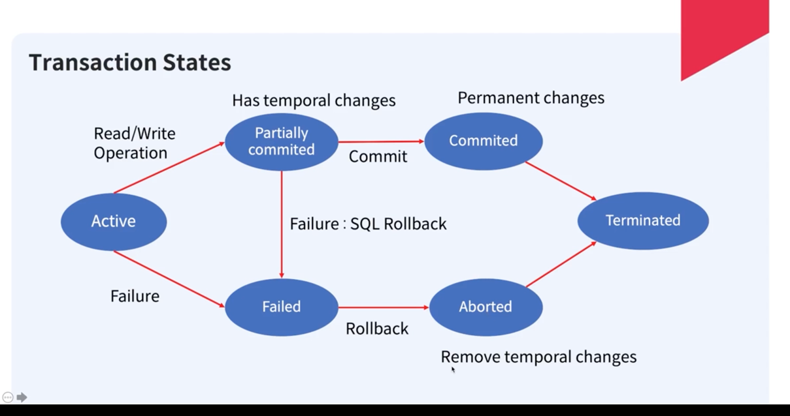

## DB 내부의 트랜잭션
### 데이터 무결성을 위해
- Atomic
- Concurrency control (동시성 제어)
- 장애 후 Recovery

> 이렇게 무결성이 유지되면, Consistent database state
> 
> 결국은 일관된 값으로 유지되어야한다.

### 트랜잭션이란, 데이터 무결성을 지켜 데이터 일관성을 지키는 것
data processing의 집합을 포함한 atomic operation
- ACID 특성을 지켜야한다.

#### 트랜잭션 states

---

## 트랜잭션 스케줄
동시에 실행되는 트랜잭션의 순서를 정하는 것을 말한다. 
Read > Write는 세트로, 이 단위를 트랜잭션이라고 한다. 
Read>Write 세트끼리는 순차적으로.

- 정확한 결과를 만드는 두 스케줄은 시리얼 스케줄
  - 이는 순차적 실행으로 throughput이 좋지 않다. 
- 그래서, serial schedule과 동일한 결과를 내는 스케줄을 serializable 스케줄이라 한다.
  - conflict serializability
    - conflict란 
      - 두 개의 다른 트랜잭션
      - 같은 데이터에 대한 작업이며
      - 적어도 하나의 작업이 write인 경우
      - 먼저 실행하는 것에 의존적으로 결과가 바뀌는 것
    - conflict serializability란
      - conflict이 없는 스케줄링
      - no-conflict operation의 순서 바꿈에 의해 serial schdule로 변환이 되는 스케줄
  - view serializability
    - view equivalent?
      - 처음에 각 트랜잭션에서 보는 것이 동일한 것.
      - 마지막 쓺이 동일 한 것 
  - Precedence graph
    - 스케줄의 conflict serializability 테스트 
    - 트랜잭션 간 conflict가 있으면 directed edge로 표시한다.
    - 그래프가 cycle이 없으면 conflict serializable 스케줄

- 복구 가능한 스케줄
  - T2가 T1에 의해 바뀐 데이터를 사용할 경우, T1이 commit 되기 전에 T2는 커밋되면 안된다. 
  - Cascading schedule
    - 데이터를 연결해 사용하면 t1실패시 모든 트랜잭션 실패
    - 이 스케줄은 복구가 불가능한 스케줄을 만든다.
    - Cascade-less 스케줄: 다른 트랜잭션들은 커밋후에 변경된 데이터를 읽는다
      - 이는 회복 가능한 스케줄

## 회복 시스템
Atomicity: 트랜잭션의 작업들이 실행 중 장애가 발생하면 실행된 작업은 롤백이 필요

Durability: 장애 후에도 커밋된 트랜잭션의 데이터는 영원히 저장

- 이는 로깅으로 회복 알고리즘을 만든다. 
- 가장 많이 사용된 Aries Recovery algorithm
  - Write-Ahead Log
    - Disk에 변경된 내용을 적기 전에 반드시 로그가 안전한 스토리지에 저장되어야한다.
  - Undo Log: commit 되지않은 변경 사항들을 원복할 때 사용
    - old 값을 포함.
    - Disk 업데이트 전 로그를 적는다
    - Commit log가 flush되기 전 트랜잭션의 모든 체인지는 디스크에 반영시킨다. 
    - Commit이 되기 전 crash가 나면, 반대로 돌면서 <abort> 시킨다.
  - REDO log: commit된 변경사항들을 REDO할 때 사용
    - new 값을 포함
    - Disk 업데이트 전 로그 적는다
    - 모든 로그를 커밋할 때 flush
    - 변화가 disk에 반영된 뒤 END 로그를 write
    - commit은 있으나 end가 없으면, 처음부터 돌면서 진행
  - DBMS는 체크포인트로그를 주기적으로 작성한다.
  - 체크포인트 로그를 하는 동안, Update는 허용하는 기술

## 병행 제어
동시에 실행되는 트랜잭션 관리를 위해, Locking을 제공.
- 동시성 문제 해결

- 락 매니저라는 것을 구현

### 락의 종류
- shared lock
  - read-only 
- exclusive lock
  - read-write lock

- commit이 될 때 release된다. 

### Deadlock
- 트랜잭션이 서로 각각의 락을 잡고, 상대 트랜잭션 락도 잡아서 무한정 기다리게되는 상황.
- DBMS는 이를 detect해 롤백한다.

### Two Phase locking protocol
- 락을 얻는 단계
- 락을 푸는 단계
- 지금은 MVCC를 사용해 락킹 성능 개선.
  - read는 락을 잡지 않는다
  - 단점은 버전에 대한 가비지 컬렉션 필요
  - 이전 old value를 바라보는 트랜잭션이 없을 때 실행

