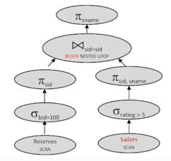

Query Optimization은 어떤 답을 받고 싶은지에 대한 선언적 언어와, 어떻게 그 답을 계산할지를 고민하는 컴퓨터 프로그램 사이를 연결한다. 

- query optimizer는 카탈로그 매니저로부터 적절한 legal query plan과 다른 테이블 cost는 어떤지 통계 정보를 볼 수 있다.
- 어쩔 때는 그렇게 optimal한 결과가 나오지 않을수도 있다.

## Query Optimization의 요소들
1. Plan space
2. Cost estimation
3. Search Strategy

결국 가장 작은 비용으로 플랜을 찾고자 하는 것이 이상적인 목표고, 
실제로는 예상되는 가장 적은 비용으로 플랜을 찾고자 한다. 더불어서 나쁜 플랜도 피하고자한다.

- 참고: "System R" Optimizer에 기반을 두고 있다.

#### Queries over Multiple relations
system R의 경우, left-deep join tree 만 고려하여 검색 공간을 제한한다. materialized table 허용하지않는다. 파이프라이닝이 되어야한다. 이는 항상 좋지는 않다.

### 1. Plan space - Algebra Equivalences
어떻게 우리가 짠 query와 동일한 답을 만들어낼까? 
1. selections

2. projections

3. Cartesian Product

4. join: 주의해야한다. 잘못하면 카테시안 프로덕과 비슷한 결과가 나올 수 있다. 

## Query Rewriter - Heuristics
cost에 관련해 너무 많은 비용이 들지 않게, rewrite 한다. 

1. selection : selection은 비용이 얼마 들지 않지만, join은 많이 들게되므로 조인을 하기 전에 selection을 할 수 있게 cascade한다.
2. projection: 테이블에서 필요한 컬럼만 남게끔 작업한 뒤 join해서 비용을 줄인다.
3. join : 카테시안 곱을 피한다.

## Physical Equivalences

## Example

1. page nested loop join
   - Sailors scan + S scan * Reserves Scan 

     - cost big, and selection can be pushed down

2. selection pushed down

    - Sailors scan + S scan whose rating is over 5 * Reserves Scan 
    - 고르게 분포되어있다면 반정도
3. more selection pushed down

   - Sailors scan + S scan whose rating is over 5 * bid = 100?
   - 오른쪽의 테이블 selection의 경우 pushed down 되어도 결과에는 영향을 끼치지 못한다.
   - 만약 join order를 바꾸게 되면 이야기가 달라진다.
4. Inner Materialized Table

   - 임시로 테이블을 끼워넣을시, S scan + R scan + Materialized scan + Filtered S * Materialized scan
5. Sort-merge Join
5개의 버퍼 있다고 가정 시, 4개의 버퍼가 sort를 한다. IO = 
   - scan S 
   - scan R 
   - Sort 
     - R: pass 0 = 10 (write), pass 1 = 2*10 (read, write)
     - S: pass 0 = 250, pass 1,2,3 = 2* 250(read, write)
     - 10 + 2* 10 + 250 + 250*2*3
   - merge : 10 + 250
   - 모두 더하기
6. Block Nested Loop
   - scan S
   - scan R
   - Write temp T1
   - for each blockful of high-rated S
     - ceil(250/4)
     - * 10
7. Projection Pushdown
   - 이 경우, 굳이 Materialized 가 필요가 없다. 하나의 버퍼로도 충분하다.
   
   - scan R

8. Indexes

- R clustered, 10
- S unclustered
- 각 R 튜플 수에 맞는 S tuple 고르기 
- 10 + 1000 * 1

- Physical Property
    - sort order: relational ops 가 고려하지않는 부분
    - hash grouping
    - 몇 ops는 결과값으로 이를 만들어내고
    - 어떤 경우는 이들을 인풋값으로 요구한다.
    - 인풋으로 쓴 이후에도 이 값들을 보존하기도 한다.

### 2. Query Optimization Cost
고려해볼 것들
1. cost 공식
2. size estimation: 굉장히 정확하지는 않지만 실질적으로 잘 동작하기는 한다. cpu와 I/O 비용을 고려한다. 
   - catalog information: 주기적으로 업데이트 된다. 통계적으로 카디날리티나, 페이지 수 등의 정보를 제공한다.
   - selectivity: Reduction Factor라고도 불린다. 결과값 사이즈를 줄이는 영향이 얼마나되는지에 대한 정보다. 따라서 output 튜플 / input 튜플 값이다. 

#### each plan 당 전체 비용을 예측한다.
- 각 작업의 비용을 계산한다. 이는 인풋 카디날리티에 따라 다르다. 
- 또한 각 작업에서 결과 사이즈도 예측해야한다. 결과값이 곧 다른 작업의 인풋이 되기 때문이다.

#### 결과값 예측
- result cardinality = Max # tuples * product of all selectivities
- selectivity 계산법

- 조금 더 나은 예측을 위하여 히스토그램을 사용할 수도 있다. 
  - equiwidth: value range가 같다. 
  - equidepth: value값 수가 비슷하다.
### 3. Search Algorithm: Dynamic Programming
- single table plan과 multiple table plan으로 나뉜다. 
- single의 경우 select, project, groupby/agg을 포함한다. 
#### Single cost estimates

#### Left-deep plans 계산
- 릴레이션 순서나, 접근 방법, 조인 방법에 따라 플랜이 달라진다. 
- 벨만의 원리를 이용해서, 가장 좋은 전반적 플랜은 서브플랜의 가장 좋은 버전을 포함한다는 것을 기억
- 그런데 physical properties는 이 원칙을 깰 수가 있다. 
  - 상위의 C를 조인하는 데 있어서 Sort가 요구되나 A-B 를 조인하는 데 있어서는 optimal 하지 않을 때
  - 이 때는 physical property도 고려하는 방향으로 optimal 원칙을 확장해야한다.
- 먼저 스캔과 조인을 가려내고, Order By, Gruop By 등의 계산을 한다. 