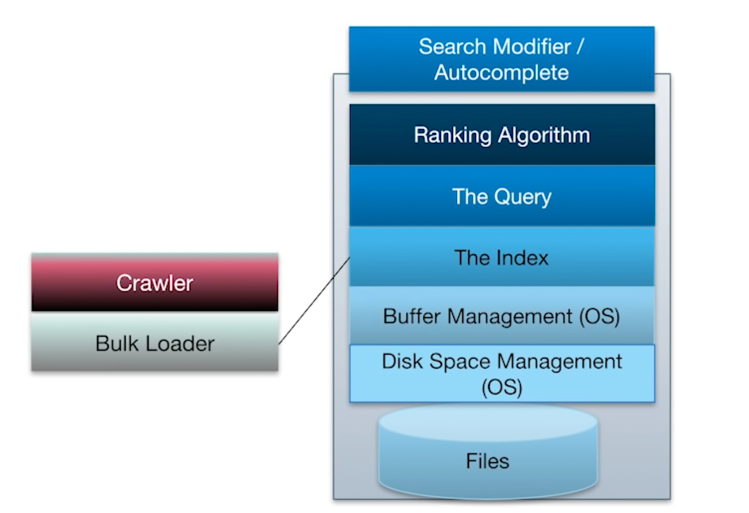
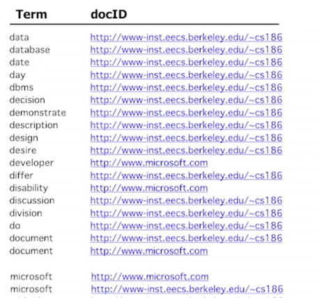

IR은 부정확한 문법에, 정확하지않은 결과 등으로 데이터베이스와는 조금 차이가 있다. 

## Bag of Words Model
- 각 문서는 단어들의 모음들이라고 말하는 모델. 
- 필요없는 몇몇 단어들이 있고, 그들은 모음 속에 넣우주지 않는다. 
- 또한 근본이 되는 단어를 넣는다. 

## Boolean Text Search
가장 기본적인 텍스트 쿼리 방법. 
- 단어와 관련된 단어들을 가져온다. 
- sql로 캐스팅하게된다면, straightforward
- 일반적인 sql query 방식과는 다르다. 끝까지 찾아내 작업한다. 
## Text Indexes
text index = 테이블과 인덱스 모두를 말한다. 

텍스트 더미를 받으면, files라는 페어를 만든다. (docId text, content text)
Inverted File로 b트리를 만든다. 

그를 통해 인덱싱을 할 수 있다. 

## phrase
1. schema를 확장한다. InvertedFile(term, docID, position) -> position 추가. 
2. 결과를 후처리
3. Near 도 가능! 

## 업데이트
삭제나 변경이 잘 일어나지 않아서, 업데이트를 최대한 미룰 수 있다. 

## 숙제
- 더 빠른 알고리듬
- 어떻게 rank할지
- 동음이의어를 어떻게 클러스터링할지
- 어떻게 더 나은 I/O 성능을 위해 캐싱할지?
- 어떻게 좋은 웹 크롤러를 작성할지
- SEO를 다루기 등

