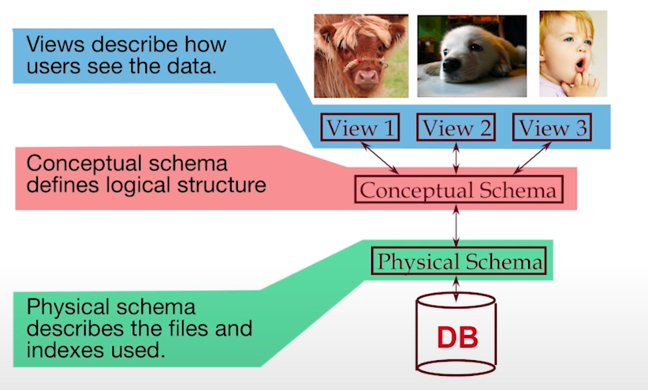
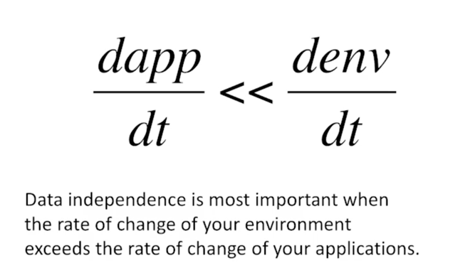
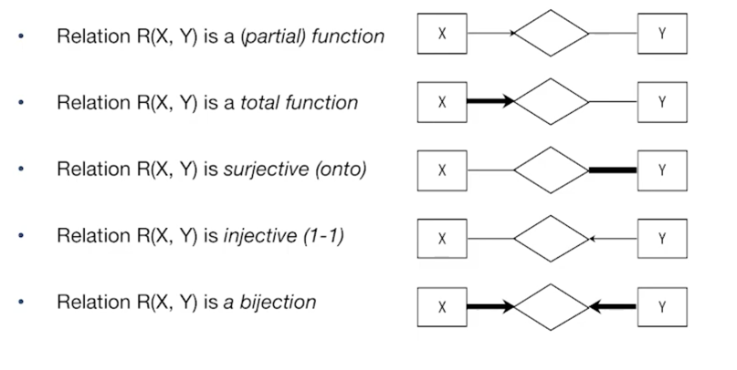

어떻게 DBMS 를 사용할 것인가 ? 
## DB Design
1. 요구사항 분석
2. 개념 디자인: ER Model
3. 논리 디자인: ER to DBMS
4. 스키마 조정
5. 물리 디자인: indexes, disk layout
6. 보안: Grant, Revoke

## 개념 디자인을 위한 데이터 표현
- Data model: 데이터 스키마와 같다. 
- 데이터의 관계 모델: 릴레이션, 로우와 컬럼

### 데이터 독립성
- 논리적 데이터 독립성: 논리적 구조가 바뀌어도 뷰는 유지되어야한다. 
- 물리적 데이터 독립성: btrees같은 것이 바뀌어도 논리적 구조는 바뀌면 안된다.

왜 이것이 중요한가? 데이터베이스와 관련 애플리케이션을 유지시키기 위해.
 (Hellerstein's Inequality)

## ER Model
프로그래밍을 모르는 사람과 소통하기 위한 그래프 등을 그려놓은 모델! 
이는 개념 디자인을 할 때 작성된다. 

- 엔티티와 속성, 관계
- 일대일 일대다 다대다, 그리고 crows notation

- 엔티티가 되고 속성이 되고는 상황에 따라 다르다. 
- ER 디자인은 주관적이며, 함수적 종속성을 드러낼 수 없기에 명확하지는 않다. 
