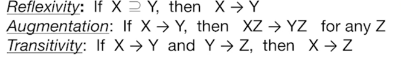

스키마를 정제하기! 중복을 제거해야한다. 예를 들면 중복된 값! 이는 
- 삽입, 삭제, 갱신 이상을 일으킨다. 
- 이를 해결할 방법은 함수적 종속성. 이는 무결성 제약 중의 하나로, 스키마 내에서 중복을 가려낸다. 
- 함수적 종속( x -> y )을 보면, 어떤것이 이상을 일으킬지 알 수 있다. 그리고 나눌 수 있는 테이블을 나누게 한다.
  - 암스트롱의 axioms: 
    - reflexivity
    - augmentation
    - transitivity

## Basic Normal Forms
- 제 1 정규형(원자)
- BCNF (유용): 함수적 종속성으로부터 파생된 데이터를 찾을 수 없다. 

decomposition의 단점
: 다시 합치기 어렵다. 몇 쿼리를 처리하는 데 비용이 더 많이 든다. 의존성 체크는 조인을 요한다. 

- Loss가 생길 수 있다! Lossless Decomposition 필요. 

그러나, lossless decomposition 또한, 종속성을 제대로 볼 수 없을수도 있어서 문제가 있다. 
어떻게 해당 종속성을 보존하는가 ? 
