여러 클라이언트들이 sql을 실행할 때, 
- Lock manager
- Logging & Recovery

### 동시성
- 처리량과, 반응 시간에 이점이 있다. 

트랜잭션은 데이터베이스에서 매우 중요! 
트랜잭션은 원자 단위로 실행되는 다양한 액션 순서. 
트랜잭션이 보장하는 원칙은 : ACID
1. Isolation : 한 트랜잭션은 다른 트랜잭션을 서로 방해하면 안된다. 
2. Atomicity and Durability: 트랜잭션은 커밋 혹은 abort로 결론이 난다. 로깅을 통해 해당 원칙을 지킬 수 있다. 
3. Consistency: DB 무결성을 지키게 한다. 

해당 원칙은 동시성을 통한 성능 향상과 프로그래머들로 하여금 안심하게 한다. 

## 동시성 제어
한 트랜잭션이 끝난 뒤에 다음 트랜잭션을 시행한다면 안전하지만 느리다.
- serializability: 몇 연속된 스케줄과 같을 때 
  - 그를 알기란 쉽지않다. 쉬운 테스트 방법이 필요하다.
  - conflicting operation 개념을 활용한 테스트! 
    - 서로 다른 트랜잭션과, 같은 개체에 대하여 작업하거나, 최소 하나는 쓰기 작업일 때 conflict가 일어난다는 가정.
    - 그러면 conflicting이 아닌 작업은 어떤 순서에 있어도 관계가 없다.
- Conflict Serializable Schecules:
  - conflict equivalent: 
  - conflict serializable: non conflict 작업의 위치만 서로 다른 것. 
  - conflict dependency graph 사용! 비순환이어야 conflict serializable
  - view serializability: conflict serializability보다 더 많은 스케줄의 가능성을 열어둔다. 
  - 

## Two Phase Locking
conflict serializability를 구성하는 가장 흔한 스키마

두개의 규칙이 있다. 
1. 읽기 전에 트랜잭션이 공유 락을 먼저 획득해야한다. 쓰기 전에 exclusive 락을 획득해야한다.
2. 락을 release 하기 전에는 새로운 락을 얻을 수 없다.

two phase lock의 시간 흐름에 따른 락 hold
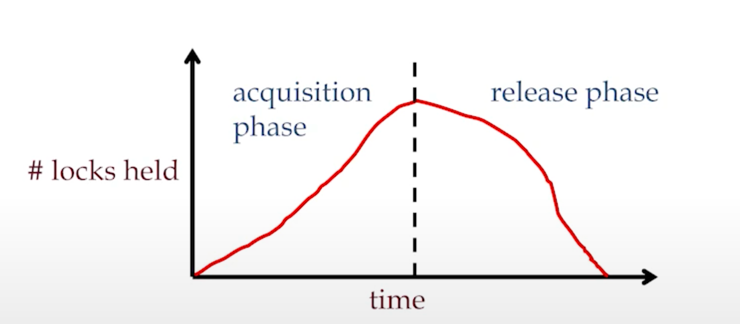

- conflict serializability를 보장한다. 
  - 락을 끝까지 획득한 지점을 락 포인트라 말하는데, 이 시점부터는 release를 시작하고 트랜잭션을 위해 conflicting transaction들이 블락된다. 
  - 해당 락 포인트 순서대로 equivalent serial schedule 을 시행할 수 있다.
- 문제는 cascading abort를 막지는 못한다는 것이다.
  - cascading abort: 한 트랜잭션의 abort가 다른 트랜잭션의 abort를 요구하는 상황
  - 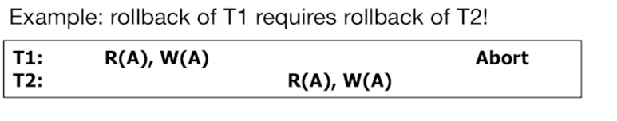
  - 이를 막기위해 strict two phase locking을 진행한다. 이는 모든 트랜잭션이 커밋되거나, abort 될 때 모든 락들이 한번에 풀려야한다는 원칙을 가지고 있다. 
  - 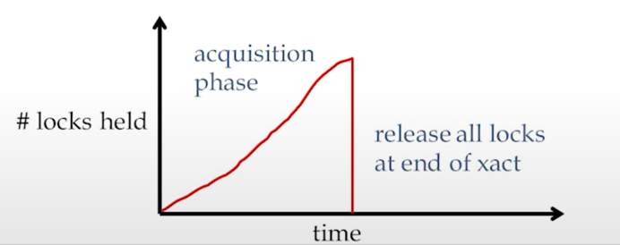

### 예시
- 2PL이 아닌 예시
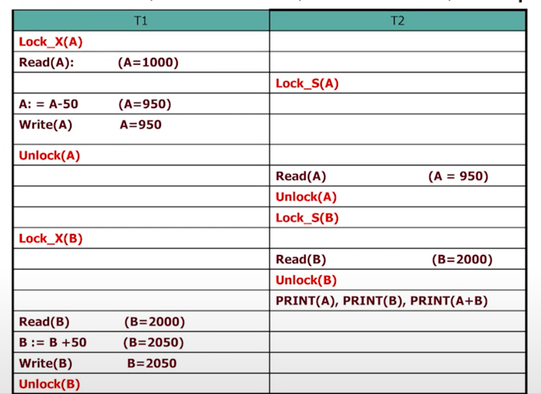
- strict 2PL
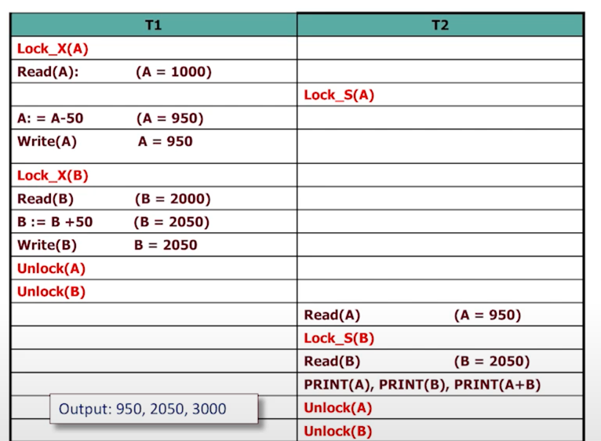
- 2PL
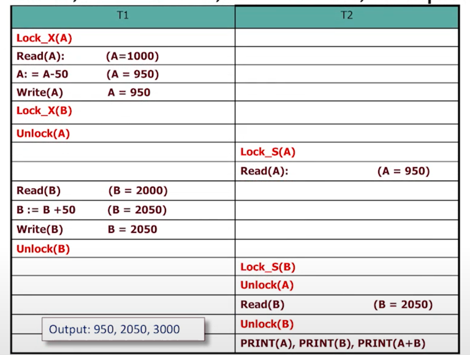

- strict 2PL 스케줄이 허용하는 범위: 모든 conflict serializable 스케줄을 말하지는 않는다.
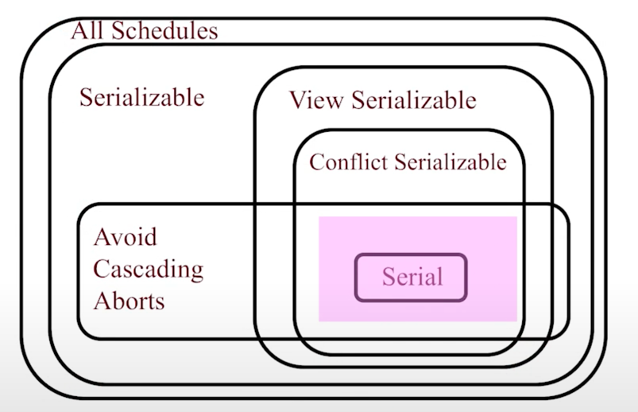

### 어떻게 락 매니저가 작동하는가
트랜잭션이 락을 붙잡고있을 때 다른 트랜잭션이 락을 요청하면, queue에 해당 요청이 쌓인다.
- 해시테이블을 유지한다. 락이 된 개체 이름이 Key가 된다.
- 현재 획득된 락의 엔트리를 저장한다. 해당 엔트리가 포함하는 정보는 아래 세가지다.
  - granted set: 현재 락이 주어진 트랜잭션 세트
  - lock mode: 락 타입 (공유인지 exclusive 인지)
  - wait queue
  - 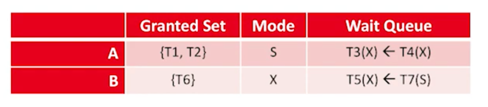
- 락 요청이 들어오면: conflicting lock을 가지고 있는지 아닌지, 혹은 웨이팅이 있는지 체크한다. 
  - 없으면 granted set에 집어넣고, 있으면 queue에 집어넣는다 (보통 FIFO 알고리듬)
  - 때로는 granted set에 있는 트랜잭션이 공유 락에서 exclusive 락으로의 업그레이드를 요청하기도 한다. 꽤나 흔하다. 

### 락 예시
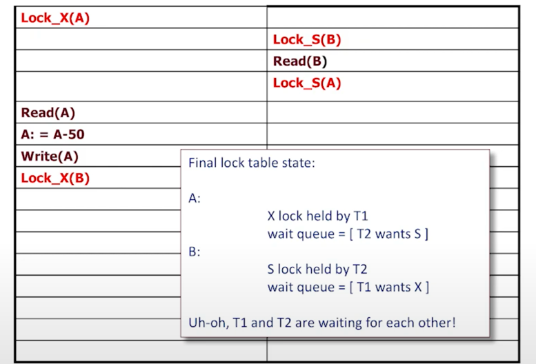
이 경우는 데드락으로, 트랜잭션들끼리 락을 서로 가지고 있으면서 서로의 락을 기다리는 현상

이 문제를 다룰 방법은 크게 세가지다.
1. prevention: 
   - OS에서 행해지는 가장 흔한 기술. 가장 일반적으로는 자원 우선순위를 두는 방식. (ex. 프린터 > 네트워크 카드>스크린...) 그런데 dbms에서 어떻게 자원 우선순위를 둘 수 있을까? 따라서 실질적으로 이용할 수 없다. 
2. avoidance: 잘 이용되지는 않는다.
   - 시작 시간에 따른 우선순위를 부여받는다. 
     - wait-die: A라는 트랜잭션이 B가 이미 가지고 있는 락을 부여받고싶어한다. 만약 A가 우선순위가 더 높으면 B를 기다리고 아니면 abort한다.
     - wound-wait: 우선순위가 A가 더 높으면 B를 abort, 아니라면 기다린다. 
   - 이것이 데드락이 없도록 할 수 있는 이유는, 사이클을 만들지 않기 때문이다. 
   - 그런데 트랜잭션이 재시작하면, 원래 가지고 있던 타임스탬프를 유지할 수 있어야한다. 그 이유는 abort 되더라도 결국에는 트랜잭션이 오래되어야하기 때문이다. 
   - 트랜잭션 age만 우선순위 기준이 되지는 않는다. 
3. detection and resolution: waits-for 그래프를 만들어낸다. 주기적으로 사이클을 체크한다. 사이클을 만들어내는 트랜잭션을 없앤다. 사실 그런 것들이 많지는 않다. 

어떤 시스템은 그냥 타임아웃을 쓰기도 하는데, 이 경우 정보가 날아갈 수 있으니 현명하지는 않다.

### 데드락 시나리오
1. 피할 수 없이 그냥 일어난다. 
2. 락 업그레이드를 잘못 실행한 경우

3. 다양한 락 업그레이드 
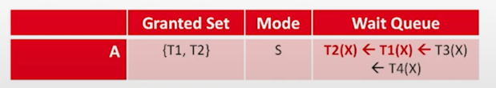

### Lock granularity
어떤 단위로 락을 설정할지가 애매하다. 튜플? 페이지? 테이블? 

너무 작은 단위로 하게되면, 동시성을 높게 가져가지만, 오버헤드가 크다 (메모리 소요를 많이하게된다. )
너무 크게하면, 너무 큰 단위로 락이 만들어져 동시성 이용을 많이할 수가 없다. 

데이터 단위에 계층을 만들어서, 어느 단위에서도 락을 설정할 수 있게 한다.
또한 intent lock이라는 개념이 있다. 
- S or X락을 가져가기 전에, 트랜잭션은 그보다 큰 단위에서의 intent lock을 걸어야한다.
  - IS: intent S lock 더 작은 단위에서 락을 걸기위해 부모에 거는 락
  - IX: intent X lock
  - SIX: S & IX. 유용하다. 어떤 페이지의 튜플을 업데이트 하고자할 때, 그보다 큰 단위인 페이지에 S를 걸어두고 하나하나 읽으며 원하는 튜플이 나오면 X를 건다. 
- 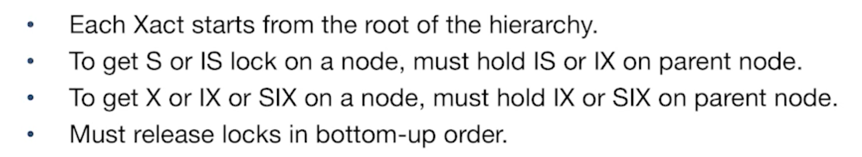
- 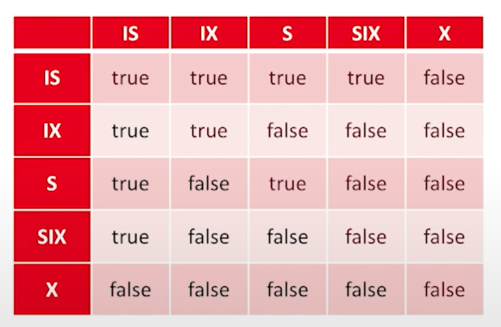