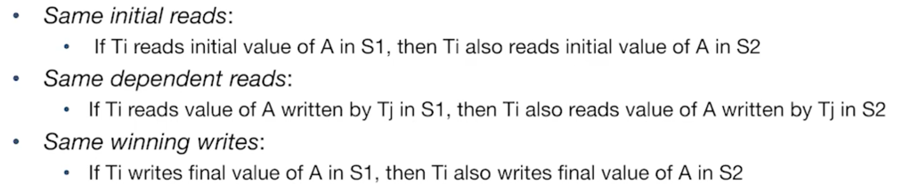

여러 클라이언트들이 sql을 실행할 때, 
- Lock manager
- Logging & Recovery

### 동시성
- 처리량과, 반응 시간에 이점이 있다. 

트랜잭션은 데이터베이스에서 매우 중요! 
트랜잭션은 원자 단위로 실행되는 다양한 액션 순서. 
트랜잭션이 보장하는 원칙은 : ACID
1. Isolation : 한 트랜잭션은 다른 트랜잭션을 서로 방해하면 안된다. 
2. Atomicity and Durability: 트랜잭션은 커밋 혹은 abort로 결론이 난다. 로깅을 통해 해당 원칙을 지킬 수 있다. 
3. Consistency: DB 무결성을 지키게 한다. 

해당 원칙은 동시성을 통한 성능 향상과 프로그래머들로 하여금 안심하게 한다. 

## 동시성 제어
한 트랜잭션이 끝난 뒤에 다음 트랜잭션을 시행한다면 안전하지만 느리다.
- serializability: 몇 연속된 스케줄과 같을 때 
  - 그를 알리간 쉽지않다. 쉬운 테스트 방법이 필요하다.
  - conflicting operation 개념을 활용한 테스트! 
    - 서로 다른 트랜잭션과, 같은 개체에 대하여 작업하거나, 최소 하나는 쓰기 작업일 때 conflict가 일어난다는 가정.
    - 그러면 conflicting이 아닌 작업은 어떤 순서에 있어도 관계가 없다.
- Conflict Serializable Schecules:
  - conflict equivalent: 
  - conflict serializable: non conflict 작업의 위치만 서로 다른 것. 
  - conflict dependency graph 사용! 비순환이어야 conflict serializable
  - view serializability: conflict serializability보다 더 많은 스케줄의 가능성을 열어둔다. 
  - 