Recovery Manager는 ACID 중, Atomicity, Durability에 책임을 가지고 있다. (+ Consistency 위반할 경우 롤백 기능까지)

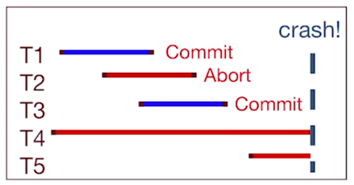

Recovery가 필요한 이유는 위의 사진에서도 볼 수 있듯이, 
Crash 이전에 Commit 된 경우는 안전하게 유지되어야하고, crash된 것은 그 이전 상태로 원복시켜야하기 때문이다.
 
즉 Durability, Atomicity를 지켜야한다.

### 왜 트랜잭션이 abort 되는가? 
- User/Application 이 명확히 abort 시켰기 때문에
- Consistency check에 실패시 -> ex) tuple 삭제하려 하는데, 그를 참조하는 다른 테이블이 있을 시
- 데드락
- 성공적 커밋 이전에 System failure 

### SQL support for Transaction
보통은 sql이 트랜잭션에 필요가 없지만 가끔 함께할 때가 있다. 
- SQL Basics: Begin, Commit, Rollback, Savepoint

### Durability: Why do databases crash? 
1. Operator Error (Power cord 꼬임 혹은 잘못된 명령어 타이핑)
2. Configuration Error (db가 할당된 것보다 커질 때, 파일 퍼미션이 적절히 설정되지 않았을 때)
3. Software Failure(DB bug, 보안 문제, 잘 일어나지는 않는다.)
4. Hardware failure(media, server) -> 제일 잘 안 일어난다. 

### A, D를 지킬 수 있는 스키마
간단하게는, 
1. 모든 수정된 페이지는 버퍼 풀에 pin 되어있다. (No Steal Policy)
2. 커밋할 때 해당 페이지를 디스크에 보내고, unpin, commit 한다. (Force policy)

그러나 이 경우는 확장성이 없고, dbms가 crash 될 가능성을 배제한다.

- No Steal Policy: UNDO 없이 atomicity 보장, pin된 페이지가 나쁜 성능을 초래한다.
- Force: 랜덤 I/O가 많아서, 나쁜 성능. 왜냐하면 모든 dirty page가 커밋되어야하기 때문이다. REDO 없이 durability는 보장

오히려 더 나은 스키마는 STEAL/No-Force
- 복잡하지만 좋은 성능.
- Steal Policy: UNDO를 해서 Atomicity 보장. 옛날 버전을 저장해둔다.
- No-Force: 크래시가 문제인데, 이를 위해 적절한 시기에 flush. REDO 허용. 복잡하게 durability를 보장

위 두가지가 제일 중요한 원칙.
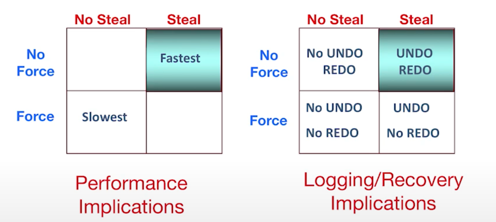

### Logging: 트랜잭션을 할 때의 모든 업데이트 (ordered list to allow REDO/UNDO)
<XID, pageID, offset, length, old data, new data>를 포함한다. 

#### Write-ahead Logging
log record를 data page 가져오기 전에 적기, 커밋 전에 모든 로그 레코드를 force

이 모든 원칙은 UNDO, REDO를 통하여 A, D를 보장하게 돕는다. 

- write buffer(tail)이 있다. 
- 각 로그에 숫자도 있다. 이를 LSN이라 한다.
- (flushed LSN, 메모리에서 이를 트래킹한다.)
- page LSN: 로그 포인터. db 데이터 페이지가 가지고 있다. 해당 페이지에서 업데이트 된 가장 최신 로그 레코드
- 페이지가 db에 플러시 되기 전에 로그는 page lsn <= flushed lsn를 충족해야한다. 

#### UNDO Logging
- FORCE and STEAL
- recovery 해야할 때, 커밋되지 않은 경우 모든 트랜잭션을 취소한다. 
- 첫번째 룰: 데이터가 바뀔 때, 바뀌기 전 데이터를 디스크에 써야한다. 이것이 old value를 보장하기 때문이다. 
- 두번째 룰: 커밋할 때, 수정 페이지를 커밋 전에 써야한다. 커밋이 허용되기 전에 반영해서 모든 변화를 보장하려 한다.
- 이는 write ahead와는 다른 것이, 커밋 허용 전에 쓰기 때문 (?) -> 무슨 말인지 몰겟음

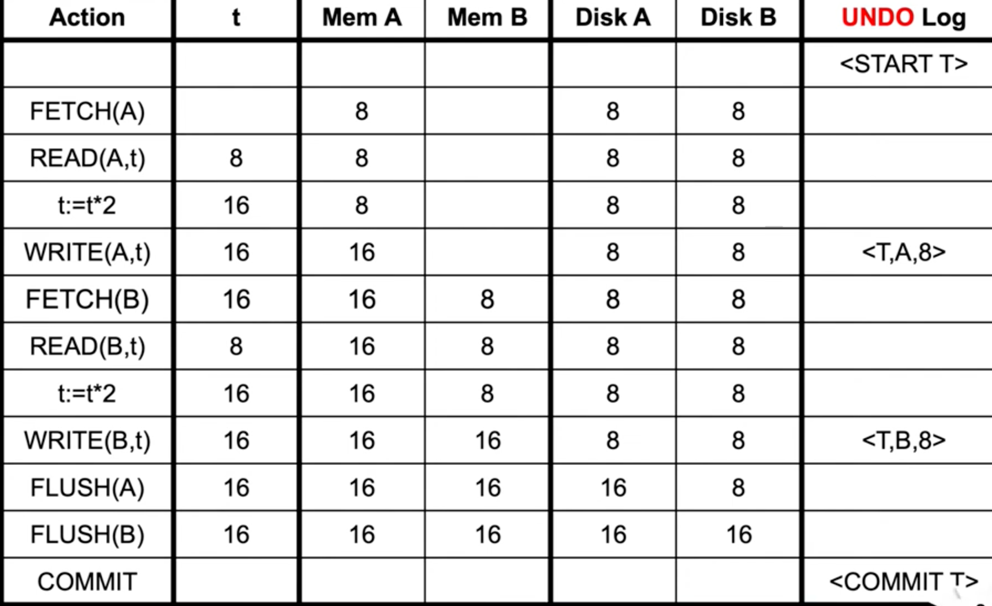
- 이 경우 커밋되지 않았으므로 UNDO
- 커밋된 뒤에 크래시 나면 그냥 아무것도 안해도 된다.
- 그리고, 커밋 전에 disk 에 flush 해야한다.
- 모든 커밋되지 않은 트랜잭션을 스캔한뒤에 UNDO. 
- UNDO는 멱등하기에, Recovery 중간에 크래시가 또 나도 상관없다.
- dirty page done early
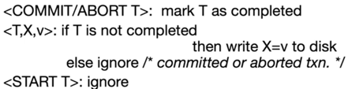
- 오래 걸리는 단점이 있다. 메모리는 적게 쓴다.
#### REDO Logging
- No Force, No Steal
- 이전의 데이터를 저장하는 게 아닌 새로운 값을 디스크에 저장하는 것.
- 커밋되었다면 재시도. 커밋되지 않았다면 건드리지 않는다. 
- 첫번째 룰: 수정시, 로그와 커밋 모두가 디스크에 쓰여져야한다. 수정된 페이지가 디스크에 쓰여지기 전에 (No-Steal). 이로써 더티페이지가 커밋 뒤에 행해진다. 이것이 Write ahead와 일맥상
- 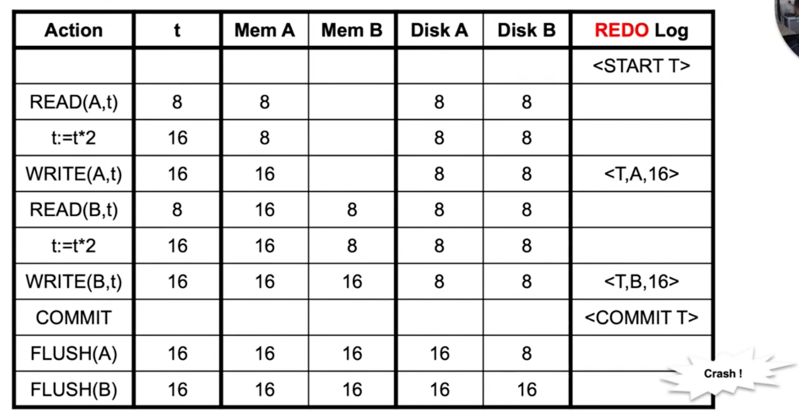
- 커밋 뒤에 flush
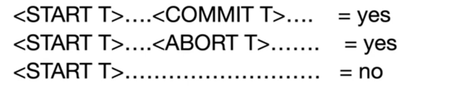

- 처음부터 로그를 읽고 commit 된 경우 redo
- 이는 느리다! 체크포인팅 필요.
- dirty page late

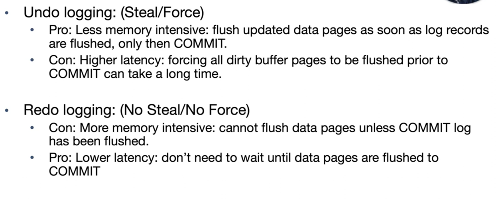

## ARIES log
- ARIES란, 알고리듬! UNDo, redo를 결합함.
- 체크포인트라는 개념이 핵심

### 체크 포인트
그간 undo, redo는 모두 모든 로그를 읽어야했다. 이 부분을 체크포인트가 굳이 그러지않아도 되게끔 만들었다.
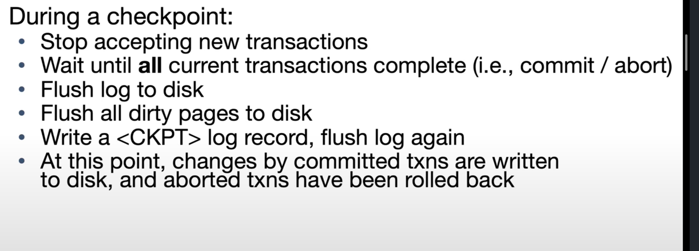
문제는, 데이터베이스가 체크 포인트 과정에서 아무것도 할 수 없다는 것이다. 이상적으로는 그 과정 속에도 트랜잭션을 수행할 수 있어야한다.
따라서 해당 정보를 저장할 새로운 자료구조가 필요하다.

1. 트랜잭션 상태(running, committing, etc)
2. dirty page, 그를 유발한 첫 페이지

리커버리 동안 1,2번을 먼저 로그로부터 생성한다.
메모리에 진행중인 트랜잭션과 더티 페이지를 생성하고 replay한다. 

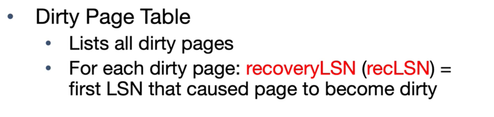
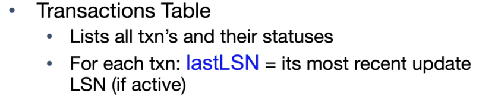
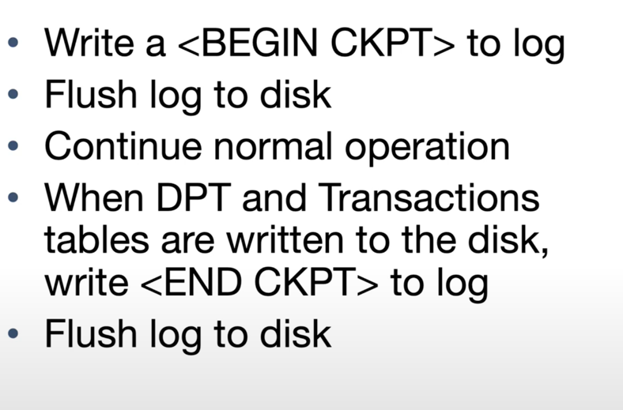

1. 트랜잭션이 시작하면,
Log에 start 입력 후 트랜잭션 테이블을 업데이트 한다. (ex. <START, T105>) 이 경우 last LSN은 널! 버퍼 풀과 더티페이지는 변하지 않은 상황. 
2. 트랜잭션이 업데이트할 때, (ex. T100이 10을 Page7에 업데이트 시, <T100, P7, 5, 10> 이라고 쓴다. )
3. 페이지가 플러시되면, 우선 버퍼 풀에서 페이지 번호를 로그로부터 찾아서 더티페이지를 삭제! 디스크 업데이트 먼저한다. 
4. 페이지 인입을 원하면, dirty page 엔트리를 만들고 recLSN = null, 버퍼 풀에 페이지를 가지고 온다. 트랜잭션테이블과 로그는 바뀐 게 없다.
5. 트랜잭션 커밋시, 로그에 커밋 레코드 작 -> 플러시 -> 트랜잭션 커밋 처리 -> 더티페이지 플러시 (나중에)-> 로그에 <End, t100> 이라고 적기 -> 트랜잭션 테이블에 complete 라고 적기
6. abort시, log에 abort 레코드 작성 > lastLSN으로부터 첫 액션을 찾아냄> compensation record 작성한다. > prevLSN을 통해 undo > transaction abort> 나중에 더티페이지 플러 > 트랜잭션 테이블 complete
---
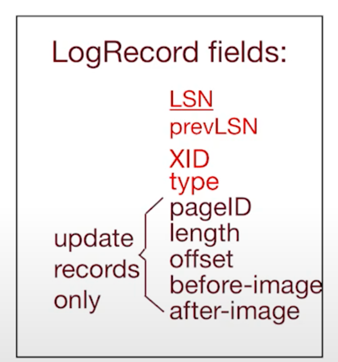
위의 사진은, REDO, UNDO를 위한 충분한 정보를 제공한다. 

그 외에, 메모리 테이블에는 트랜잭션 테이블과 더티페이지 테이블이 있다.
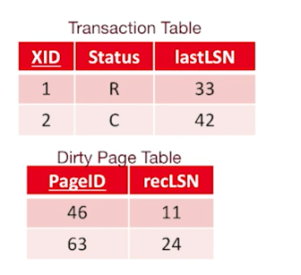

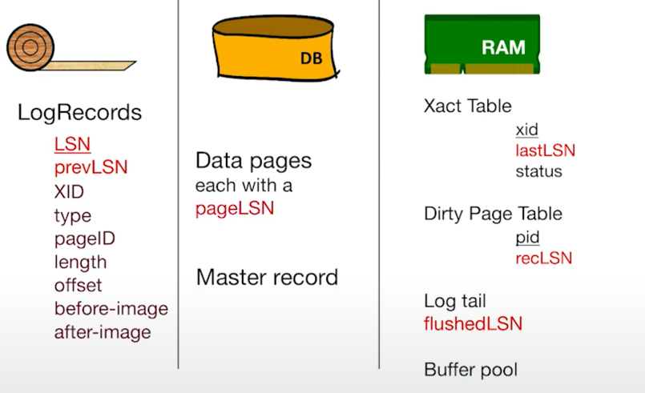

## 실제 Recovery
1. checkpoint로부터 시작해서
2. analysis: 어떤 것이 커밋되었고 어떤것이 abort되었는지 분석
3. REDO
4. UNDO

### 분석 과정
체크포인트 이후의 로그를 스캔한다. 
- End record: 트랜잭션을 지운다.
- Update: Page P가 더티페이지 테이블에 없으면 P를 추가한다. recLSN을 LSN에 저장.
- 실제로 실행중이거나 시작되었던 것들을 살려낸다. 

## ARIES REDO
- 모든 과정을 반복한다. abort 된 것들 까지
- 가장 작은 recLSN부터 스캔한다. 그 이유 ? 해당 페이지 수정한 가장 처음의 레코드기 때문이다. 
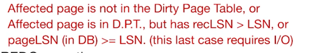
- 위의 세 조건 중 하나가 충족이 안되면 REDO 진행

## ARIES UNDO
가장 간단하게는 트랜잭션 테이블에 가서, 남아있는 트랜잭션을 abort. 
- 이것의 단점으로는: 트랜잭션 하나하나에 random IO를 해야하므로 비효율.
- 이를 한번에 할 수 있는 방법이 있기는 하다. 
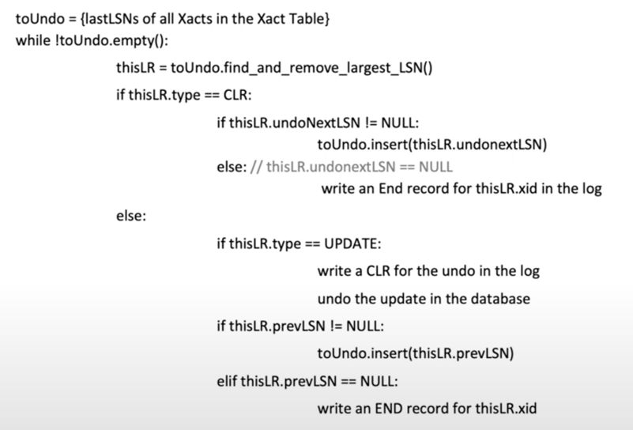

