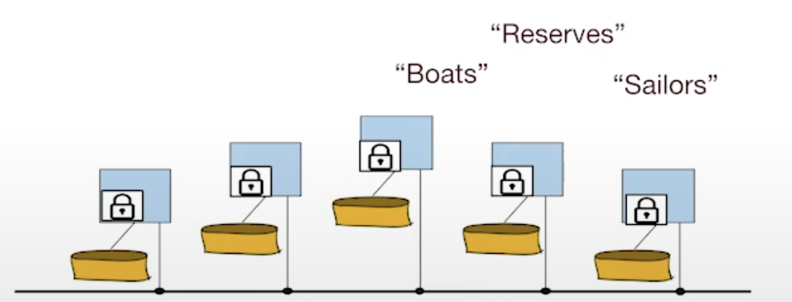
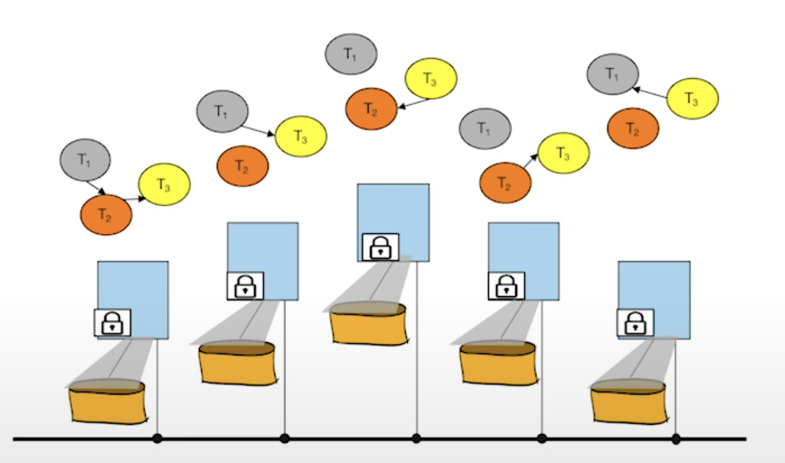

## Intro
분산 트랜잭션은 Shared Nothing 아키텍쳐를 띤다.
- network가 믿을만하지 않다. 딜레이가 있거나 packet loss가 있다.
- 더불어, 시간도 동기화가 되지않아서 완벽하게 동기성을 유지하기가 힘들다. 
- 그러나 분산 트랜잭션은 분산 컴퓨팅에서 중요한 위치를 차지하고 있다. DBMS의 데이터는 분산 컴퓨팅에서 가장 까다로운 부분이다. 분산 트랜잭션이 없다면 많은 기능을 사용하지 못하게 될 것이다.
- 그 중에서도, 병행 제어를 어떻게 할지에 대해서 알아본다.

## Distributed Locking

각 파티션된 노드는 각 락 테이블을 가진다. 
해당 노드에 맞게 작동한다. (노드가 페이지인지 튜플인지에 따라 각각 맞게끔 작동)

만약 조금 더 큼직큼직한 범위에서의 락에서는, home 노드를 할당한다. (테이블이나 DB 차원의 락의 경우)
혹은 마스터 노드에 집중될수도 있다.

지역 락은 깔끔하고 효율적이다.
그러나 1) 전역적으로 데드락이 일어날 수 있다. 혹은 2) 커밋이나 abort issue가 존재한다. 

### Deadlock

자신의 락을 가지고 있으면서 다른 노드의 락을 원하는 상황! 
주기적으로 전역적인 cycle을 확인해서, abort하게된다.

### Distributed Commit
노드의 딜레이나 failure가 있는 상황에서 Commit을 해야할지 abort를 해야할지 고민이 될 수 있다. 
해당 노드가 다시 정상적으로 돌아온다면 어떻게 Recover 해야할까? 

이는 데드락보다 더 까다롭다.

A node에서 다른 노드에 메세지를 전달할 때, 해당 메세지는 지워질수도, 순서가 잘못될 수도, 위치가 다른 메세지들 사이에서 뒤죽박죽이 될 수도 있다. 
이 경우 메세지를 받은 노드에서 메세지를 커밋해야할지? 아닐지에 대해서는, 
해당 메세지를 받는 다른 노드들과의 협의가 필요하다.

다른 노드들에서는 어떻게 받았는지를 서로 비교하는 것이다.

#### 한가지 방법: Voting
분산 시스템에서 자주 사용하는 방법.

찬성/반대 시스템! 그런데 얼마나 투표를 받아야하는걸까?
모든 노드가 찬성해야한다. 어떤 싱글 노드가 데드락이나 다른 제약조건 침해를 당했을 때는 abort 되어야만 하는 상황이기에. 또한 어떤 노드인지 무기명 투표가 되어야한다. 

그렇다면 어떻게 투표를 실시할까? 노드에 문제가 있을수도 있고 메시지를 주고받는 한중간에? 
이 때, 2PC(2 Phases Commit)을 사용한다. 2PL이랑은 다르다. 그건 싱글 컴퓨터 락 프로토콜이라면, 
2PC는 분산 커밋 프로토콜이다. 
- wedding ceremony 처럼 동작한다. (Jim Gray에 따르면.)
    - 단계 1. prepare 하라고 참여자들에게 중재자가 말한다. 참여자들은 yes/no 투표를 한다.
    - 단계 2. 모든 준비가 되면, 중재자가 투표 결과를 나눈다. 참여자는 ack로 화답한다. 
    
- 그런데 이 과정에서 로깅이 필요하다. 참여자 뿐 아니라, 중재자 자체도 fail할 수 있기 때문이다.
    - 단계 1에서는 참여자가 prepare/abort record를 생성하고 작성한 뒤에 vote하고(prepare log, 중재자 id 기재), 중재자가 커밋 레코드를 작성한 뒤에 flush한다. (commit log, 모든 참여자 id 기재)
    - 단계 2에서는 commit/abort record를 작성한 뒤에, ack로 화답하고 중재자가 end 레코드를 로그에 적는다. 

### Recovery
중재자는 준비된 참여자로부터 트랜잭션에 대한 질문을 들을 수가 있다.
- 만약 중재자가 가지고있는 트랜잭션 테이블에 commit/abort 정보가 들어있다면 그걸 전달하지만, 
- 아니라면 abort 메세지를 보낸다. 
    - 이는 중재자 자체가 준비되었다는 메세지를 받기 전에 크래시가 난 경우다. 

중재자를 어떻게 Recover? 
1. commit log는 있지만 end 레코드는 없을 때, 다른 참여자가 commit 을 다 했는지 확인 불가하다. 이 경우에는 단계 2를 다시 진행한다.
2. abort record가 있다면 아무것도 하지않는다. 

참여자를 어떻게 recover? 
1. prepare/commit/abort 모두 없다면 아무것도 안한다.
2. prepare & commit이 있다면 ? 중재자에 ack를 보낸다. 
3. prepare만 있다면? 위의 사례처럼 중재자에게 질문을 한다. 
4. abort만 있다면? 아무것도 하지않는다. presumed abort

### 가용성
- 가용성 이슈가 있을수가 있다. 
    - 한 노드가 down 되었을 때 락을 release할 수가 없다. 
    - 참여자가 죽어도 가용성 이슈가 있다. 중재자 로그로부터 새로운 참여자를 만들어내면 되기 때문이다.
    - 중재자가 죽으면, 정말 문제다! 이를 해결하기위해 3PC도 고안되었다. 그러나 Paxos protocol이 이를 해결하였다.