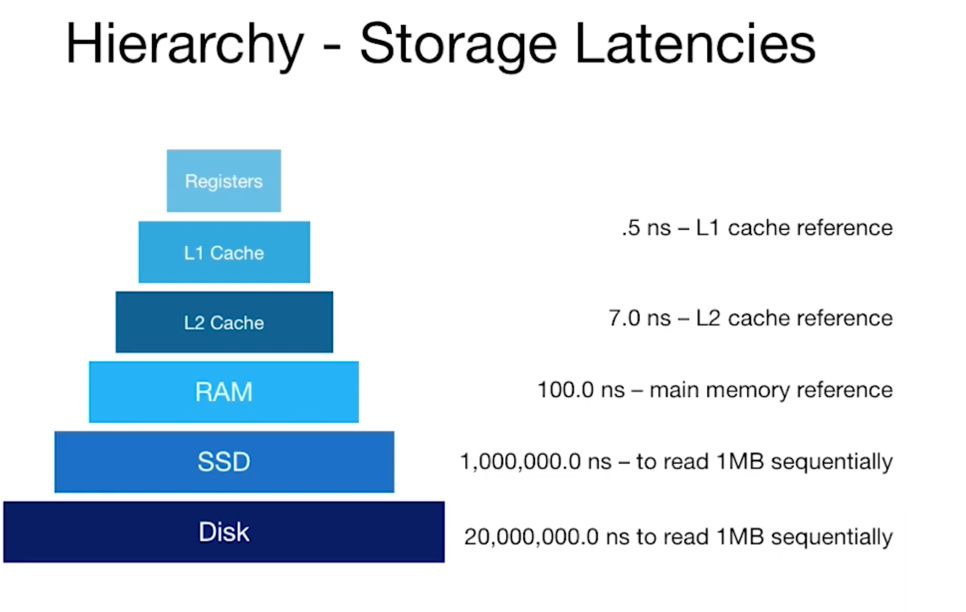

어떻게 SQL이 시행될까?
- 쿼리 Parsing, 최적화 모듈
- 관계대수 : 테이블과 레코드를 논리적 파일의 페이지로 구성. 
- 파일과 인덱스 관리
- 버퍼 관리: 메모리에 있다는 착각을 하게 만든다. 
- 디스크 공간 관리
각 레이어는 그 바로 아래에 있는 레이어만 신경쓴다. 이것이 추상화! 

이는 싱글 dbms 하나의 이야기고 여러 dbms가 함께 작동할 경우, 동시성과 회복에 대한 문제도 신경써야한다. 

## Disk Space Management
- DBMS의 제일 아랫단의 disk space management
- Disk에서 RAM으로 페이지를 가져와야한다. api로
- 이건 몹시 느려서, 계획을 잘 세워야한다. 

### Components of a Disk
- Platters spin
- Arm Assembly 
- 한번에 한 헤드만 읽고 쓸 수 있다. 
- 블록/페이지는 여러 섹터로 이뤄져있다. 
- seek time, rotational delay, transfer time. 각각 ~2-3ms, ~0-4ms, ~0.25ms가 걸린다. 따라서 앞의 두개의 시간을 줄여내는 게 필요하다.

### Flash
- 아주 조금 읽고(4-8K), 듬성듬성 많이 쓸 수 있다. (1-2메가)
- 마모된다. 2-3천 번의 지우기가 일어나면
  - controller로 관리 필요
- 조금만 적고 싶더라도 많은 변화가 일어날 수 있어 조심해야한다. (write amplication)
- read fast, 
- 순차 읽기라 하더라도 생각보다는 빠르지않다. 랜덤 읽기와 비슷하다.
- 그러나 쓰기는 느리다
- 순차 읽기보다 랜덤읽기가 4배정도 느리다. 
- 확실히 HDD보다는 빠르다. 
- 지역성은 ssd, hdd 모두에 적용된다. (ssd: write random, hdd: seek/rotation delay)

### Storage Pragmatics & Trends
대부분의 중요한 DB는 그렇게 크지않다. 
- 그러나 무어의 법칙보다 데이터 크기가 커지고 있다. 
- 데이터의 종류 따라 다른 솔루션들이 나온다.
  - 빅데이터: 쉽고 저렴하게 아카이빙
  - 스몰 데이터: 고정된 사이즈의 중요한 데이

### Disk 공간 관리
- 블록: 전송 단위, 읽고 쓰는 데 있는
  - 64-128KB
- page: block이랑 동일한의미
  - 블록사이즈 청크 (RAM)
- next block? 
  - 순차 블록
  - 같은 실린더
  - 인접한 실린더
- 순차 스캔을 위해 프리페치

### Disk Space Management
- Map pages to locations on disk
- Load pages from disk to memory
- Save pages back to disk and ensuring writes

위의 layer는 순차적인 페이지가 더 빠를 것이라고 예상한다. 

### Implementation
1. 곧바로 스토리지에 명령을 내리면 어떻게 될까? 
   - 직접적으로 호출하기에 다른 디바이스를 끼울 수 없다.
2. Run over filesystem
   - Allocate one Large contiguous file
   