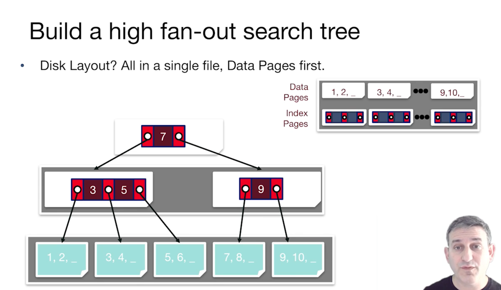

인덱스로 더 빨리 value를 찾자! 
- RAM 
  - Search trees
  - Hash Tables
- 를 이미 보았고, 이제는 disk-based data 구조가 필요하다.
  - paginated

index는 lookup, modification을 빠르게 하기 위한 자료구조다. 
- (key, heap file pointer)로 구성된 data entries
- b+-Tree, Hash, R-Tree...

### Search Tree 만들기
디자인 목표: 빠른 순차 스캔, 이진 검색은 너무 깊어질 수가 있어서 high fan-out을 지향, support insert

#### 1. ISAM
- data pointer 트리를 만든다.
- 이진 검색은 너무 깊어질 수가 있어서 그렇게 구성하지는 않는다. 
- Optimization: left most key는 삭제

- 해당 방법은 삽입에 문제가 있다. 11이 삽입된다고 가정하면, 다시 정렬해야한다. 
- 사실 이건 IBMdl 1960년대에 주창
- 그러나 좋은 시작이다. B+ Tree로 발전되었다. 

#### 2. B+ Tree
- ISAM과 유사 (key, page pointer)
- 다른점은 동적 트리 인덱스. 효과적으로 삽입 삭제를 지원한다. 
  - 루트에서 시작
- 왜 +가 붙는가? 모든 데이터가 leaves에 있다. 
- 1/2만 차지한다.
- fan-out 가능한 수는 2d + 1, record 가능한 수는 * 4
- 검색 알고리듬은 ISAM과 동일! 
- 삽입을 할 경우에는, leaf를 찾아 sort
  - 근데 자리가 없으면 split leaf, fix next/prev pointers
  - orphan이 있으면, 그중 제일 작은 수를 copy해서 leaf entry된다. 이유는 모든 데이터 entry가 leaf에 위치하기 때문이다. routing key는 push된다.  
  - find correct leaf L.
  - Put data entry onto L. 
    - enough -> done
    - not enough -> split L
      - split and form recursive middle key push up 
      - tall 보다는 wider하게
- 삭제의 경우 그냥 삭제하면 된다. 페이지 자체가 비면 삭제할 수는 있다. ]
- large table를 로딩할 때, 매번 인덱스를 만드는 것은 비효율! 
  - sort -> fill leaf pages to some fill factor full 되면 parent를 업데이