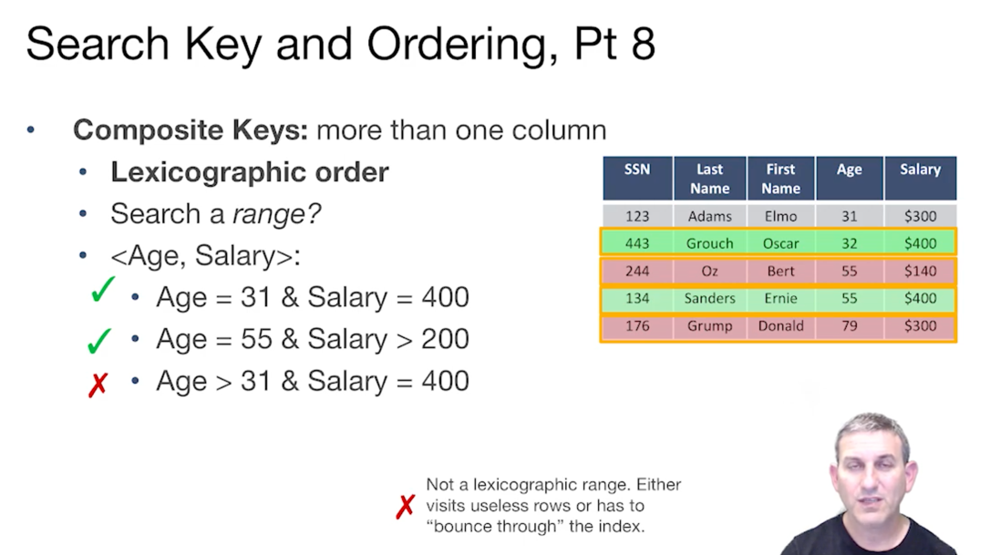
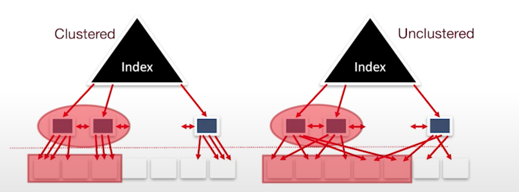
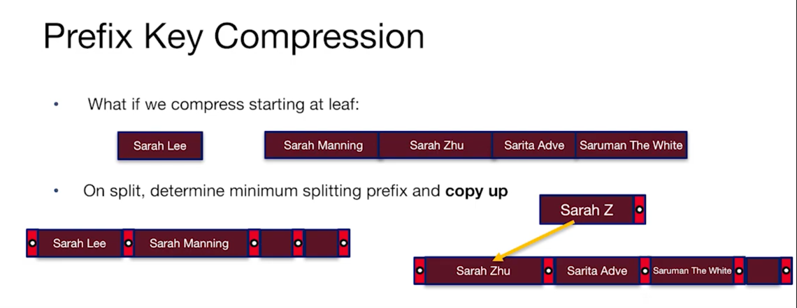
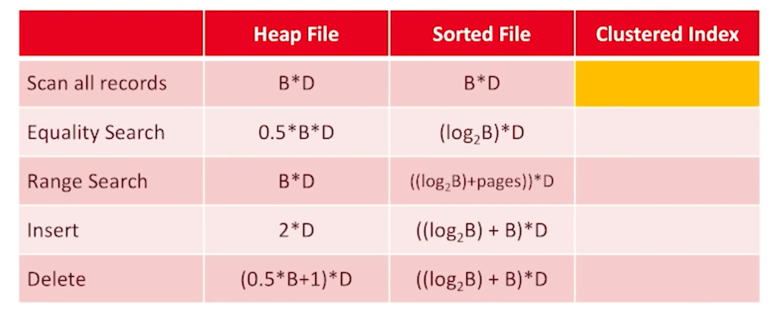
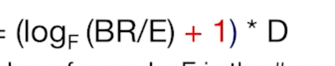
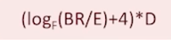
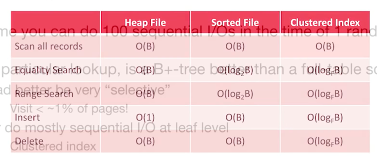

## index 구조에서 생각해보아야할 것
1. 쿼리 지원
2. 서치 키 선택
3. 데이터 엔트리 스토리지
4. 다양한 길이의 키 tricks
5. Cost Model Index vs Heap vs Sorted File

## 1. Query Support
Basic Selection: key, op, constant
- Equality selections (op is =) or Range selections
- B+-tress provide both but linear hash indexes provide only equality

더 나아가면, 다른 신기한 selections도 있다.
- 2d box
- 2d circle 
- R-tree, KD-tree같은!
- near neighbor queries

우선은 1-d range search를 다룰 것.

## 2. Search key and Ordering
- lexicographic order
  - search key specified
  - 필요없는 row를 방문할 경우 Not a lexicographic range
  - 

## 3. Data Entry Storage
상당히 성능에 큰 영향을 준다.
- 데이터 엔트리에는 세개의 대안이 있다.
  - 1. by value: record contents가 인덱스 파일에 저장되어있다. (b+ tree) 그래서 포인터를 따를 필요가 없다. 
  - 2. by reference: <k, rid of matching data record > 여기서 rid of matching data record는, 페이지 id or slot id pair
  - 3. by list of references: large record id에 걸맞다. <k, list of rids of matching data record > 많은 중복 키가 있을 때 유용
- By reference는 다양한 인덱스를 지원하는 데 요구된다. 
  - 이는 clustered 될수도, unclustered 될 수도 있다.
  - heap file order not to be perfect, 일단 나중에 정렬할 수도 있다. 그러나 성능은 클러스터 유무에 따라 굉장히 다르다.
  - 일단 클러스터 인덱스를 만들기 위해 heap file을 sort한다. 몇몇 남은 공간들을 만들어놓는다(미래를 위해)
  - 
  - 클러스터 인덱스는 꽤 순차적인 접근이 가능하다.
  - 범위 서칭에 능하다. 지역성도 제공한다. 
  - 단점은 유지 비용 (re-sort), 그래서 lazily하게 제공! 또한, 2/3 packed

## 4. Variable length keys
key 길이가 너무 다양할 때, Prefix key Compression 시행해서 
- 최소로 나눌 prefix를 결정한다. 그리고 그를 copy up
- 

Suffix key compression도 있다. 
모든 키가 큰 common prefix를 가지고 있을 때, 가장 common한 prefix를 헤더에 두고 나머지를 suffix로 처리
- 전체적으로는 너무도 다른 key를 가졌지만 앞은 비슷할 때 쓰기 좋다.

## 5. B+tree Cost

- Scan all the record
  - 2/3만 차있기 때문에, Scan all the record 비용은 1.5* B* D
- Equality Search
  - 이를 계산하기 위해서는 평균 Internal node fanout(F), 평균 data entries 수(E)를 알아야한다. 
  - Search the Index = 
  - Lookup Record in heap file by id = 1* D
  - 위 둘을 더한 값
- Range Search
  - Search the Index = 
  - heap file access = 1.5*page수*D
  - scanning the leaf level = 1.5*page수*D
  - 위 셋을 다 더한 결과
- Insert
  - 일단 인덱스 찾아서, heap file과 leaf에 입력하는 시간
  - 
- Delete
  - 일단 인덱스 찾아서, heap file과 leaf에 입력하는 시간
  - 
- 결론

- 특정 lookup을 위해서, 
  - selective
  - clustered index
  - ssd
  - 를 통해 full-table scan은 안 하는 게 낫다.