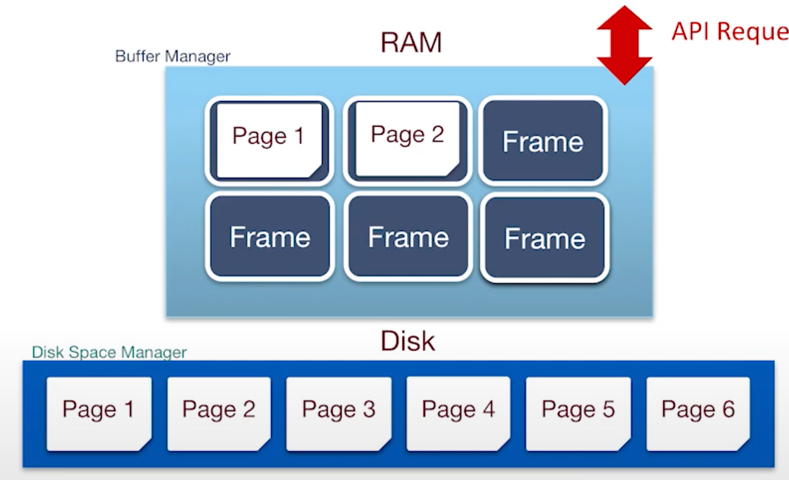

Files and Index Management가 api에 기반한 Ram이었다면, Buffer management는 어떻게 그를 추상화하는 지에 대한 영역

프레임이라 불리는 메모리 페이지를 가지고 있다. 
버퍼 매니저는 디스크 페이지를 메모리에 등록하고 수정하는 환상을 준다.
- API Request 로 메모리 관리

## Questions We need to Answer
1. 어떻게 dirty pages 를 다룰지

dirty page란? 메모리에서 수정한 페이지. 
dirty bit의 유무로 파악한다. 
- 추가 질문
  - 동시성 작업
  - write-back 이전의 crash가 생길 경우
2. Page Replacement
페이지가 사용중이라는 것을 page pin count를 통해 알 수 있다. 

그리고 버퍼 매니저가 가득 차면, page replacement policy를 통하여 대체될 페이지를 결정한다.

- 페이지가 요청되면
  - un-pinned frame 선택
  - dirty하다면 disk에 쓴다.
  - 프레임에 가져온다
- pin the page and return its address

- 정책은 IO 수에 영향을 준다. 
### 종류 1: LRU
- Least Recently Used
  - pin된 프레임은 대체 안한다. 
  - Last Used 된 시간을 기록한다. 이 자체를 싫어하는 사람들이 많다.
  - 선형적 검색을 하게되어 시간이 오래걸린다.

### 2. Clock
LRU의 시간을 기록하는 것에 반발. 
시계처럼 시계 방향으로 돌면서 reference bit을 확인하고, 해당 bit이 있으면 삭제! 
그것 조차 없으면 그것을 대체 대상으로 삼음.

최적의 상황에서는 현재 위치한 페이지를 대체하는 것이다. 

### 위의 두 사례가 언제나 좋지는 않다. 
굉장히 잘 쓰이지만, 커다란 파일을 계속해서 스캔할 때는 좋지않다. 
큰 파일이 반복된다면, 계속해서 replace하는 일이 반복될 것이다. 

이를 Sequential Flooding이라 한다. 

### 3. MRU
위의 문제를 MRU로 해결한다.
Most Recently Used page를 교체

## Improvement for sequential scan: prefetch
page 1 요청할 때 2-5도 요청하는 것. 

이는 랜덤 IO 오버헤드를 줄인다. + 백그라운드에서의 컴퓨팅 허용. 병렬! 

## LRU는 랜덤, MRU는 반복 순차적 접근에 유리하다.
그래서 
- DBMS에 힌트를 준다
  - big queries: 
  - simple Lookups: LRU

## Why dont use OS Buffer Cache?
- Portability: 데이터 베이스에 예측 가능한 성능을 위해서. 여러 파일시스템에서 다르게 행동하면 안되기 때문에!
- OS 제한: 대부분의 파일 시스템은 데이터베이스의 정확성에 영향을 줄 수 있다. OS가 제대로 말 안들을 수 있음.
- DBMS는 참조 패턴을 예측할 수가 있다. 이는 페이지 교체와 prefetching 하는 데 도움을 준다. 