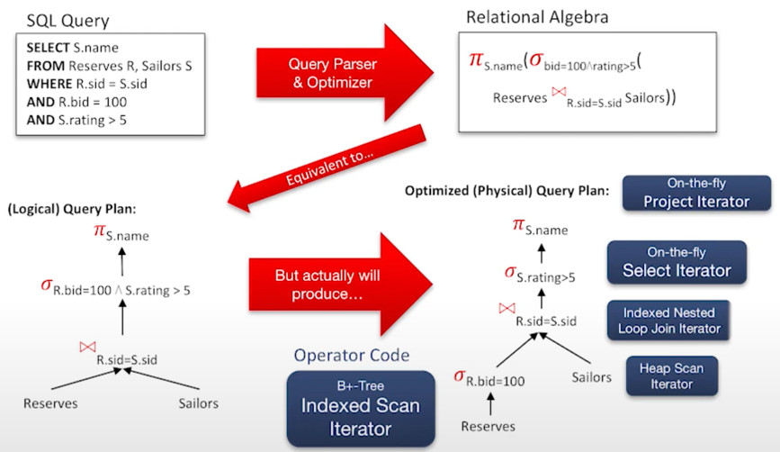

쿼리를 평가하기위한 operators.

- SQL과 관계대수의 차이점
  - 선언형인 SQL에 반해 관계대수는 Operational하다. 즉 어떤 오퍼레이션 순서로 진행할지 정한다.
- Codd가 초기 버전의 SQL과 관계대수를 연결해서 둘을 컴파일 할 수 있게 되었다. 

## 관계대수의 특징
- Closed: 결과가 곧 릴레이션의 인스턴스다.
- Typed: 인풋 스카마가 결과를 결정한다. 
- 기본적으로 집합의 성질을 가져서, 중복이 없다. 

### Unary Operator : Single relation
1. Projection: vertical
   - sql에서 select와 같다.
   - select a subset of column
   - 중복은 제거한다. 실 시스템에서는 자동으로 지우지 않는다. semantic side: 중복이 필요할 때가 있고, Performance side: 그들을 삭제하는 것에 비용을 소모할 수 없음.
2. Selection: horizontal
   - where  ~ 과 같다. 
   - 중복 제거 굳이 필요없다. 
3. Renaming: Rename attributes and relations

### Binary Operator: pairs of relations
1. Union
2. Set-difference
   - sql: except와 같다. 
3. Cross-product
   - 스키마 양립할 필요는 없다.
   - 중복도 만들어지지않는다.

### Compound Operator: macros
1. Intersection
2. Joins
   - theta
   - equi
   - natural join

