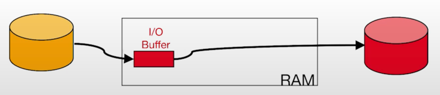
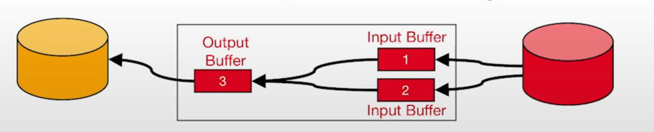
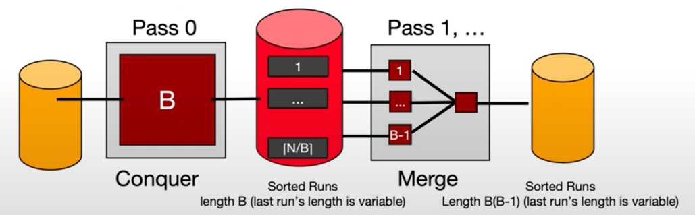
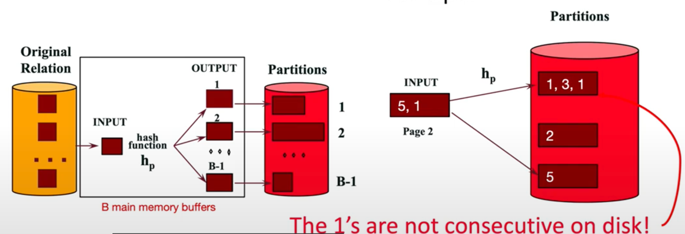
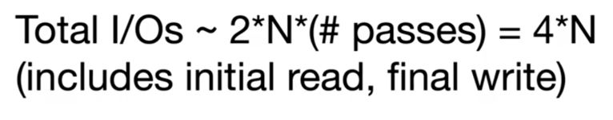

쿼리 프로세싱의 중요한 두 축: sort, hash
## Why sort를 배우는가
1. Rendezvous
   - 여러 튜플을 동시에 한 군데로 가져온다.
   - 중복을 제거하고, 그루핑을 하고, sort-merge를 한다. 
2. Ordering
   - output이 순서를 지켜야할 때가 있다. 
   - 트리 index 대량으로 가져오기위한 첫 걸음.
- 1G의 RAM에 100G의 데이터를 정렬하기
  - 가상 메모리로는 어렵다. 소팅 알고리듬 이해하기 어렵다. 알고리듬이 몹시 느려질 것이다. 
  - Single-pass streaming data through RAM
    - compute f(x) for each record, write out the result
    - map reduce의 map 과정과 비슷
    - input, output buffer 크기를 달리하여 스트리밍하게한다. 그렇지만 여러개의 인풋 버퍼나 여러개의 아웃풋 버퍼를 놓을 수는 없다.
    - 그래서 double buffering으로 개선한다. 두 개의 스레드를 만든다. 
    - 하나는 input이 비면 채우고 output이 차면 보내주는 일, 하나는 원래 싱글 버퍼링에서 하던 일을 한다. 
    - 이는 정렬 뿐 아니라 다른 작업들에도 적용이 가능하다. 
  - Divide and Conquer 알고리듬 두개가 있다 (out-of-core algorithm)

## Two-way sorting
1. Pass 0 (conquer a batch)

   - read a page, sort it, write it
   - only one buffer page is used
2. Pass 1,2,3...

   - requires 3 buffer pages
   - 2개의 input buffer, 그 중에 작은 것들부터 output buffer에 옮긴다.

## External Sort

만약 위의 사례보다 많은 buffer page가 있다면::
- N개의 페이지를 B개의 버퍼 페이지로 정렬하기 위해
  - Pass 0: use B buffer pages. 
  - Pass 1, 2... : merge B-1 runs at a time. 버퍼 페이지들 중 가장 작은 수를 output buffer에!
- Cost

  - 정렬하는데 얼마 걸리지 않는다. 
- Memory Requirement for External Sorting
  - 2개의 pass만으로 얼마나 큰 테이블을 정렬할 수 있는가? 
  - 최대 B^2

## External Hashing
sort의 대안. order 하고자 하기 보다는, 중복을 제거하거나 그룹을 형성할 때 사용

- 어떻게 메모리보다 큰 공간을 해싱할까? 
- Divide
  - 먼저 input buffer 를 hash 함수로 나누어서 파티션한다.
  - 
  - 이 때 원 페이지보다 파티션 페이지 수가 많을 수 있다. 
  - 또한 파티셔닝된 데이터가 연속적이지 않을 수 있다. 
- Conquer
  - Rehash해서, 연속적이지 않은 데이터를 차례대로 만든다. 
  - 다른 hash 함수를 이용한다(divide할 때랑 다름)
  - 각 파티션을 가져와서, 다시 hash한다. 이 때 중복되던 것들이 연속적으로 바뀐다. 
- Cost
  

- 2개의 pass만으로 얼마나 큰 테이블을 정렬할 수 있는가?
    - 최대 B^2, 해시 함수가 골고루 데이터를 분류한다는 가정 하에 가능

### Recursive Partitioning for External Hash
너무 테이블이 크면 여러번 파티셔닝해야한다. 

gender같은 너무도 많은 중복이 있다면 어떻게 재파티셔닝할까? 
이때는 인풋 데이터를 샘플링해서, 전체적인 데이터 흐름을 파악해서 더이상 파티셔닝하지 않는 방향으로 전개한다.

## Sort Hash Duality
sort, hash 간 성능 비교를 한다면? 

둘 다 4*N 

## Parallel hashing
우리가 메모리를 사용하는 방식으로 병렬처리한다. 
- Phrase 1: 데이터에 따라 적절한 컴퓨터에 전달한다.
  - 그 이후에는 우리가 위에서 배운대로 해싱한다. 
- 가지고 있는 컴퓨터 수만큼 빨리 처리한다.

## Parallel Sorting
해싱과 좀 다르게, 값 범위를 나누어서 컴퓨터에 전달한다.

그러나, 어떻게 각 범위별로 수가 같을 것을 확신하는가? 
- 예측치를 만들어서, 스플릿이 어떨지 예상한다.

## sort, hash 비교
- hash pros:
  - duplicate 제거 -> 스케일 하기에 좋다.
  - 병렬처리에서 더 쉽게 비슷한 수로 나눌 수 있다.
- sorting pros:
  - sort 하기에 좋다. 
  - duplicate, bad hash function에 민감하지않다.

