Query Optimizer는 각 Operator를 선택해서,
Operator는 iterator interface를 실행한다. 
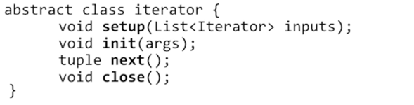

- heap scan 등에 적용 (이 경우 iterator는 없음)
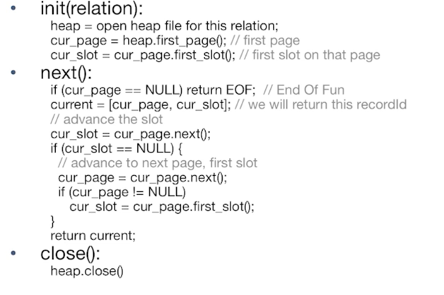

- sort -> blocking iterator
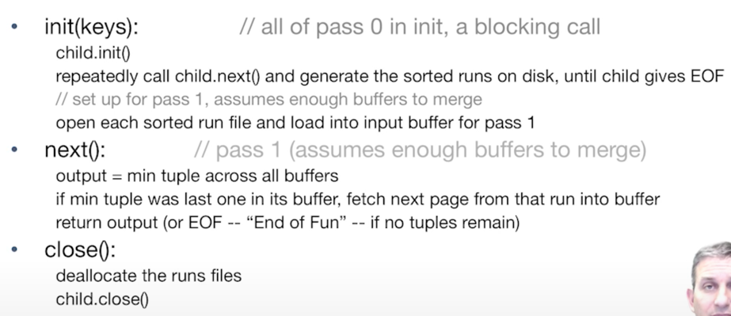

- 모든 input이 sorted 되었다는 가정 하에 Group by 를 진행
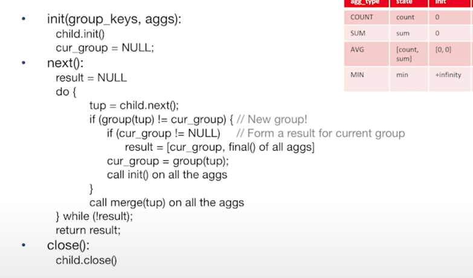

이러한 쿼리플랜은 single-threaded + little memory

## Join Iterator
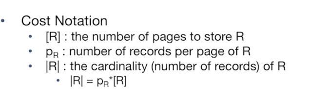

### Simple Nested Loops Join
foreach record r in R do
    foreach record s in S do

cost: 

- blocking으로 개선할수도, 다른 페이지를 로드하기 전에 !
  - for each rpage in R: 
    - for each spage in S :
      - for each rtuple
        - for each stuple
- 한번에 두개의 페이지를 로드해도 개선 가능. (block nested loop join)

- 그러나 이는 충분한 페이지가 있어야한다. 
### Index Nested Loops Join
- Equi-joins
- index가 있을 때 사용
- 기본적으로 R 스캔하고, R 카디날리티* S 튜플 찾는 비용이지만, 
- Alternatives & Clustering 여부에 따라 코스트가 달라진다.
  - 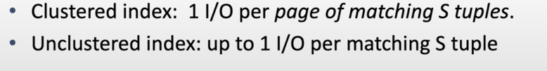
  - 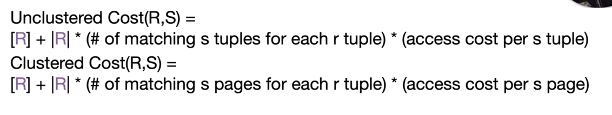
  - 
### Sort -Merge Join
- Equi-joins

- 먼저 각 테이블을 Sort를 하구
- Join ! 
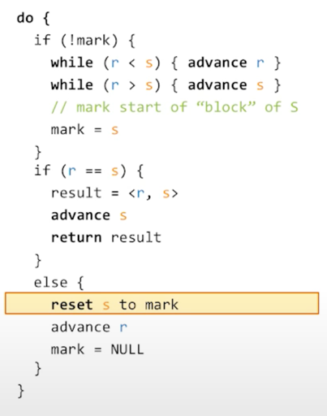
- cost? 
  - 먼저 R와 S를 정렬, 후 스캔을 한다. 
  - 최악의 경우는 모든 R & S의 Join value가 같을 경우! 그러면 모든 튜플*튜플이 나온다.
  - R과 S를 2 패스 내에 정렬하려면 버퍼가 얼마나 커야하는가? 
  - 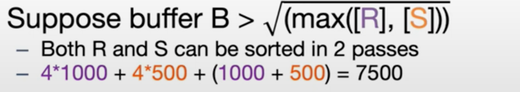
  - IO가 조금 덜 나오게 개선할 수도 있다. 
  - 

### Memory Hash Join
- Equi-joins

memory에 R 테이블이 꽉 차서 들어가고 S는 스트림한다고 가정.

버퍼는 인풋 버퍼와 아웃풋 버퍼를 제외하고! 

### Grace Hash Join
- 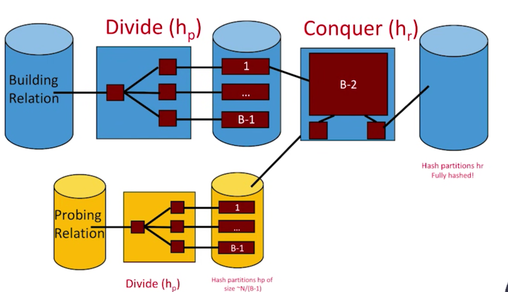
- R, S로부터 모든 튜플을 파티션하여 디스크에 넣는다. 이 때 서로 다른 디스크나 머신에 올려질 수 있다. 
- 각 파티션의 해시 테이블을 Build & probe, Build: R, Probe: S 
- 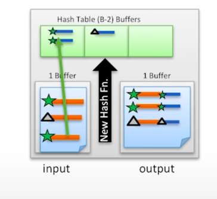

즉, 해시 함수로 파티셔닝을 한 뒤에, 그를 다시 확인해서 아웃풋을 만들어낸다. 
- 비용? : 파티셔닝할 때 두 릴레이션 모두 Read+write, matching 할 때 Read, so 3* (R PAGE + S PAGE)
- 메모리 요구사항: 파티셔닝할 때, R을 # Buffer -1로 나눈 값, 매칭할 때는, 파티셔닝한 값이 B-2보다 작아야하므로 R < b^2이다.
- S는 신경쓰지 않는데, 이는 스트리밍 하는 데에만 사용되기 때문이다. 그래서 S의 크기가 몹시 클 때 이 방법이 유용하다. 

### Naive vs Grace
Naive는 R이 그저 버퍼크기보다 작으면 되지만, Grace는 B^2보다 작으면 된다. 대신 cost가 더 많이 나간다.
둘을 합쳐볼 수도 있지만, 좀 까다롭다.

### Hash Join vs. Sort-Merge Join
- Sorting pros: 
  - 이미 인풋 값이 정렬되어있을 때 좋다. 
  - 혹은 아웃풋 값이 정렬되어있으면 좋다. 
  - 데이터 분배가 중요하지는 않다. 
- Hashing props: 
  - join을 위해, 더 작은 릴레이션 사이즈에 맞출 수 있다. 
  - 인풋이 이미 해싱되어있거나 아웃풋이 해시되어야할 때 필요하다. 

