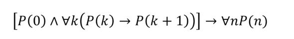

수학 증명 기법 중의 하나.
모든 자연수 n에 대하여, 어떤 명제 P(n)이 참임을 증명할 때 사용한다.

### 수학적 귀납법의 증명 방법.
- 기본 가정: 시작점 P(0)이 참임을 증명한다.
- 귀납 가정: 임의의 자연수 k에 대하여 P(k)가 참일 때, P(k+1)도 참일 것이라는 일반적인 가설을 세운다.
- 귀납 단계: 이 가설이 참임을 증명
- 결론: P(0)이 참이니 P(1), P(2)도 참이니 연쇄적으로 모두 참이 된다. 

이는 어쩌면, 신뢰의 문제일지도 모른다.

재귀함수 동작 방법과 상당히 비슷하다. 

- 종료 조건이 만족하면 값을 그냥 반환한다.
- 아닐 경우, 현 문제보다 하나 줄여서 자기 자신을 재귀적으로 호출하고,
- 그 모든 과정을 합쳐 답을 만들어낸다.

### 스스로 만든 공식 증명하기
프로그래머는 공식을 매번 검증해야하는가? 아니다.

그러나, 해야할 때가 있다.
스스로 만든 공식은 어떻게 검증할 것인가?
- 모든 가능한 데이터를 넣어서 테스트 해본다. 
- 혹은, 수학적 귀납법으로 증명을 한 뒤 사용한다.

#### 공식 증명 1: 홀수 합 구하기
P(1) = 1^2 (참)

P(k+1): k^2 + 2(k+1) - 1 = k^2 + 2k + 1 = (k+1)^2
#### 공식 증명 2: 멱집합의 원소수 구하기
P(0): 원소의 수가 2^0 = 1개인가? (참)

P(k+1): P(k)가 참이라 가정했을 때, 이도 참이어야한다.
>k+1개의 원소가 들어있는 집합을 T, 원소 하나를 뺀 집합을 S라고 가정했을 때,
S의 모든 부분 집합은 T의 부분 집합이 된다.

S의 멱집합 개수에, 원소 하나가 추가된 집합 수는 서로 동일하다.

그래서 기존 S의 부분집합 개수였던 2^k개 * 2개가 T의 부분집합 개수이므로, 2^(k+1)이 성립한다.

## 수학적 귀납법이 중요한 이유
재귀함수에서 사용하는 논리가 수학적 귀납법이고, 이 귀납법은 과학적 사고 방법을 익히는 데 필요하다.

즉, 
1) 과학적 사고 방법을 훈련할 수 있게 한다.
   - 패턴 분석 > 가설 성립 > 실제 증명
   - 연역적으로 확실히 증명할 수 있는 문제는 수학적 귀납법으로의 증명
   - 아닌 경우는 확률을 높여 객관성을 확보하는 과학적 사고 방법
2) 재귀 함수 설계에 도움을 준다.
   - 문제를 반복 가능한 작은 부분으로 쪼개는 훈련이 재귀함수를 설계하는 데 도움
   - 수학적 귀납법에서의 기본 가정은 재귀 함수의 종료 조건과 같다.

**수학적 귀납법은 사실 연역법의 한 종류다**

귀납은 많은 사례를 보고 거기서 공통 이론을 뽑아내는 것이다. 

수학적 귀납법에서 귀납은 가설을 세우는 정도에서만 사용된다.
(기존의 데이터를 관찰하고 어떤 공식이 맞을 것이라는 가설을 세운다)

증명을 할 땐, 오히려 앞 조건에서 참이라 증명된 명제를 차례대로 다음 조건에 연쇄 적용하니, 그건 오히려 연역이다.

## 재귀
### 피보나치 수열, 하노이의 탑 등 대표 문제가 있다.
재귀는 반복문으로도 가능. 
그러나 재귀 방식은 반복문과 완전히 동일하지는 않다. 

### 재귀로 풀 수 있는 다양한 문제, 다중 분기 재귀
재귀 함수로 성능 향상도 가능하다.
여태까지의 재귀 함수란, 그냥 문제를 잘개 쪼개 쉽게 풀 수 있는 크기로 만든 것이었다.
- 그러나, 어떤 재귀 방식은 성능 향상을 위해 사용한다. 
  - 이를 다중 분기 재귀라고 한다.

#### 다중 분기 재귀
영어로는 multi-branched recursion
문제 영역의 일부만 방문하는 것만으로 원하는 결과를 찾아낸다.
- 분할 정복 알고리즘의 영역
  - 단순히 재귀 때문이 아니라 멀티스레딩과 분산 덕분이기도 하다.

## 분할 정복
재귀와 어떤 관계가 있는지! 
n개의 숫자가 있는 곳에서 90이 있는지 확인하라는 문제가 있다고 하자.
처음부터 끝까지 검색한다고 하면, 운이 좋았을 때 한번에, 나쁘면 n개를 찾아보아야한다.

이 반복 횟수를 줄일 수는 없을까?

### 오름차순으로 정렬을 했을 때
조금 더 효율적일 수는 있지만 사실 시간 복잡도는 변하지 않는다. 

### 이진 탐색
정렬되어 있는 데이터 집단에서, 어떤 값을 찾을 때 유용
절반의 영역만 재귀적으로 탐색하면, 답을 찾을 수 있다.

> public static bool BinarySearchRecursive(int[] nums, int value, int min, int max){
>   if(min > max){
>       return false;
>   }
>   int mid = (min+max) / 2;
>   if(value == nums[mid]){
>       return true;
>   }
>   else if(value < nums[mid]){
>       return BinarySearchRecursive(nums, value, min, mid - 1);
>   }
>   else {
>       return BinarySearchRecursive(nums, value, mid+1, max);
>      }
> }

문제 영역을 여러 부분으로 나눈 뒤 한 부분씩 문제를 해결해 나가는 것을 반복하는 과정이 분할 정복 알고리듬이라고 한다.

### 분할 정복 알고리듬의 예: 최댓값 구하기
이진 탐색은 데이터 간의 관계를 이용해서 고려할 데이터 수를 줄이는 분할 정복 알고리듬이라면, 
하드웨어에 기대는 정복 알고리듬도 있다. 

최댓값을 구하기 위하여, 보통은 O(n)의 시간 복잡도를 가지는 코드를 짜곤한다.
배열 내의 요소를 다 나누어서 분할 처리를 한다고 생각을 해보자.

한명이 한다면 그것은 여전히 O(n)이다.
그런데, CPU의 코어가 여러개라면? 여러개의 배수만큼 빨라진다. (실제는 조율 시간 비용도 있기는 하지만)

그래픽 카드에도 코어가 매우 많다. 요즘 슈퍼 컴퓨터들은 그래픽 카드로 구성한다. 

여러개의 코어가 데이터를 동시에 처리하는 것을 병렬 알고리듬이라고 한다. 
우리가 배우는 알고리듬 지식은 여러 개의 cpu를 고려하지 않고 만들어진 게 보통이다. 

**그런데, 이는 데이터가 한 컴퓨터에 담을 수 있는 것보다 크지 않고 로직을 실행할 수 있는 주체가 여럿일 때 매우 유용하다.**

근데 엄청난 양의 데이터를 처리해야한다면? 
이건 빅데이터의 영역이고, 분산 시스템을 사용하여 분할 정복 알고리듬을 병렬적으로 돌려야한다.

### 분산 시스템이란? 
네트워크로 연결된 여러 개의 컴퓨터들이 큰 작업의 일부분을 처리.

즉, 내 컴퓨터의 코어가 아니라 다른 컴퓨터를 동원해서 분할 정복 알고리듬을 실행하는 방법이다.
- 당연히 컴퓨터의 수가 100개면, 이론상 처리 속도도 100배다.
- 역시 조율이 필요하고, 네트워크 통신 중 지연이 있어서 실제로는 그 정도 속도가 나오지는 않는다.

수억개의 문건에서 'hello' 수를 찾는다고 생각해봤을 때,
최상층에서는 분할해서 결과를 내고,
그 아래에서는 분할 후 재귀로 연산을 한다. 이것이 바로 mapReduce 모델이다.
- 이런 방법으로 대용량의 데이터를 처리하는 모델이다.
- 하둡이 대표적인 예다.

