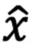
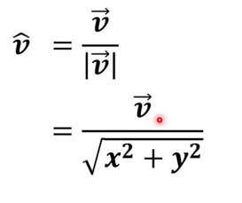
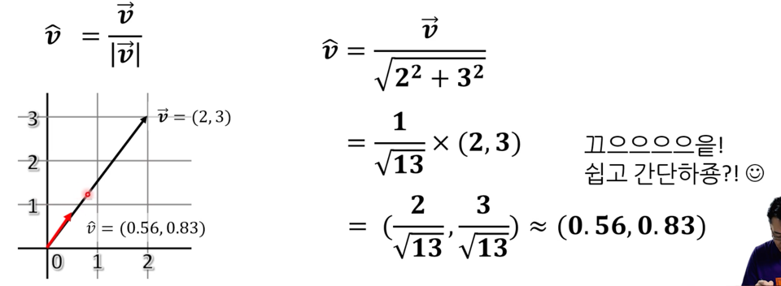
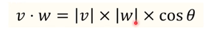
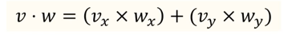
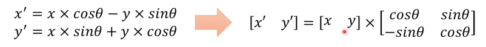

## 벡터
프로그래밍에서도 벡터의 개념을 많이 쓴다.
- 물리 및 수학에서보다는 확장되어있다.

### 벡터는 힘의 방향과 크기를 나타낸다.
속력은 화살표의 길이로 표현, 
방향은 화살표의 방향으로 표현한다.

### 프로그래밍에서 어떻게 벡터를 표현할 것인가.
크기와 방향. 근데 그냥 double로 자료 구조를 만들면 꽤 불편하다. 
정밀도가 좋지 않기 때문이다.

끝 점만 있으면 벡터를 그릴 수 있다. **성분 표기법**
성분은 영어로 component라고 한다. 

- 길이는 직각인 선을 수직으로 그으면 피타고라스의 정리를 통해 길이를 구할 수 있다.
- 삼각함수 이용하여 각도도 알 수 있다.(역탄젠트)
- 벡터는 사분면 어디에든 존재한다.
- 벡터는 여러 개의 성분으로 구성된 자료 (3차원 표현 위해 3개가 될 수도 있고, 4차원 표현 위해 4개가 될 수도 있다.)

### 성분 표기법을 사용하면 계산이 왜 편할까?
- 벡터의 속력을 2배 빠르게 만들려면? 
- 화살표를 두배로 길게 만들면 된다.

**벡터로 방향만 나타내고 길이를 동일하게하며 필요시 스칼라값만 바꿔줄수도 있다.**
- 그를 단위벡터라고 한다.
- 단위벡터는  로 표시한다.
- cm, km의 단위같은 것이다.

**특정 벡터로부터 단위 벡터를 구할 수도 있다.**
- 어떤 벡터에서 크기를 빼고 방향만 표현하고 싶다면 그 벡터를 단위 벡터로 만들면 된다.
- 사실 벡터를 벡터의 길이로 나누면 단위 벡터가 나온다. 

## 벡터의 덧셈
그냥 각 성분끼리 더하면 된다.
- 전제: 두 개의 벡터가 부딪혔을 때의 방향과 속도

## 벡터의 뺄셈
빼는 벡터를 뒤집는다. (성분에 -1을 곱한다)
그리고 더하면 된다.

### 2d/3d 공간에서의 연산도 편히 할 수 있다.
- 내적: 벡터의 곱셈 중 하나. 점 곱이라고도 한다 (dot product)
  - 
  - 
  - 둘은 같다. 
  - 벡터 성분을 이용하면 세타 없이도 내적을 구할 수 있다.
  - 이는 두 벡터 사이의 각도를 구할 때 사용한다. 
    - 이 각도에 따라 같은 방향을 가리키는지, 직각인지 등을 알 수 있다. 
    - 두 벡터 모두 단위 벡터면, 내적 값이 곧 코사인. 코사인 값을 이용하면 대략적으로 두 벡터 간의 관계를 알 수 있다.
  - 내적의 값이 0이면 두 벡터는 직각
  - 1이면 두 벡터는 평행이다.

## 벡터가 프로그래밍에 필요한 이유
지금까지의 나온 벡터는 방향 벡터다.
그러나, 벡터는 방향 외의 것도 저장이 가능하다. 즉, 벡터란 여러개의 성분으로 구성된 <**자료구조**>다.

- 그래서 벡터란, 한 개체의 특성을 담고 있는 정보라 할 수 있다. 
  - 마치 적성검사처럼 각 점수를 (3,44, 34,...)로 표현해볼 수도 있겠다.
  - 이를 엄밀하게 말하면 튜플이라고도 한다. -> 다양한 데이터를 N개 모아놓은 것.
  
### 튜플 vs 벡터
매우 비슷한 의미를 가진다
벡터는 성분의 데이터 형이 모두 같은 것이 보통,
튜플은 성분의 데이터 형이 다를 수 있다.

- 튜플과 벡터는 집합과는 다르다!
  - 성분의 순서가 중요하다.

근데, 왜 벡터로 저장하는지?
- 벡터로 저장한다는 것은 데이터를 정형화된 형태로 저장한다는 의미다.
- 그래서, 일단 정형화된 벡터가 있으면 연산이 쉽다.

## 행렬
벡터는 한 줄로 데이터를 저장했다면, 행렬은 여러줄로 저장한 것이다.

### 행렬을 말할 때는 행 수 먼저 언급.
M개의 행과 N개의 열을 가진 행렬은 M x N 행렬
- 이차원 배열과 비슷하다.

### 사실 벡터도 행렬이다. 
M이 1이면 행 행렬, 행 벡터라고도 부른다. 
N이 1이면 열 행렬, 열 벡터라고 부른다. 
- 프로그래밍에서는 위 둘을 각각 행 벡터, 열 벡터라고 부른다. 

### 그럼 벡터 연산을 행렬에도 적용 가능한가?
어떤 것은 가능. 어떤 것은 불가능
- 행렬 x 스칼라는 가능
- 행렬 + 행렬 가능
  - 두 행렬의 행 수나 열 수가 다르면 덧셈 불가 (이는 벡터도 동일)

### 전치 행렬
행과 열을 교환해서 얻는 행렬
- 행렬 A의 전치 행렬은 A^T라고 표기.

### 벡터 x 행렬
- 내적을 구하는 것과 비슷하다. 
- ex. 각 부서에서 가중치를 두어서 적성을 평가하는 것
- 행렬 x 벡터 = 벡터 X 행렬^T
- 수학은 전통적으로 행렬 x 벡터를 쓴다.
- 프로그래밍은 반반으로 갈린다. 
  - 그런데 좌 -> 우로 곱하는 것이 메모리의 구조를 이해하는 데 좋다.

### 단위 행렬
- I로 표기. 
- 행 번호, 열 번호가 동일한 요소의 값이 1 나머지는 0

### 회전 행렬
- 공간 상에서, 어떤 x, y 에 대해 곱하여 회전 시킨다.

### 행렬 x 행렬
- (벡터 x 행렬) x 행렬, 벡터 x (행렬 x 행렬)일 때, 
- 벡터 수가 많다면 벡터 x (행렬x행렬)이 연산이 빠르다.
- 