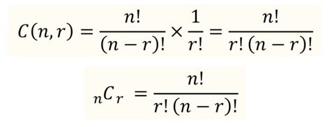

### 조합론
물건들을 여러 형태로 그룹 짓는 방법을 연구하는 학문.
프로그래밍에서 많이 쓰인다. 

## 경우의 수
어떤 시도를 통해 일어날 수 있는 사건의 가짓수.

### 곱의 법칙
어떤 절차를 2개의 일로 나누어 수행할 수 있다.
첫 번째 일을 할 수 있는 방법은 n1, 두번째 일을 할 수 있는 방법은 n2.
두번째 일은 첫번째 일이 끝나야만 할 수 있다.
- 그러면, 그 절차를 수행하는 방법의 가짓수는 n1 x n2

다중 프로그래밍의 다중 for문과 같다. 

### 합의 법칙
어떤 2개의 일이 있는데,
첫번째 일과 두번째 일은 연결해서 일어날 수 없다.
첫번째 일 아니면 두번째 일만 일어남.
- 이 때, 두 경우 가짓수를 합친다.

프로그래밍의 for 문 여러개와 같다.

### 포함-배제 원리
첫번째, 두번째 일을 더했는데 겹치는 경우가 있을 때, 이를 합한 것에서 뺄 것.
합집합의 개념과 비슷하다고 보면 된다.

### tree 이용하기
트리구조를 이용할 때 경우의 수를 더 쉽게 구해볼 수도 있다. 

동전 던질 때, 같은 면이 두 번 연속해서 나오지 않는 경우를 생각해본다 할 때,
자식 노드를 같은 것으로 만들지 않으면 된다.

조건문의 분기처리를 하는 것 -> 결정트리라고도 한다.

### 순열과 조합

프로그래밍을 하며 순열과 조합은 당연히 알아야 하는 것.

n개의 물체 중 r개를 뽑을 때, 경우의 수를 의미.
유일한 차이는 순서를 따지냐 안 따지냐다.

#### 순열: 순서를 따짐
- 프로그래밍에서 배열 같은 것.
- (2,1,4) , (2,4,1)은 다르다!
- 곱의 법칙

#### 조합: 순서를 안 따짐
- 수학에서 집합 같은 것
- 순열에서 중복을 뺀 것과 같다.
  - 중복을 뺀다는 것은 -> 선택지 수로 나눠주는 것.

- 나만의 규칙을 만들어내어 문제를 풀 수 있다.

