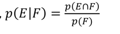
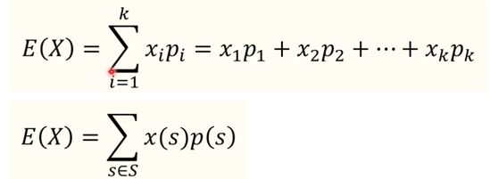
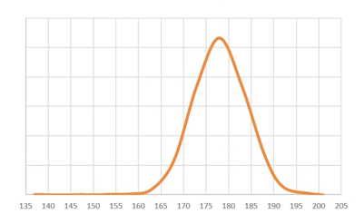
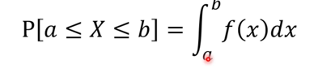
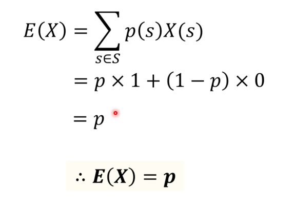
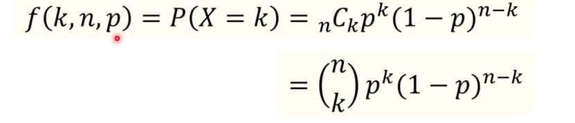
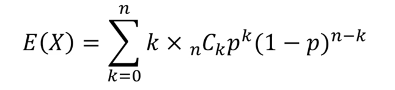
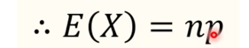

어떤 사건이 일어나는 경우 / 전체 사건의 경우

이 확률에 기반하여 테스트 및 디버깅의 우선순위를 결정하기도 한다.

그런데, 확률을 명백히 판단할 수 없는 경우도 존재한다.
ex. 몬티 홀 문제.

### 조건부 확률
어떤 사건 F가 발생했을 때, 그런 상황 하에서 사건 E가 일어날 확률.
ex. 동전 연속으로 던지기

### 독립 사건
조건부 확률에서 F가 E에 영향을 미치지 않는 경우
p(E|F) = p(E) ->  p(E)p(F) = p(E, F의 교집합)

독립 사건의 의의
어떤 조건 F하의 사건 E의 확률을 구하는 건 복잡하지만, 독립 사건에는 F가 E에 전혀 영향을 미치지 않아서 최적화가 가능.

### 기댓값
기댓값은 어떤 실험을 무한히 했을 때, 나올 수 있다고 믿는 값을 말한다.
보통 평균을 기댓값이라 한다.

그런데, 수치화할 수 없는 문제(ex. 동전 던지기)를 수치화하는 것 : 확률 변수
이름은 변수지만, 하는 행동은 함수.

### 확률 변수의 예: 두개의 동전 던지기
- 확률 변수 X = 앞면이 나오는 횟수
두 개의 동전을 던졌을 때 나올 수 있는 모든 경우의 수를 보면, 

P(X=0) 
x는 앞면의 개수라고 정의.

### 기댓값 공식

## 확률 분포
- 이미 아는 내용: 표본 공간에 있는 각 사건들이 일어날 확률의 합은 1이다.
그러면, 각 사건이 일어날 확률은 어떻게 분포가 되어 있을까?

종류를 두가지로 나눌 수 있는데, 
- 크게 이산 확률 분포와 연속 확률 분포로 나뉜다.

### 이산 분포
- 확률 분포가 띄엄띄엄 떨어져 있는 것이다.
- 확률 변수 X가 취할 수 있는 값이 유한개인 분포다.
- 대표적인 예: 동전 두 개를 던질 때, 주사위 두 개를 던질 때 등!

모든 사건의 확률이 모두 같은 이산 확률 분포는 이산 균등 분포라고 한다. 
> 보통 컴퓨터 공학에서 난수라고 하는 게 바로 이것이다.

#### 확률 질량 함수
확률 변수가 어떤 값을 가질 확률을 이산 확률 분포에서 확률 질량 함수라고 말한다.
- 영어로는 probability mass function

### 연속 확률 분포

실제 사람의 키를 올바르게 잴 수 있다면, 특정 구간 안의 모든 실수값을 가질 것이다.
따라서, 이는 연속 확률 분포를 이룬다고 할 수 있다.

#### 연속 확률 분포의 기댓값
이산확률 분포처럼 계산할 수는 없다. 
대신 확률분포에서 모든 확률을 더하면 1
그 안의 면적을 구하는 방법은 적분

연속 확률 분포에서 확률 변수 X가 a <= X <= b

그 범위 안에서 모든 확률의 합
이를 확률 밀도 함수라고 한다.

### 컴퓨터 공학에서 사용하는 확률 분포는 주로 이산 확률 분포다.

### 베르누이 시행
간단한 확률분포의 시작점.
- 이산 확률분포의 한 종류
- 어떤 시험이 오직 이분법적으로만 볼 수 있을 때의 확률 분포

- 확률 변수 X가 각 값을 취할 때의 확률
  - P(X = 1) = p
  - P(X= 0) = 1-p
#### 베르누이 시행 기댓값

### 이항 분포 (binomial distribution)
- 베르누이의 시행을 여러번 실행하는 것 (베르누이의 시행: 결과가 예/아니오인 실험을 단 1회만 하는 것)
- 거기서 몇 번 성공하는지에 대한 확률 분포.

#### 이항분포의 확률 변수: N번 시도에서 확률 p인 결과가 나오는 횟수를 표현.
n번의 시도에서 k번 성공할 확률

#### 이항분포의 기댓값

이를 다 계산하면 

라는 결론이 나온다.

이 이항분포의 실험횟수 증가가 될수록 연속확률 분포에 가까워진다.

### 확률을 이용한 알고리듬
대부분의 알고리듬은 결정적 알고리듬이다. (deterministic)
항상 확실한 결과가 나온다.

데이터가 많을 때, 이 결정적 알고리듬이 느리다.
그런데, 확실한 답을 하염없이 기다리는 것이 맞을까?
맞을 가능성이 높은 답이면 충분할 때도 있지 않을까?

그래서 확률적 알고리듬이라는 것이 있다.
이는 무작위 알고리듬이라고도 한다. 실행 중에 난수를 뽑아 다음 과정을 결정한다.

크게 **라스 베가스 알고리듬**과 **몬테 카를로 알고리듬**이 있다.

최근 들어 이는 관심이 높아진다. 양자 컴퓨터의 알고리듬은 기본적으로 무작위 알고리듬이기 때문이다.
특히 머신러닝과 딥러닝에서 몬테 카를로 알고리듬을 많이 쓴다.

속도 향상이 가능하다.
무작위로 사건 하나를 뽑아 진행하므로, 입력 데이터가 같아도 실행 때마다 실행 시간이 달라질 수 있다.

### 라스베가스 vs 몬테카를로
- 라스베가스
  - 언제나 올바른 결과를 찾는다.
  - 결정적 알고리듬만큼 오랜 시간이 걸릴 가능성이 약간이나마 존재
  - 무작위 퀵 정렬
- 몬테카를로 알고리듬
  - 언제나 결과를 찾기는 한다.
  - 하지만 결과가 틀릴 확률이 어느 정도 있다. 
  - 그런데 얼마나 틀린지 알려준다.

