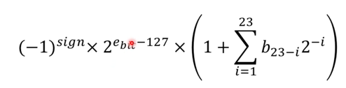
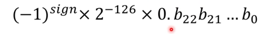

## 실수 = 유리수 + 무리수

## 정수의 이진법 표기
계속 양쪽에 2를 곱해서 2진법으로 실수를 표기하게끔 처리

그러나, 계속 무한 반복될 수 있다.
정확히 2진수로 표현 못하는 실수가 있는 것이다. 

이를 극복할 두 가지 방법
- 고정 소수점 수
- 부동 소수점 수

## 고정 소수점 수
정수 표현을 실수에 적용(확장)
몇자리까지는 정수로, 그 아래에는 소수로 표현. 
ex. 4비트는 정수 3비트는 소수면
Q4.3으로 표현

- 이는 표현할 수 있는 범위의 값은 확실히 표현 가능.
- CPU에서 실수 계산을 해주는 전담 장치가 없었기에 이를 직접 구현해서 쓰는 경우가 많았다.
- 오차가 없어야할 경우 적합.

단점은,
- 표현 가능한 수의 범위가 작아진다.
- CPU가 고정 소수점 수를 지원하지않는다.

- 연산 뒤 정밀도 손실, 오버플로 발생 가능.

## 부동 소수점 수
이걸 잘 알아야한다.
floating-point number

어디든 소수점이 이동한다.
실제 유효한 숫자는 같으나, 소수점을 움직이는 것으로 표현 가능한 범위가 엄청 늘어난다.
그래서 정밀도를 희생한다.

### 장점
- 표현 가능한 범위가 넓다
- CPU에서 표준을 다 지원

### 단점
- 돈 관련 프로그램에 쓰기 부적합.
- 그러나 대부분의 경우에는 적합

### 어떻게 구현되어있는지?
그 전에, 과학적 표기법을 알아야한다.
너무 크거나 작을 때, 가수와 지수로 n승을 만들어 정리.
ex. 4 * 10^19

- 유효 숫자란: significant digits -> 수 정확도, 정밀도에 영향을 주는 숫자 

### 정확도와 정밀도
같은 행위를 동일한 횟수로 반복해서 얻은 데이터의 패턴을 설명한다. 
- 정확도
  - 참 값에 얼마나 근접했는가
- 정밀도
  - 데이터들이 얼마나 밀접해있는가.

### 정규화한 과학적 표기법
정규화? 다양한 스케일의 값을 동일한 스케일, 동일한 규격으로 맞게 맞추는 것

- 가수의 제일 왼쪽에 있는 유효숫자를 정수부의 첫번째 자리로 이동
  - 3234553* 10^2를 3.234553 * 10^8로 표현하는 것

### 32비트 부동 소수점(IEEE 754)
- 부호 비트: 1비트, 0이면 양수, 1이면 음수
- 지수비트: 8비트. 음/양수 표현 가능. 실제 나온 값에서 -127을 해야한다.
  - 그 이유는 음수 표현을 위하여.
- 가수비트: 23비트
  - 가수의 정수부는 언제나 1이고, 가수비트는 소수점부터. 
  - 1.b22b21b20 * 2^e...b: 가수, e: 지수

### 지수는 -126에서 125까지의 값을 가진다.
모든 비트가 0이거나 1일 때 예외 상황이 발생하기 때문
-127과 128은 따로 표현한다.

- 이 공식으로는 0이 안나온다. 

0에 가까운 수를 표현하기위해, 혹은 무한대의 수를 표현하고자 해서.

- 그래서 새로운 공식을 사용
- 이 경우에는 0을 표현 가능.
- 
비트패턴이 다 0이면 최종 0을 만들수있다.
- 이 공식을 비정규화 수에 쓸 수 있다. 
  - 정규화 안된 수. 지수비트가 0이지만, 가수비트가 0이 아닐 때 절대값이 엄청 작은 숫자를 표현하기위해 사용
  
  - 위와 다른 케이스:: 지수값 128일때
    - 지수비트가 0xff + 가수비트 0x00 -> 지수값 128
      - 무한대
    - 지수비트가 0xff + 가수비트 0x00이 아닐때 -> 지수값 128
      - 수가 아니다.

### 32비트 부동 소수점의 예
1. 3.75
- 10 -> 2진수 변환 (11.11이 되는데)
- 이를 정규화하면 1.1111 * 2^1

- 이를 다시 10진수로 돌리면
- 지수는 128 - 127
- 가수는 

2. 3.14
- 10 -> 2진수 변환
- 유실되는 데이터가 있다.
- 다시 10진수로 돌아오면 더 큰 수가 등장한다.

- 실수는 무한대지만 갯수가 정해진 비트로 표현하다보니 근사치로 나올 수밖에 없다.

### 부동 소수점의 정밀도
6-9자리의 유효숫자를 보장한다. 
어떤 경우에는 6자리, 어떤 경우에는 9자리 보장
숫자 자체를 반올림해서 자릿수를 맞추어야한다.

정밀도 6: 10진수 실수 float에 저장했다가, 다시 그걸 10진수 실수로 변환한 뒤, 원래 10진수 수의 자리를 6자리로 맞추면 다시 그 수가 나온다.

### 정밀도의 중요성
- 돈 관련 업계에서 float은 좋지않다.

## 부동 소수점 9자리
- 서로 다른 두 수가 정말 다르다는 것을 알려면, 최대 9번째 유효숫자까지 확인해야한다. 

## 자료형 변환
- 32비트 정수를 부동 소수점으로 바꾸면 정밀도 손실 있다. 
  - 32비트 부동 소수점의 가수(24비트)로는 32비트 표현 불가

### 부동 소수점 비교
- 부동 소수점은 근사치로 실수를 표현하기 때문에, 동치 연산자를 쓰면 안된다.
  - 대신 엄청나게 작은 양수인 epsilon 비교
  - Math.Abs(num - num2) <= Single.Epsilon

### 64비트 부동 소수점

- 32비트 정수에서 64비트 부동 소수점으로 바꿀 때, 정밀도 손실이 없다. 
- 지수 11비트, 가수 52비트 -> 더 촘촘

### 16비트 부동 소수점
- 색을 빠르게 그려야할 때 사용. 유효 숫자가 3자리로 충분

### 32와 64비트 비교
- CPU는 32, 64만 지원
  - 32비트 계산이 더 빠르다. 64비트가 크기가 두배.
  - CPU 캐시를 더 사용. 그래서 더 느리다.
  - 높은 정밀도 필요시 64비트 쓴다. 
  - 더 빠른 속도를 위해 16비트를 쓰는 경우(GPU)
  
### 부동 소수점 수의 사칙연산
작은 쪽 지수를 큰 쪽 지수와 동일하게 만들고 사칙연산 (덧셈, 뺄셈)

1. 가수끼리 곱하고
2. 지수끼리 더해서 
3. 결과를 정규화한다. (곱셈)

나눗셈도 같다.

