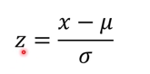
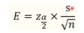

## 정규분포의 확률 밀도 함수
정규분포로 확률 밀도를 표현한다면, 
아웃라이어는 눈에 띄지않는다. 

또한 데이터의 노이즈를 제거하기가 좋다.

(상대평가를 한다고 가정할 때)이는 적분으로 비율을 따져볼 수 있는데, 매번 그렇게할 수 없으니 정규분포를 이용한다.
 
그 중에서도, 표준 정규분포를 이용한다. 
정규 분포는 조금 언어가 잘못되었다. 

정규분포는 평균과 표준 편차에 의해 결정된다. 
이 평균과 표준 편차 값에 상관없이 그래프를 정규화하면 1%의 위치를 딱 알 수 있을 것이다.

## 표준 정규분포
평균과 표준편차를 정규화한 것이다.
- 표준 편차를 1, 평균을 0으로 한다.

개별 값에서 평균을 빼면, 새로운 평균은 0이된다. 

표준 편차를 정규화하기 위해서는, 
평균을 뺀 값을 표준편차로 나누면 된다. 
이를 z-score라고 한다.

개별값이 평균에서 얼마나 떨어져 있느냐를 알려준다. 
1만큼, 2만큼 떨어져있는지를 표현

z값이 같아도 분포들마다 의미는 다르다. 

## 68-95-99.7 규칙
- z값이 1 표준편차라고 했을 때, 68%다.
- 2면 95%
- 3이면 99.7%다

이는 3 표준 편차 이상 떨어져있는 개별값은 흔하지 않다. 
이것이 나오게 되면 뭔가 문제가 있다고 판단한다. 

이러한 수치는 적분 결과로 나온다. 
이것을 표준 정규 테이블이라 한다.

## 대단위 통계
표본 조사를 해야하는 경우: 너무 많은 종류를 조사해야할 때, 전체를 정의하기 애매할 경우

**-> 이 경우 일부만 조사한 뒤 그 결과를 토대로 전체를 조사할 때 결과를 추측하는 경우가 많다.** 

- 모집단: 통계를 통하여 알고자 하는 전체 대상
- 표본 집단: 전체 대상에서 특정한 기준에 따라 선별한 대상

- 모평균과 표본 평균은 다르다!
- 표본 집단 수를 늘려도 어느정도는 다르다.
- 그래서 학자들이 새로운 방식을 제시한다. 
  - 모집단의 통계가 있을 것 같은 구간을 정하는 것이다.

## 구간 추정
구간이 넓어질수록 맞출 확률이 오르지만 정밀도는 하락하고, 구간이 좁아질수록 정확도가 떨어지지만 정밀도는 증가한다. 
- 이는 정확히 어떤 값을 예측하고 그 값이 맞을 확률을 구하는 게 아니다. 

이러한 구간과 존재할 확률을 각각 신뢰구간과 신뢰도라한다.

- 신뢰구간: 모집단의 통계가 있다고 추정하는 구간.
- 신뢰도: 모집단의 통계가 신뢰구간 어딘가에 존재할 확률
- 보통 90, 95, 99 중 하나를 사용한다. 

신뢰도가 높다는 건 신뢰 구간이 넓어진다는 의미다. 
신뢰 구간이 넓어짐으로써 모집단의 통계가 신뢰 구간 안에 있을 확률은 오르나, 정밀도는 떨어진다. 

즉, 신뢰도가 높아질수록 정밀도는 떨어진다.

## 신뢰 구간과 오차 범위

오차 범위를 구하는 공식

- 표본 수가 증가할수록 오차 범위가 줄어든다. 
### 신뢰 구간 구하기
표본 평균에 오차범위를 더하고 빼면 끝.

