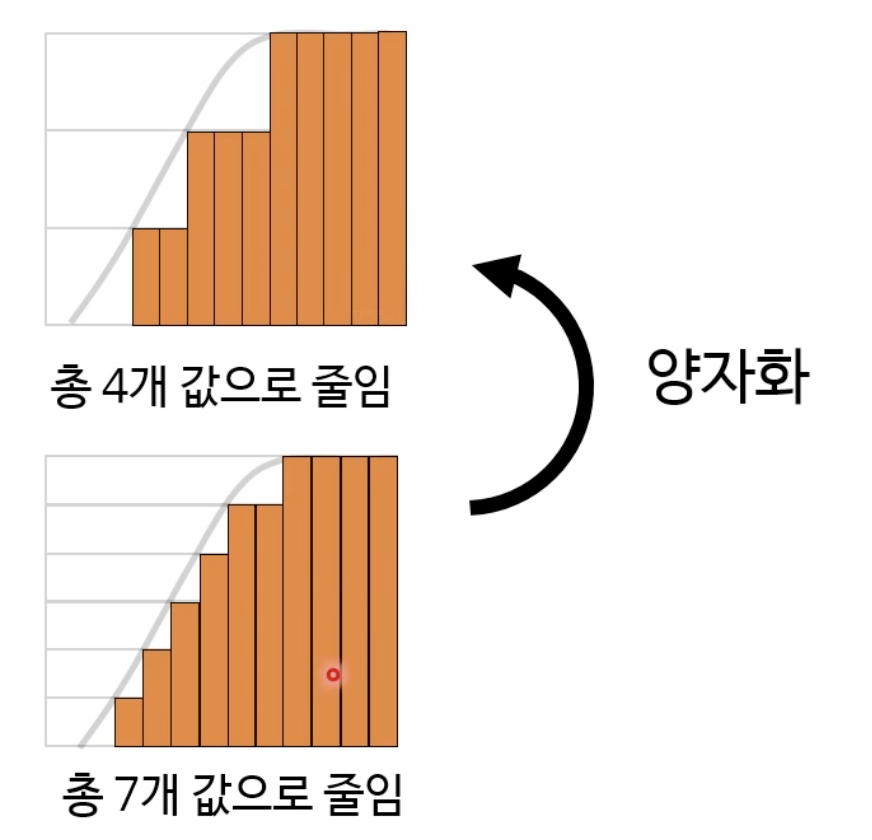
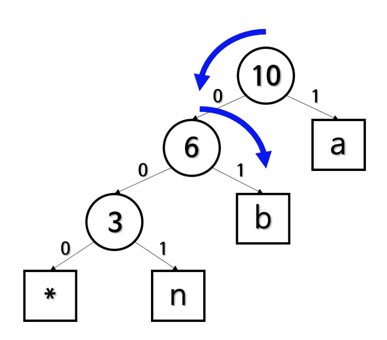
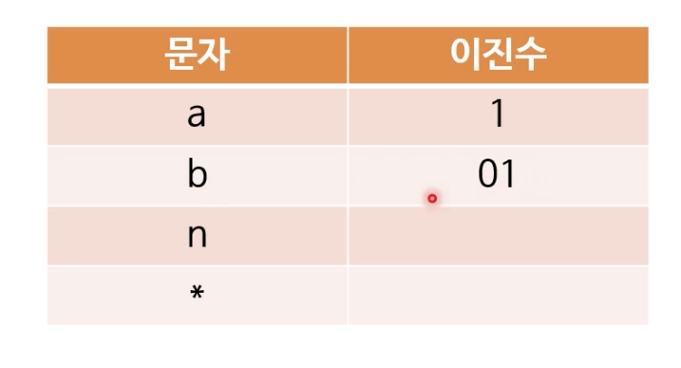

일종의 테크닉이다.

특별한 속성을 가진 복잡한 문제를 푸는 방법이다.
복잡한 문제를 그보다 단순한 하위문제로 나누어서 풀게된다.

- 재귀적!
- 가장 단순한 문제 +1은 그 다음으로 단순한 문제다. 이걸 반복하면 원래의 복잡한 문제까지 해결한다.

### 배낭 문제

- 크기와 가격이 다른 여러 물품이 있는데
- 값아치가 최대가 되도록 구성해야하는데,
- 주먹구구식으로 풀 경우 모든 경우의 수를 따져봐야한다.
- 물품 하나가 추가될 때마다 경우의 수가 두배씩 뛴다. O(2^n)

재귀함수에서, 중복을 제거한다. 기록을 해서!
그것이 메모이제이션

## memoization

- 계산 결과를 캐시에 저장해둔 뒤, 나중에 재사용하는 기법
- 보통 함수가 매개변수에 따라 반환하는 값을 캐싱하는 것을 지칭한다.

```java
public static int fibonacciRecursive(int number, int[] cache) {
    if(number <=1){
        return number;
    }

    if(cache[number]!=0){
        return cache[number];
    }

    int ret = fibonacciRecursive(number - 2, cache) +fibonacciRecursive(number - 1, cache)

    cache[number] = ret;
    return ret;
}
```

이 메모이제이션을 동적 계획법에서 사용하기도 한다. 다른 곳에서도 메모이제이션을 사용한다.

### top-down 동적 계획법

- 최종적으로 풀려하는 복잡한 문제에서 시작
- 필요에 따라 재귀적으로 하위 문제를 푼다. 두번 이상 평가하는 문제는 캐시 덕분에 계산을 생략한다.
- 기존의 재귀 함수를 크게 변경하지 않아도 된다는 장점이 있다. 그냥 캐시 로직을 추가할 뿐이다.

### 아래에서 위로 푸는 tabulation

```java
public static int fibonacci(int num) {
    int[] arr = new int[num + 1];

    arr[0] = 0;
    arr[1] = 1;

    for(int i = 2; i <= num; i++){
        arr[i] = arr[i-2] + arr[i-1];
    }
    return arr[num];
}
```

- 가장 작은 문제부터 시작한다.
- 순서대로 그보다 하나 더 큰 문제를 풀어나간다. 필요하지 않은 하위 문제도 평가할 수 있다. 그래서, 문제를 잘 분석해서 최적의 순서를 찾아야한다.
- 그럼에도, top-down 방식보다 보통 더 빠르다. cpu 캐시에 좀 더 친화적이고, 재귀 함수 호출을 피할 수 있기 때문이다.
- 이런 속도 향상은 메모리를 더 사용하게된다.

## 동적 계획법으로 푸는 배낭 문제

작은 배낭에서부터 해법을 찾아간다.

1. 우선 그리드를 만든다. 쉽게 말하면 표를 만든다! (모든 동적 계획법 알고리듬은 그리드로 시작한다.)
2. 칸마다 값을 비교한다.
3. 새로운 물품이 있으면 이전 행과 비교하여 현재 물품 추가 전의 최댓값과, 현재 물품의 값 + 남은 공간에 넣을 수 있던 최댓값을 더한 값을 서로 비교한다.

### 동적계획법을 적용할 수 있는 문제의 특징

1. 최적 부분 구조: 하위 문제의 최적 해법으로부터 큰 문제의 최적 해법을 구할 수 있다. 강화 학습에서 흔히 등장하는 벨만 방정식도 이에 기초한다.
2. 하위 문제의 반복: 피보나치 수열처럼, 하위 부분을 또 계산하고 계산하고..

### 분할 정복 vs 동적 계획법

둘 다 큰 문제를 하위 문제로 나누어 하위 문제의 최적해법을 합친다.

그러나 분할 정복의 경우 하위 문제가 반복되지 않고, 동적 계획법은 하위 문제가 반복된다.

### 동적 계획법으로 문제를 푸는 과정

1. 문제에 동적 계획법을 사용할 수 있는지 판단
2. 어떤 상태와 매개변수를 전달할지 결정
3. 상태 간의 관계를 정립하고
4. 종료 조건을 결정한다.
5. 메모이제이션 혹은 타뷸레이션을 추가한다.

2,3,4 는 재귀함수 구성과 마찬가지다.

1번이 제일 어려운 부분이다.

할 수 있는 것은 동적 계획법 문제를 최대한 많이 풀어보아야한다.

- 어떤 제약 하에 어떤 값을 최적화한다거나, 재귀함수에 동일한 매개변수가 반복적으로 전달되는 경우 동적 계획법일 가능성이 높다.
- 그리드를 만들려 해볼 것 !

예시: 최단 경로 찾기, 최장 공통부분 문자열, 와일드카드 패턴 매칭, 부분집합 합, 레벤슈타인 거리, 연속 행렬 곱셈 등...

---

## 그리디 알고리듬

알고리듬 기법 중 하나. 굉장히 많이 사용한다.

그 순간 최적의 해법을 찾는 방법이다.
최종적으로 최적 해법이 안 나올 수가 잇다. 그러나 빠른 의사 결정이 가능하고 충분히 괜찮은 해법이다.

- 근사 알고리듬이다.

탐욕의 기준에 따라 여러가지 해법이 있다.

- 최종적으로 최적인 해법을 못 찾을 수도 있지만, 충분히 훌륭한 결정을 빨리 내릴 수 있다. -> 보통 랜덤하게 선택하는 것보다 낫다.

1. 정렬하고 O(n log n)
2. 순서대로 훑기 때문에 O(n)

시간 복잡도는 O(nlogn)이다.

그래서 빠르다.

### 쪼갤 수 있는 배낭문제인 경우

그리디 알고리듬이 최적의 해법을 찾는다.

### 그리디 알고리듬을 사용하기 적합한 경우

- 제대로 된 해법을 구하는 알고리듬의 복잡도가 너무 높은 경우
- 적당히 좋은 해법도 상관없는 경우
- 동적 계획법을 사용할 수 없는 경우

어떤 경우에는 최적의 해법을 주기도 하기 때문에 사용한다.

한 번 내린 결정은 다시 돌아보지 않는다. 과거의 선택은 현 선택에 영향을 미치지만 미래의 선택은 현재 선택에 영향을 미치지 않는다.

### 사용례

- 최소/최대화 문제
- 여러 그리디 선택이 가능하면 모두 시도 혹은 반례를 통해 제거할 것
- 정렬을 해야 속도가 빨라질 수도 있다.

### 생활에 도움되는 그리디 알고리듬: 동전 교환 문제

#### 의사코드

1. 동전 배열을 내림차순으로 정렬
2. 가액이 잔액 이하인 가장 큰 동전을 결과에 추가
3. 잔액에서 그 동전 가액을 뺌
4. 잔액이 0이 아니면 2단계로 돌아감.

### 인터벌 스케줄링

점검 시간이 겹치지 않는 시설을 가장 많이 찾는 것

- 모순에 의한 증명: 그리디 접근법이 최적이 아니라고 가정하고 증명한다.

종료 시간이 이른 것부터 고르는 결론!

- 인터벌 파티셔닝
- 지연시간 최소화
- 다익스트라의 최단 경로
- 운영체제의 job 스케줄링
- 결정 트리 학습법
- 허프만 코딩

이런 것들을 그리디 알고리듬에서 사용할 수 있다.

## 허프만 코딩

우리가 현실적으로 많이 사용한다. zip 파일 압축할 때, 우리는 그리디 알고리듬 사용!

### 데이터 압축

- 원본 데이터보다 적은 비트 수로 정보를 표현하는 방법.
- 저장공간을 절약하고, 전송 속도도 단축할 수 있다.

- 흔한 압축 알고리듬: zip, RLE(앞의 둘은 무손실) JPEG, MP3 (손실)
- 무손실: 원본 데이터를 완전 복구가 가능하다. 비교적 압축 파일 크기가 크다. 데이터 분석을 통한 알고리듬 개발을 해야한다.
- 손실: 원본 데이터와 비슷하게만 복구한다. 비교적 압축 파일 크기가 작다. 데이터 분석과 인간의 이해를 통한 알고리듬 개발을 한다. 그래서 더 기발한 알고리듬이 많다.

### 어떻게 압축할까: 양자화
원본에서 비슷한 값들을 하나로 모아 값의 개수를 줄이는 방법이다. 


- JPEG의 경우 비슷한 주파수끼리 합치기 때문에, 크게 양자화를 거친 티가 나지 않는다. 

결과적으로는, 값 표현에 사용하는 비트 수를 줄이는 게 핵심이다. 그런데 품질 손상을 최소화할 수 있는 방법을 고안해야한다. 


### 문자열 전송하기 
네트워크 상에서 10글자 정도를 전송한다고 해보았을 때, 문자열을 이진수로 표현해야한다. ASCII로 인코딩을 해야한다. (1글자 당 8비트다.)

문자열이 길어지기 시작하면, 데이터가 엄청나게 커진다. 
글자 수는 못 줄여도, 압축은 하면 좋겠다는 생각이 든다. 

룩업테이블 이용 -> 중복되는 글자를 참조하도록 하면 비트를 줄일 수 있다. 

여기서 앞의 0은 생략하는 방법도 사용한다. 그런데 그렇게 될 경우, 디코딩 시 10과 1에 혼동이 온다. 

### 허프만 코딩
입력 문자들에 적합한 가변 부호를 선택한다. 그래서 헷갈리지 않고 각 코드를 제대로 된 문자로 디코딩하게된다. 

빈도가 높은 문자에 비트수를 조금 할당하고, 적은 문자게 많이 할당하는 방식이다. 

허프만 트리를 그려서, 빈도가 높은 문자를 루트에 가깝게 만들고, 루트부터 리프까지의 경로가 그 문자의 비트패턴이다. 0은 왼쪽 자식으로, 1은 오른쪽 자식으로 향하게 만든다. 

1. 우선 빈도로 오름차순 정렬
2. 빈도가 가장 낮은 두 행을 선택해서, 두 문자가 리프가 되도록 트리를 만든다. 두 빈도를 합한 것을 parent로 둔다.
3. 트리를 원래 표에 다시 넣고 재정렬한다. 
4. 모두 트리로 합쳐질 때까지 2-3을 반복한다. 




#### 디코딩
1. 트리를 가져와서, 비트 값과 일치하는 변을 따라간다. 
2. 리프 노드에 도달하지 않았다면 1로 돌아간다.
3. 리프 노드에 있는 문자를 출력 후에 루트 노드로 복귀한다. 
4. 모든 비트를 읽지 않았다면 1로 돌아간다. 

전제는 인코딩에 사용한 허프만 트리를 알고 있는 것이다. 

어떻게 디코더에 허프만 트리를 전달하냐면, 표로 혹은 트리 자체로! 코딩하려면 표가 편하다. 

