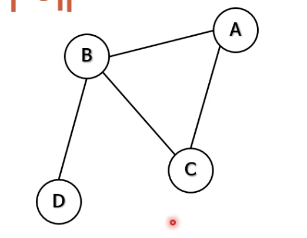
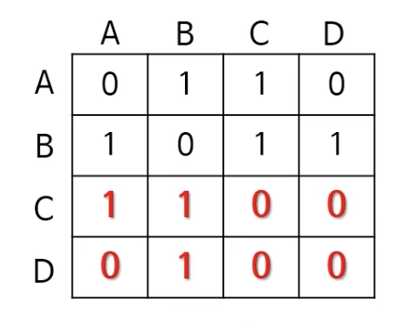
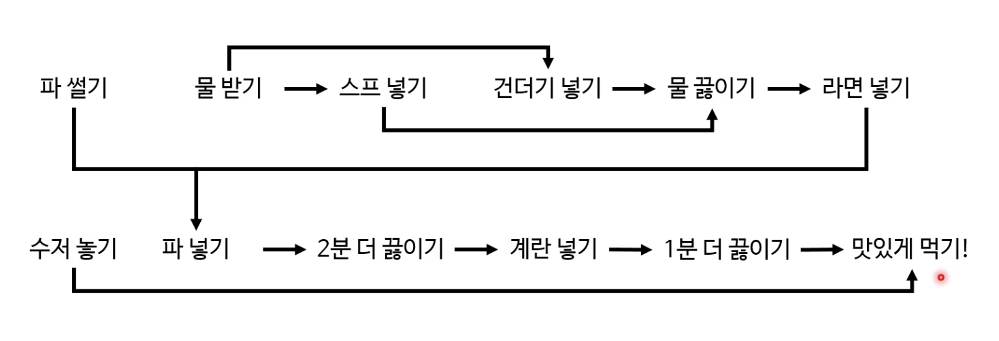

그래프는 실무적으로 알아두면 좋지만, 흔히 사용하지는 않는다. 
그렇기 때문에 잘못하면 탁상공론으로 갈 수가 있다. 

# 그래프란? 
데이터를 잘 정리하는 방법 중 하나라고 간단히 정의해볼 수 있다.

- 여기서 데이터란, 노드를 말한다. 정점이라고도 할 수 있다. 이 노드에는 아무거나 저장해볼 수 있다. 무엇을 저장하든 상관이 없다. 
- 잘 정리한다는 것의 뜻은 노드 간의 관계를 정리한다는 것이다. 이 관계란, 직접적인 관계를 말한다. edge라고도 부를 수 있고, 간선이라 부를 수도 있다. (or link, line) 그런데, 관계는 어떤 것이든 상관없다.

예로는 서울 지하철 노선표같은 것이 있다. 전/현 직장동료와 같이 네트워크를 표현하기도 하고, 세탁기 사이클도 그래프로 나타내볼 수 있다. 

그런데, 트리와 좀 비슷한 느낌이기도 하다. 사실 트리는, 그래픽의 특수한 모습이다. (방향 비순환 그래프)

사실, 그래프는 이전의 자료구조들을 일반화한 것이라 할 수 있다. 

정리하자면, 그래프란 데이터들과 그 관계를 보여주는 방법 중 하나다. 이들은 서로 연관 있는 노드의 집합이다. 네트워크 형태의 관계를 보여주기에 적합하다. 복잡한 실세계의 문제를 모델링하기에 적절하다. 그래프 이론을 적절히 적용하면, 시간 복잡도를 확연히 줄일 수가 있다. 

## 그래프의 종류
1. 방향 vs 무방향 그래프

방향이라는 건 화살표가 있다는 것, 엣지가 한 방향만 가리킨다. 

무방향 그리프는 엣지에 특별한 방향이 없어서 양방향을 가리키는 것과 같다. 
무방향 그래프의 최대 엣지 개수는 n(n-1)/2다. 

2. 순환 vs 비순환 그래프

비순환 그래프는, 일단 떠나면 다시 그 노드로 돌아오는 경로가 없고 순환 그래프는 있다. 

3. 가중 vs 비가중 그래프 

모든 엣지가 동일한 의미를 가지는 것이 비가중 그래프다. 가중 그래프는 관계 정도가 서로 다르다. 

## 그래프의 다양한 표현 방법
이 그래프를 사용하면 스케줄링이나, 여행 경로, 원자 결합 등의 다양한 문제를 풀 수 있다. 

그런데 원과 선으로 그려놓는 그래프를 어떻게 코드로 옮겨야할지가 문제다. 

이를 표현할 때, 인접 행렬이나 인접 리스트로 표현하게 된다. 
1. 인접행렬: N x N 행렬, 서로 인접한 노드를 표현한다. 
 
위의 그래프를 행렬로 바꾸면 4 * 4 행렬이 된다. 


만약 방향 그래프라고 할지라도 크게 다르지는 않다. 

이 인접행렬은, 

장점은 
1. 쉽게 구현할 수 있고
2. 변 제거의 시간 복잡도가 O(1)이다.. 
3. 관계를 쉽게 찾는다. 

단점은
1. 공간을 더 차지하고
2. 언제나 같은 공간을 차지한다. 심지어 노드가 연결이 많이 없더라도!
3. 인접 행렬을 만드는 시간이 O(N^2)이고 인접 노드를 찾는 시간이 O(N)이다.

2. 인접 리스트

각 노드마다 이웃의 리스트를 만든다. 
연결리스트 N개를 배열에 저장하는 방식이다. 

이의 장점은 공간을 적게 사용하고, 삽입과 삭제가 빠르다는 것이다. 

노드 a에서 b로 가는 엣지가 존재하는가? 에 대한 답변이 O(1)보다 느리다. 

## 그래프의 깊이 우선 탐색
그래프에서 깊이 우선 탐색을 트리에서처럼 진행하면 무한 루프가 생긴다. 

따라서, 이미 처리했던 노드를 다시 처리하면 안된다. 방문한 노드를 기억해야한다.
1. 전역적으로 방문했던 노드를 기억하거나
2. 각 노드마다 방문했는지 여부를 기억한다. 

두번째 방문 시 처리하지 않고 곧바로 다음 노드로 넘어가게끔 표현한다. 

스택에 이미 들어간 노드는 다시 넣지 않게하는 것이 올바른 노드 기억법이다. 

```java

public static void searchDepthFirst(Node node){
    HashSet<Node> discovered = new HashSet<>();
    Stack<Node> stack = new Stack<>();

    stack.push(node);
    discovered.add(node);

    while(!stack.empty()){
        Node next = stack.pop();

        System.out.println(next.data);

        for(Node neighbor : next.neighbors){
            if(!discovered.contains(neighbor)) {
                stack.push(neighbor);
                discovered.add(neighbor);
            }
        }
    }
}
```


그런데, 방향 그래프에서는 그래프의 모든 노드를 방문할 수 없을 수가 있다. 그래서 DFS의 인자로 모든 노드 목록을 전달해서 방문할 수 있게끔 한다. 이미 처리한 목록이 있기에 중복 방문은 없다. 따라서 속도가 엄청나게 느려지지는 않는다. 

그래프의 각 노드에 대해 
1. DFS 함수를 호출하고
    - 현재 노드를 발견한 것으로 표시하고
    - 처음 발견한 이웃 노드마다 DFS를 호출한다.
2. 현재 노드를 방문한다

시간복잡도는 O(N + E), 노드 수 + 엣지 수

트리 또한 N+E지만 줄여서 O(N)이라 표현

## 위상정렬 
그래프 알고리듬이다. 그나마 간단한 그래프 알고리듬.

순서가 복잡한 노드끼리의 순서를 정할 수 있다. 비순환 방향 그래프에서만 유효한 위상 정렬이 가능하다. 

아래는 위상정렬의 예다.


- 몇가지 알고리듬이 존재하는데, 깊이 우선 탐색과 칸 알고리듬이 그 예다. 

### DFS를 활용한 위상정렬
전위 순회와 후위 순회가 있는데, 전위 순회는 올바르지않다. 

후위 순회는 끝 단계부터 시작한다. 
후위순회를 한 뒤에, 역순으로 실행하면 된다. (스택을 활용해서)

이 위상 정렬은 관계에서 순서를 정하는 매우 많은 곳에 사용이 가능하다. 

- 프로젝트 일정 만들기
- cpu 명령어 실행 순서 결정
- 컴파일 순서 결정 
- 선수 순위 결정 등

굉장히 막강한 알고리듬이다. 

## 강한 결합 요소
그래프로 이어진 곳에서 끊긴 곳이 있을 때, 어디를 연결해야 막히지 않을까? 

그와중에 서로 순환관계를 갖는 노드들이 있다. 이를 강한 결합 요소라고 한다. 

이런 요소들을 하나로 묶어서 한 노드로 생각하면 단순해진다. 여기서 진입 차수가 0인 노드에 연결해주면 된다. 

정리해보자면
- 방향 그래프에서 끈끈한 관계를 가지는 노드들의 최대 그룹이다.

처음부터 그래프 연결을 시도해야한다고 해봤을 때, 
위상 정렬을 사용하면 된다. 강한 결합으로 노드를 만들고, 이 노드들끼리 비순환 그래프를 만들면 된다. 

### 코사라주 알고리듬
1. 그래프 G를 DFS 후위 순회를 하고, 역순으로 돌린다. 
2. 그래프 방향을 반대로 바꿔준다. 
3. 역순으로 돌린 순서대로 DFS를 실행한다. 

더 갈 수 없는 노드가 있다면 그것이 강한 결합 요소 노드라고 결정한다. 

### 강한 결합 요소의 용도
- 주로 복잡한 네트워크 관계 관련
- 방대한 양의 데이터에서 연관된 그룹 찾기에 유용하다.

## 너비 우선 탐색
```java

public static void searchBreadthFirst(Node node){
    HashSet<Node> discovered = new HashSet<>();
    Queue<Node> queue = new LinkedList<>();

    queue.add(node);
    discovered.add(node);

    while(!queue.empty()){
        Node next = queue.remove();

        System.out.println(next.data);

        for(Node neighbor : next.neighbors){
            if(!discovered.contains(neighbor)) {
                queue.add(neighbor);
                discovered.add(neighbor);
            }
        }
    }
}
```

### 최단 경로 찾기
- 가장 간단하게는 주먹구구식으로 찾으면 된다. 그러나 이는 엄청난 시간 복잡도를 가진다. 
- BFS를 사용하면 최단 경로를 찾을 수 있다. 시간 복잡도도 O(N+E)다.
- 현재 깊이의 모든 노드를 방문 후 다음 깊이로 진행하게 되므로, 깊이 n을 뒤지다보면 d 노드를 찾게된다. 그래서 언제나 최단 경로를 찾는 방법이다. 

따라서, BFS로 최단 경로를 찾는 것이 좋은데, 
코드를 조금 수정해야한다. 시작점에서부터 현 노드까지의 거리를 기억해야하기 때문이다. 

저장법은 
- 해시 맵에 모든 노드 거리를 저장하거나
- 2D 배열로 저장한다. 
- 각 노드 안에 거리를 저장한다. 

```java

public static int findShortestDistance(Node s, Node d){
    HashSet<Node, Integer> distances = new HashSet<>();
    Queue<Node> queue = new LinkedList<>();

    queue.add(s);
    distances.put(s, 0);

    while(!queue.isEmpty()){
        Node next = queue.remove();
        int distance = distances.get(next);

        if(next.equals(d)) {
            return distance;
        }

        for(Node neighbor : next.neighbors){
            if(!distances.containsKey(neighbor)) {
                queue.add(neighbor);
                distances.put(neighbor, distance + 1);
            }
        }
    }
    return -1;
}
```

- 추적을 위해 추가 정보가 필요하다. 선행 노드와 같은! 

### 각 변의 거리가 다른 최단 경로를 찾기
이는 BFS로 간단히 해결할 수는 없다. 

### 다익스트라 알고리듬
위의 사례일 경우, 두 노드 사이의 최단 경로를 찾는다. 

- 방대한 노드 네트워크에 사용하기 충분히 빠르다. 
- 변의 가중치가 음수인 경우에는 제대로 작동하지는 않는다. 

개념상으로, 모든 노드를 한번씩 방문하며 아래의 연산을 하게된다. 
1. 아직 방문하지 않은 노드 중 가장 가까운 노드 n을 선택한다. 
2. n의 각 이웃 노드 m으로 여행하는 거리를 계산한다. 
3. 이 결과가 m의 기존 거리보다 가까우면 m의 거리를 업데이트하게된다. 

그리고, 모든 노드를 방문하면 최단 거리를 찾는다. 

이건 동적 계획법의 한 사례다. 
