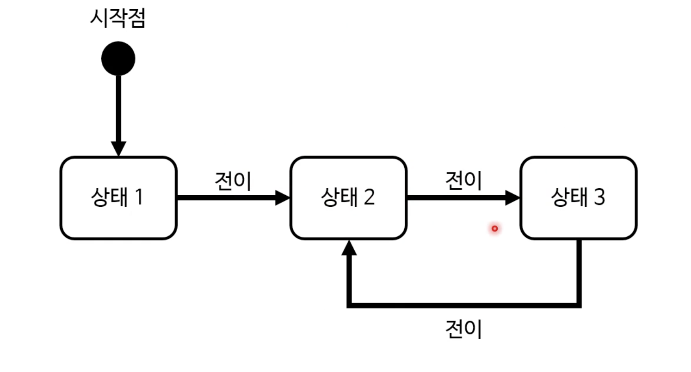

## 유한 상태 기계
상태에 따라 다른 동작을 하는 추상적인 기계다. 

기계는 동시에 두 상태일 수가 없지만, 특정 조건 만족 시 다른 상태로 변할수가 있다. 

### 용도
실세계의 매우 많은 것들을 상태 기계로 표현이 가능하다. 

웹개발로 따져보자면, 입력값 유효성 검사와 같은 것들이다.

## 정규식
문자열 검색 규칙을 정의하는 문자열이다. 
ex) /abc/:"abc"를 찾음 /a{3}/: "aaa"를 찾음

입력값 유효성 검사와 같은 것들을 찾아볼 수가 있다.

프로그래밍 컴파일러도 많이 사용한다. 
이 모두가 방대하고 복잡하다.

- regex tester 로 검사 가능
### 정규식 예 1: "hello"를 포함 
/hello/
- hello를 포함한 문자열을 찾는다.

### 정규식 예 2: hello or world를 포함
/hello|world/

### 정규식 예 3: dog로 시작
/^dog/
- ^으로 시작

### 정규식 예 4: dog으로 끝남
/dog$/
- 끝은 $사인 사용

### 정규식 예 5: dog로 온전히 끝난다.
/^dog$/

### 정규식 예 6: 'a', 'b', 'c' 중 하나 이상 포함
/[abc]/

### 정규식 예 7: 알파벳만 포함된 문자열
/^[A-Za-z]+$/
- -는 범위를 말한다.
- +는 1개 이상을 말한다. 

### 정규식 예 8: 숫자만 포함된 문자열
/^\d+$/
- \d 라는 게 숫자만을 말한다.

### 정규식 예 9: 숫자 4-8만 포함
/^[4-8]+$/

### 정규식 예 10: 알파벳 6자
/^[A-Za-z]{6}$/

### 정규식 예 11: 여러 규칙
/^[A-Z][a-z]*\d+$/
- * 0번 이상을 말한다
- 대문자 혹은 소문자 + 숫자 

### 정규식 예 12: 이메일 주소 검사 (RFC822 RFC5322)

## 정규식 플래그
- 플래그를 통해 기본 동작을 바꿀 수가 있다.

이 정규식은 몹시 편하지만, 가독성 및 디버깅 문제가 있다. 간단한 것만 검사한다. 

- 프로그래밍에 마법은 없다. 굉장히 편한 함수가 있다면, 그건 다른 프로그래머의 선물이다. 그를 우리도 직접 만들 수 있어야한다.

--- 
## KNN 최근접 이웃 (nearest neighbor)
우리는, 기계학습은 패턴 인식으로 세상을 배운다. 귀납적인 학습이라 볼 수 있다.

KNN은, 지도를 받는 학습 알고리듬 중 하나다. 
분류와 회귀분석에도 사용한다.

이 분류라는 것은, 새로운 데이터가 속하는 그룹을 예측하는 행위다. 

회귀분석이라함은, 새로운 데이터의 값을 예측하는 행위다. 

### KNN 알고리듬
1. 훈련 데이터를 로딩한다.
2. k 값을 선택한다.
3. 입력값과 가장 거리차가 적은 훈련 데이터 K개를 찾는다. 
4. 결정을 내린다. 

비슷하다는 뜻은, 거리가 가깝다는 뜻이다. 

여러 feature를 가지고, 거리를 계산한다. 
그런데 각 feature마다 비중을 다르게 할 수도 있다. 

기계학습은 이를 자동으로 해준다. 

feature 내의 값들을 비중을 비슷하게 한다. 이를 데이터 스케일링 및 정규화라한다.

- 이미지 인식 및 분석
- 연봉 예측
- 문서 분류
- 주가 예측
- 질병 발생 예측 등에 사용된다.

기계학습 데이터를 구하기 위해, archive.ics.uci.edu에서 찾아볼 수 있다. 

---
## 기타 알고리듬
1. 선형 계획법: 선형으로 표현해야하는 수학 모델에서 최고 결과를 성취하는 기법이다. 
2. 병렬 알고리듬: 여러 코어를 사용해 동시에 여러 연산을 수행하는 방법이다. cpu에 기본으로 탑재된 코어 수가 둘 이상이 되면서 흔해졌다. 모든 문제를 병렬로 풀 수는 없다. 읽고 쓰는 순서가 정확히 정렬이 되지 않아서, 신경쓸 필요가 많다. 

