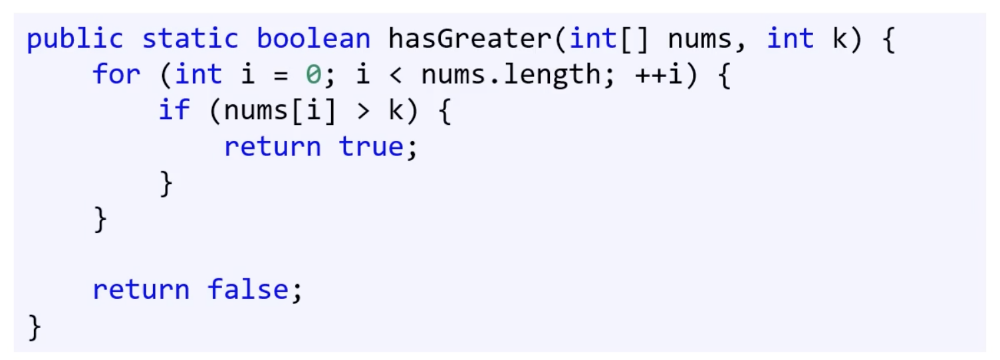

재귀함수를 잘해야 알고리듬을 잘한다! 

대표 예: 피보나치 수열

## 재귀함수의 장단점
- 장점: 가독성이 좋다. 코드가 짧다. 변수 상태가 자동 저장된다. 코드 검증이 쉽다. 
- 단점: 직관적이지 않다. 스택 오버플로우가 발생할 수 있다. 맹목적인 믿음이 필요하다. 함수 호출에 따른 과부하

## 꼬리 재귀
아무래도 성능 문제가 있을 수가 있다. 
그러나, 읽기 좋은 코드 작성이 제일 기본적인 요소다.
스택 오버플로, 성능 문제가 일어날 가능성이 큰 경우 반복문으로 변환한다. 

그런데 그런 성능 위험 단점이 없는 재귀함수도 있다. 
꼬리호출을 사용하면, 타 함수로부터 반환 후 더이상 연산이 없다. 그래서 스택 프레임에 저장해놓은 변수 값을 재사용하지 않는다. 즉 스택프레임을 재사용할 이유가 없다. 

이 경우, 컴파일러가 스택 프레임을 따로 안 만드는 최적화를 하기도 한다. 

ex. 꼬리 호출 최적화

### 꼬리 재귀란? 
꼬리 호출의 특수한 경우로, 마지막에 호출하는 함수가 자기 자신이다. 꼬리호출과 똑같은 최적화가 적용된다.

꼬리 재귀는 읽기 편하지는 않다. 쓰는 가장 큰 이유는 최적화. 그러나 생각보다 최적화 안하는 언어도 있는데, 그럴 경우는 ? 
꼬리 재귀는 반복문으로 쉽게 변경이 가능하다. 

## 주먹 구구식 알고리즘
꼼꼼하게 모든 것을 한다. 근데 똑똑한 게 아니라 시간을 퍼부어서 = Brute Force

모든 가능한 경우의 수를 시도하는 알고리즘

효율성을 고려하지는 않은 알고리즘. 근데 효율적 알고리듬이 없는 경우도 있다.
가장 직관적인 문제 해결법

- 배열 최소/최댓값, 첫,마지막 색인 찾기, 합, 평균 구하기 등..
- 비밀번호 깨는것도 한 예. 시간복잡도는 O(K^N). K는 들어갈 수 있는 문자 수, N은 비밀번호 자릿수. 따라서 자릿수가 늘수록 기하급수적 증가. 
- 외판원 문제 또한 주먹 구구식. 
    - 여러 도시를 방문해야하는 외판원. 각 도시를 최소 한번씩 망문해야하고, 가장 짧은 거리를 이동해야. 
    - 시작할 도시를 고르고 모든 방문 순서 목록을 만들고. 각 목록의 총 이동거리 계산하고, 그중 이동거리가 가장 짧은 목록을 선택한다. 이의 시간 복잡도는 O(N!)

### 기하급수적 증가 알고리듬 문제
- 외판원 문제같은 것은 N이 커질수록 문제 푸는 속도가 몹시 느려진다. 무한 루프는 아닌데 몇 분 안에 결과가 안 나온다. 
- exponential. 지수 시간이 걸린다. 다항식 시간이 걸리는 알고리듬이 좋고, 그를 P문제라고 한다. 

### P vs NP
- 학문적으로 꽤 의미가 있다. 

### P 분류
입력값에 대해 예/아니오 답을 내릴 수 있는 문제를 판정 문제라고 한다. 
P 분류는 판정 문제들을 분류하는 방법 중 하나도, <결정론적 튜링 기계로>다항식 시간 안에 풀 수 있는 모든 문제를 포함한다. 

튜링 기계란 무언가를 계산하는 기계를 대표하는 가상의 장치. 일반적인 컴퓨터 알고리듬을 수행할 수 있다. 

결정론적 튜링 기계란, 명령어를 순서대로 실행한다는 것. 코어하나에서 실행되는 다항식 시간 알고리듬이 있는 문제 P

### NP 분류
비결정적 다항식 시간을 말한다. P와 상반되는 개념이 아니라, 비결정적! 
비결정론적 튜링 기계 내에서 다항식 시간안에 푸는 문제. 
- 어떤 명령어 실행 뒤, 다음 실행할 명령어가 확정되지 않는다. 여러 다음 명령어를 병렬적으로 실행하는 기계. 그러다가 다항식 시간 내에 풀 수 있는 문제.

푸는데는 지수 시간이 걸릴 수도 있지만, 일단 답이 있으면 그를 다항식 시간 내에 검증할 수 있다.

일반적인 방법으로 풀기에는 좀 느리다. 

위와 같은 문제는 P이자 NP이다. 직렬로 다항식 문제(결정론적)는 병렬로도 다항식 문제(비결정론적)이기 때문이다.

사실 모든 P 문제는 NP다.

--- 여기까지 확실히 이해해야한다.

### 더 어려운 NP-완전, NP-난해
- NP-완전: NP 문제 중 일부. 모든 NP 문제들은 NP-완전 문제로 환원이 가능하다. NP 중에 어려운 문제.
    - 외판원 문제(판정 버전) 어떤 정해진 길이 있고, 이 길이를 넘지않는 경로가 있는지 판정할 때.
    - 배낭 문제: 크기와 가격이 다른 물품이 있을 때, 값어치가 최대가 되도록 물건을 넣고, 배낭에는 크기제한이 있을 때! 최소 어떤 값어치 V 만큼 넣을 수 있을지? 
    - 조건이 있는 문제.

- NP-난해: NP 안에 포함되는 것도 있고 아닌것도 있는데, NP-완전을 온전히 포함한다. 
    - 다항식 시간 안에 답 검증이 불가한 문제. 
    - NP보다 복잡도가 높다.

### P vs NP란?
이는 P 또는 NP를 논하는 문제가 아니라, P와 NP가 같은지 아닌지를 논하는 문제다. 
NP 완전 문제 중 하나라도 다항식 시간 안에 풀 수 있게 된다면, 이 문제는 P가 된다. 그리고 모든 NP문제를 NP완전 문제로 다항식 시간 내 환원할 수 있으므로, 모든 NP 문제가 p가 된다. 

이는 느려서 못 풀던 많은 문제를 효율적으로 풀 수 있게 한다. 

## 탐색 알고리듬
데이터 구조 안에 저장돼있는 정보를 구해오는 알고리듬. 매우 다양한 것이 여기에 포함되어서, 모두 모아 한 부분에서 배우기에는 너무 여기저기 존재한다.

대표적인 탐색 알고리듬으로는 선형 탐색 알고리듬 (O(n))과 해시맵을 이용한 탐색 (O(1))이 있다. 해시맵의 경우 N보다 큰 용량이 필요하다. 속도를 빠르게 한 대신 용량을 더 쓰는 것. 
그런데 용량을 더쓰지 않고도 속도를 올리는 방법이 있다. -> 이진 탐색

### 이진 탐색
범용적 데이터에서 제대로 작동하는 알고리듬도 중요하지만, 특정 입력 데이터, 예를 들면 정수만 처리하는 알고리듬도 엄밀히 말하면 특화된 것이다. 

