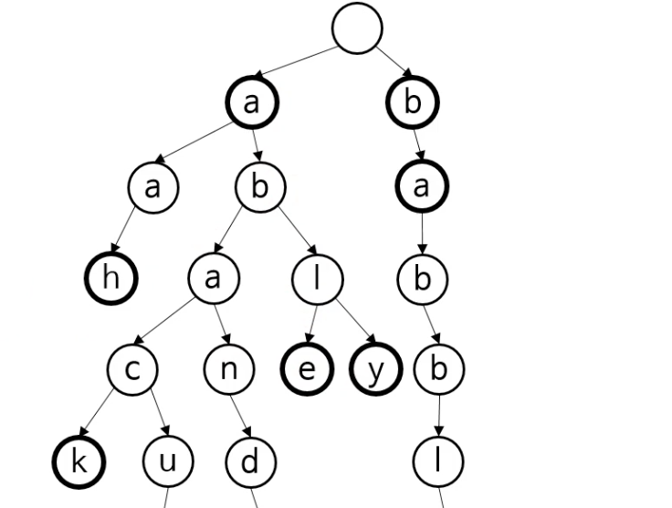

사전에 등재된 영단어를 재빨리 확인해주는 프로그램을 만든다는 가정을 했을 때, 
데이터를 가장 빨리 가져올 수 있는 곳은 메모리다. 

그럼 자료구조는 어떻게 하면 될까? 
배열로 하게되면 O(N), k개가 있다면 O(kn).

더 빠르게 찾을 수 있으려면? 해시 테이블을 사용해야한다. 

그러나 여전히 문자열 비교는 해야한다. 그리고, 만약 추천 검색어 기능을 만든다고 한다면 해시테이블은 적절치않다. 일부 단어로 해시를 모두 검색해볼 수는 없기 때문이다. = 사전식 구성

이때 사용하는 것이 트라이다.
사전식 구성을 하면 재귀적으로 검색을 하게되는데, 이 때 적당한 자료구조는 트리다. 

루트에는 아무 글자도 없고, 각 분기점에서 자식이 나뉘게 되는 구조다.
이를 트라이라한다.

## 이진트리와 다른점
이진 트리는,
- 각 노드의 연결이 키에 따라 결정되고
- 노드가 그 키를 저장하게된다.

- 연결이 키 전부가 아닌 한 글자로 결정된다.
- 노드가 키를 저장하지 않는다.
- 그 노드 위치 자체가 키를 결정한다.

### 트라이
어원: retrieval
- 원래는 트리라 발음했는데, 구분하려고 트라이로 발음한다.
- 탐색 트리 중 하나다. 
- 다른 이름은 prefix tree(이해가 좋은 이름). digital tree(디지털아닌 트리가 없으므로 이상하다)
- 어떤 집합 안에서 특정한 키를 찾을 때 사용한다. 
- 노드 사이의 연결이 한 글자로 결정된다. 키 전부가 아니다. 

### 트라이로 자동완성 기능 만들기
A 문자가 있다면 루트에서 시작해 모든 자식을 재귀적으로 붙여 string으로 보여준다. 
깊이 우선 탐색에 가깝다.

### 트라이 용도
1. 사전 데이터의 저장. (주 용도)
2. 해시 테이블 대신 사용 가능하다. 충돌이 없기 때문이다. 평균 O(1)은 아니다. 
