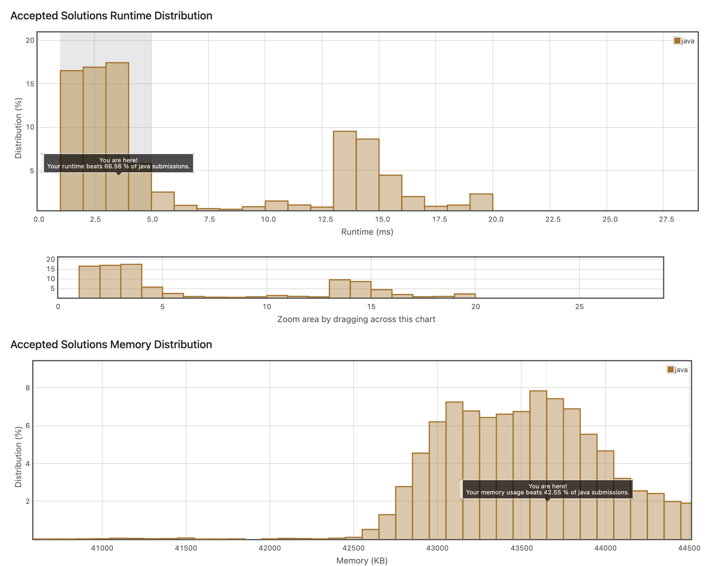

## 10. Valid sudoku
https://leetcode.com/explore/item/769

현재 위치한 숫자들이 스도쿠 규칙에 맞는지를 검사하는 코드를 작성했다.

가로줄/세로줄/3*3정방형 내에 1-9까지가 하나씩만 들어있는지를 검사해야한다.

```java
class Solution {
    boolean result = true;
    public boolean func(char[] array){
        HashSet<Character> set = new HashSet<Character>();
        for(int i = 0; i<array.length; i++){
            if(!set.add(array[i]) && array[i] != '.'){
                return false;
            }
        }
        return true;
    }
    public boolean isValidSudoku(char[][] board) {
        for(int i = 0; i < board.length; i++) {
            if(func(board[i]) == false){
                result = false;
                return result;
            }
        }
        
        for(int j = 0; j<board.length; j++){
            if(func(new char[]{board[0][j],board[1][j],board[2][j],board[3][j],board[4][j],board[5][j],board[6][j],board[7][j],board[8][j]}) ==false){
                result = false;
                return result;
            }
        }
        
        for(int p = 0; p <board.length; p+=3){
            for(int q = 0; q<board.length; q+=3){
                if(func(new char[]{board[p][q], board[p][q+1],board[p][q+2],board[p+1][q],board[p+1][q+1],board[p+1][q+2],board[p+2][q],board[p+2][q+1],board[p+2][q+2]})== false){
                    result = false; 
                    return result;
                }
            }
        }
        return result;
    }
    
}
```

시간 복잡도는 꽤 나올수도 있지만 사실 1-9까지의 범위밖에 없기에 괜찮다. 



```java
class Solution {
     public boolean isValidSudoku(char[][] board) {

        for(int i=0;i<9;i++){
            for(int j=0;j<9;j++){
                if(board[i][j]=='.'){
                    continue;
                    }
                char ch=board[i][j];
                board[i][j]='.';
                if(isValid(board,i,j,ch)==false){
                    return false;
                }
                board[i][j]=ch;


            }
        }

        return true;
    }

    private boolean isValid(char[][] grid, int i, int j, char m) {
       for(int k=0;k<9;k++){
            if(grid[i][k]==m){
                return false;
            }
        }
        
        for(int k=0;k<9;k++){
            if(grid[k][j]==m){
                return false;
            }
        } 
        
        for(int k=0;k<9;k++){
            int row=3*(i/3)+k/3;
            int col=3*(j/3)+k%3;
            if(grid[row][col]==m){
                return false;
            }
        }
        return true;
    
    }
}
```

위와 같이, 보다 