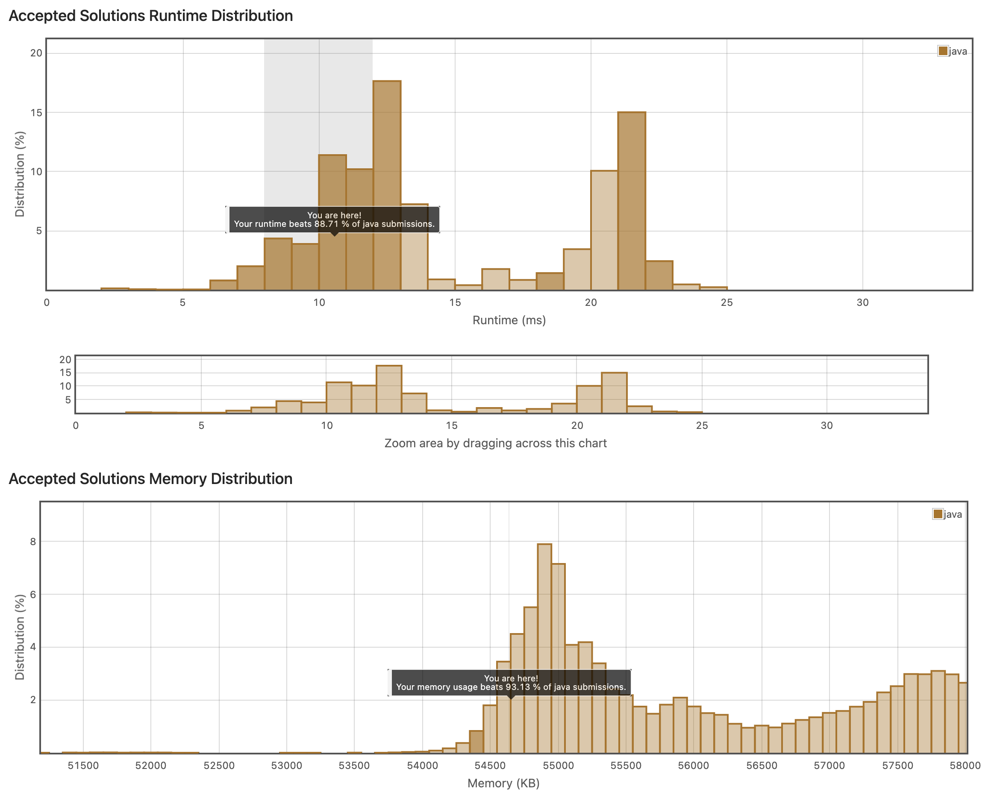

## 4. Duplicate이 포함되어있는지 찾아내기

이런 류의 문제는 배열 일부만 보는 것이 아니라 전부 다 탐색해야해서, O(N)은 어쩔 수 없다.

그러나, 부가적인 메모리를 만들어낼 때, (이미 방문한 요소를 담는 캐시 용도로) 똑같이 배열로 만들면 안된다. contains() 하는 순간 O(N)이 되기 때문이다.

따라서 Hash 류로 그를 만들어내야한다. 
```java
class Solution {
    public boolean containsDuplicate(int[] nums) {
        HashMap<Integer, Integer> flagMap = new HashMap();
        if(nums.length == 1)
            return false;
        flagMap.put(nums[0], 1);
        for(int i = 1; i<nums.length;i++)
        {
            if(flagMap.get(nums[i]) == null){
                flagMap.put(nums[i], 1);
            }else if(flagMap.get(nums[i]) == 1){
                return true;
            }
        }
        return false;
    }
}
```


HashMap으로 하면 뭔가 지저분하다 싶었다. 문제는 풀긴 풀었는데 더 나은 방법이 없을까 생각했는데, 
그냥 HashSet으로 작업하면 되는 것이었다. Hashset.add()를 진행했을 때 그것이 불가하면 true를 반환하면 되는 것이었다.

실제로도 나보다 더 빠른 코드를 쓴 사람들은 hashset을 쓰고 있었다. 심지어 코드도 간결. 아직 자바에 익숙치 않은 탓이다.
```java
class Solution {
    public boolean containsDuplicate(int[] nums) {
        HashSet <Integer> set = new HashSet<>();
        for(int i=0; i<nums.length; i++){
            if(!set.add(nums[i])){
                return true;
            }
        }
        return false;
    }
}
```