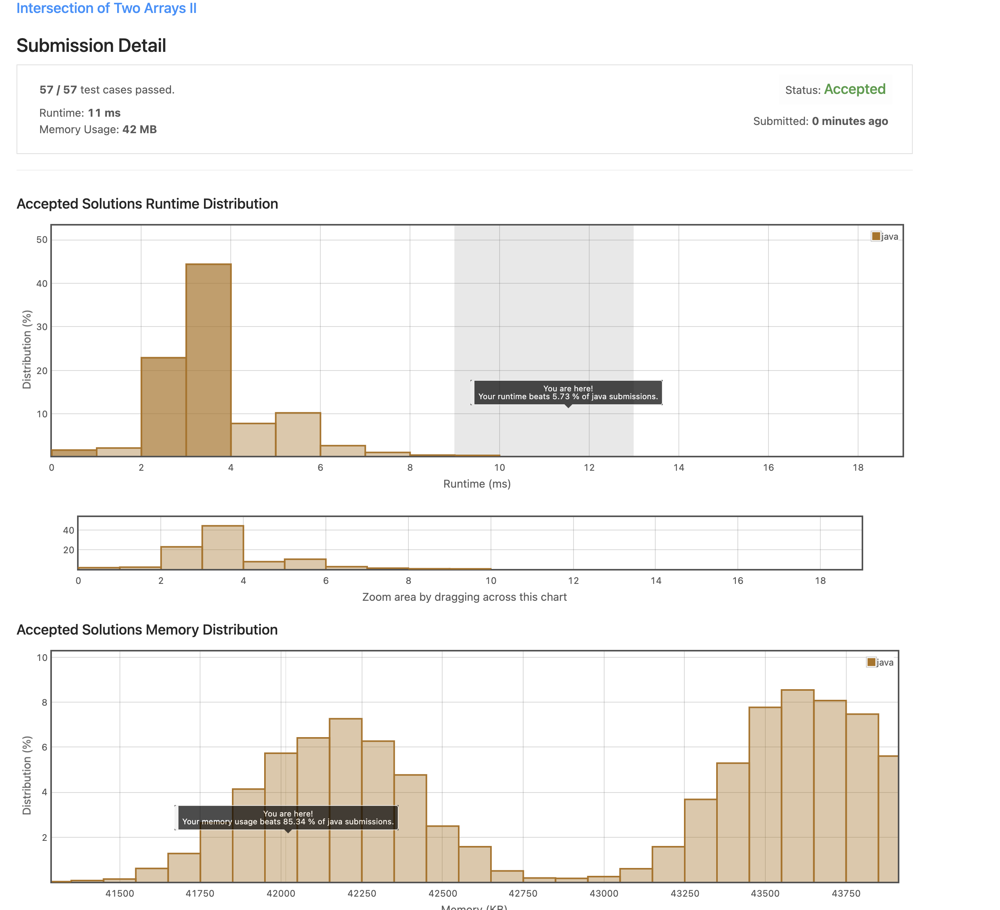

## 6. Intersection of Two Arrays II
https://leetcode.com/explore/item/674

두 배열 사이 공통되는 요소를 return 해야한다.
나는 두 배열을 정렬한 뒤, 그들을 차례로 비교하는 방법을 택했는데 정말 느린 알고리듬이었다. 

그도 그럴것이 정렬 자체가 느린 알고리듬이다. n^2이기 때문이다.

더 나은 알고리듬이 분명히 있을 것 같다. 

```java
class Solution {
    public int[] intersect(int[] nums1, int[] nums2) {
         int len1 = nums1.length;
        int len2 = nums2.length;
        BubbleSort(nums1);
        BubbleSort(nums2);
        
       

        if(len1>len2){
            return getIntersect(nums2, nums1);
        }else{
            return getIntersect(nums1, nums2);
        }
        
        
        
    }
    public void BubbleSort(int[] arr)
{
	
	int temp;

	for(int i=0; i<arr.length-1; i++)
	{
		for(int j=0; j<(arr.length-i)-1; j++)
		{
			if(arr[j] > arr[j+1])
			{
				temp = arr[j];
				arr[j] = arr[j+1];
				arr[j+1] = temp;
			}
		}
	}
}
   
    public int[] getIntersect(int[] shortArr, int[] longArr){
        List<Integer> result = new ArrayList<>();
        int len1 = shortArr.length;
        int len2 = longArr.length;
        int i=0;
        int j =0;
        while(i < len1 && j<len2){
            if(longArr[j] > shortArr[i]){
                i++;
            } else if(longArr[j] < shortArr[i]){
                j++;
            }else if(longArr[j] == shortArr[i]){
                    result.add(shortArr[i]);
                    i++;
                    j++;
            }
        }
        
        return result.stream()
                .mapToInt(s -> s)
                .toArray();
    
    }
}
```



```java
class Solution {
    public int[] intersect(int[] nums1, int[] nums2) {
        if(nums1.length>nums2.length){
            intersect(nums2,nums1);
        }
        
        int[] freq = new int[1001];
        for(int i:nums1){
            freq[i] += 1;
        }
        
        int[] res = new int[nums1.length];
        int j=0;
        for(int i:nums2){
            if(freq[i]>0){
                res[j++] = i;
                freq[i] -= 1;
            }
        }
        
        
        return Arrays.copyOf(res,j);
        
    }
}
```

위와 같이 배열에 적절히 배치되게끔 풀어도 좋고, 해시맵으로 요소 확인해도 좋을 것 같다. 
굳이 정렬하지 않아도 될 것 같다는 생각이 들었다.