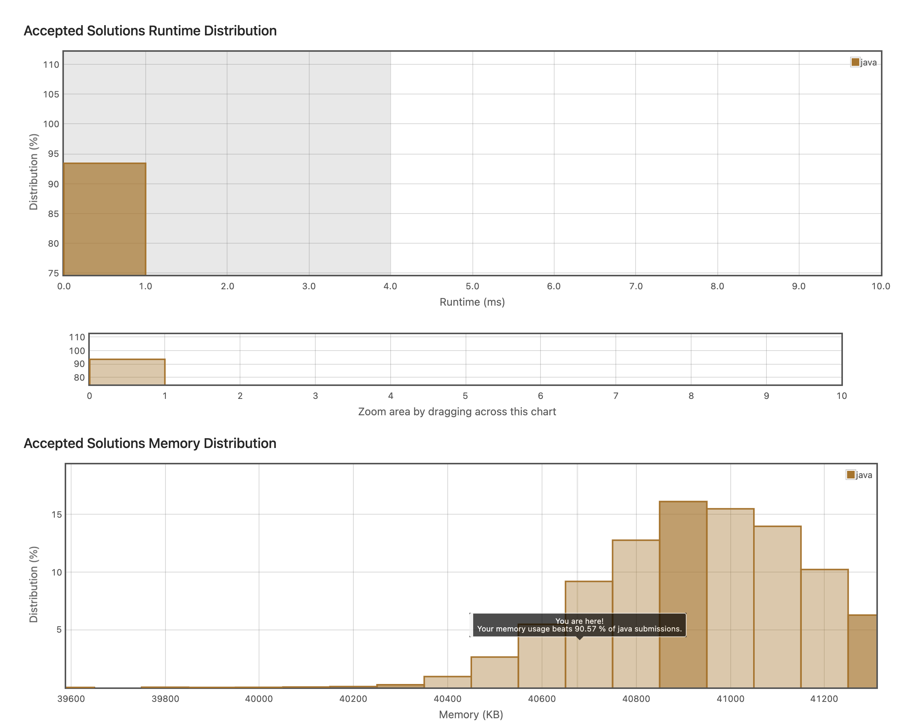

## 7. Plus One
https://leetcode.com/explore/interview/card/top-interview-questions-easy/92/array/559/

다 비슷비슷하게 풀법한 문제들인데 어떻게 단순화하느냐에 따라서 코드 품질이 결정되는 것 같다. 
이 문제는 배열 전체를 한 숫자로 보고 1을 더했을 때, 어떤 배열이 나오는지에 대해 적어야하는 문제다. 

나는 차례로 경우를 나누어 풀었는데, 코드가 마음에 안들었다. 

```java
class Solution {
    public int[] plusOne(int[] digits) {
       int length = digits.length;
        if(digits[length-1] != 9){
            digits[length-1]++;
            return digits;
        }
        
        for(int i = length-1; i>=0; i--){
            if(digits[i] == 9){
                digits[i]++;
            }else{
                break;
            }
        }
        int j = length-1;
        int flag = 0;
        while(j >= 0 && digits[j] == 10 ){
            
            digits[j] = 0;
            j--;
            flag = 1;
        }
        
        if(j == -1){
            int[] newArr = new int[length + 1];
            newArr[0] = 1;
            return newArr;
        }else{
            digits[j] = digits[j] + flag;
            return digits;
        }
        
    
    }
    
}
```

시간 복잡도도 O(n)으로 별 오차없이 다 비슷하다고 볼 수 있다. 그만큼 푸는 방법이 정해진 것 아닐까하는 생각도 든다. 

```java

class Solution {
    public int[] plusOne(int[] digits) {
        
        for(int i = digits.length-1 ; i >= 0  ; i--){

            if(digits[i] != 9){
                
                digits[i] +=1;
                return digits;
            }

            digits[i] = 0 ;  

        }


        int[] newDigits = new int[digits.length+1];
        newDigits[0] = 1;

        return newDigits;

    }
}

```