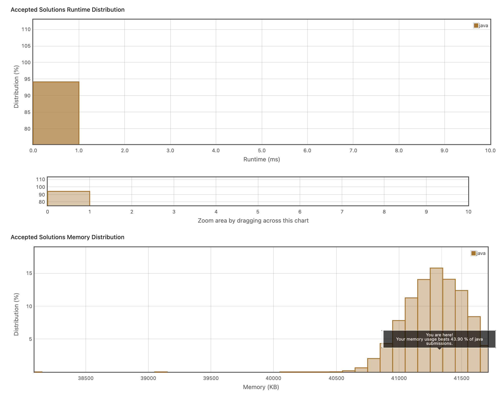

## Rotate Image
https://leetcode.com/explore/item/770

배열을 그대로 시계방향으로 90도 회전시키는 문제다. 

나는 
1. 우선 교체를 할만한 요소들을 골라 
2. 재귀로 자리를 바꾸게끔 하였다. 

이는 시간복잡도를 포기한 수준이다. 다행히 배열의 길이가 20이라서, 할 수 있겠다 싶었다. 

사실 다른 방법이 떠오르지 않았다. 그 자리에서 요소들을 교체하라는데 어떻게 할 수 있을지 감이 안 잡혔다. 


```java
class Solution {
    public int flag1;
    public int flag2;
    public void rotate(int[][] matrix) {
      
        for(int i = 0; i<matrix.length;i++){
            for(int j = 0; j<matrix[i].length; j++){
                if(j>=i&& i+j<=matrix.length-2){
                    flag1 = i;
                    flag2 = j;
                    replace(matrix, i, j, matrix[i][j]);
                }
               
            }
        }

    }
    public void replace(int[][] matrix, int i, int j, int value){
       
            int original = matrix[j][matrix.length-i-1];
            int newVal = value;
            matrix[j][matrix.length-i-1] = newVal;
            
        if(j != flag1 || matrix.length-i-1 != flag2){
            replace(matrix, j, matrix.length-i-1, original);
        }
        
    }   
}

```

아니나 다를까 내 시간복잡도는 잡히지 않는 수준이었으며 (14ms)
다른 방법이 있는 것 같았다.
```java
class Solution {
    public void rotate(int[][] matrix){
        int left = 0;
        int right = matrix.length - 1;

        while(left < right){
            for (int i=0; i< right - left; i++){
                int top = left;
                int bottom = right;

//                Fetch the topleft
                int topLeft = matrix[top][left+i];

//                Move the bottom left to the top left
                matrix[top][left+i] = matrix[bottom - i][left];

//                Move the bottom right to the bottom left
                matrix[bottom - i][left] = matrix[bottom][right - i];

//                Move the top right to the bottom right
                matrix[bottom][right - i] = matrix[left + i][right];

//                Move top left to the top right
                matrix[top+i][right] = topLeft;
            }
            right -= 1;
            left += 1;
        }
    }
}
```

내가 재귀로 때린 것을 여기서는 한번에 다 작업하였다. 
그리고 차례로 아랫줄로 내려갔다고 할 수 있다. 

훨씬 쉽게 풀 수 있는 방법인데 나는 넘 어렵게 푼거같다.