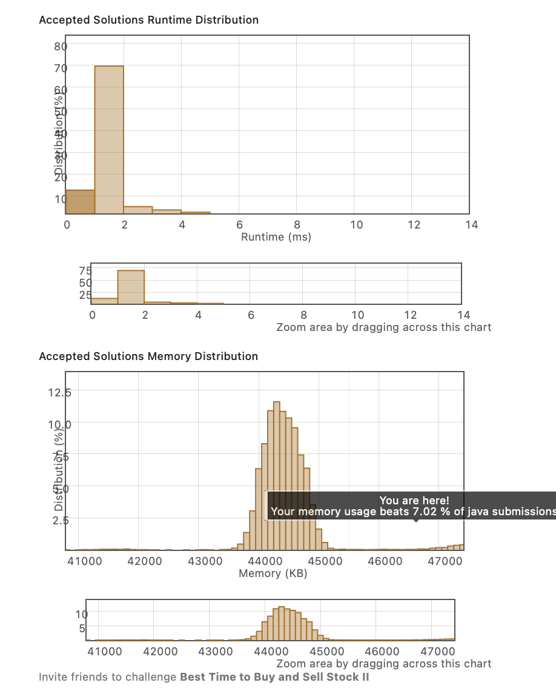
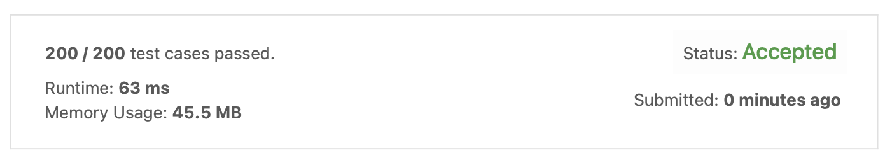

2. Best Time to Buy and Sell Stock II
https://leetcode.com/explore/interview/card/top-interview-questions-easy/92/array/564/

prices 배열이 주어졌을 때, 사고 팔기 가장 좋은 때를 구하여 최대값의 이윤을 남기는 코드를 짜야했다. 

이 또한 어려운 문제는 아니지만, 재귀로 풀라고 떡하니 만들어놓은 것 같길래 재귀로 풀어보았다. 왠지 memoization을 추가했다면, 더 빠르게 처리가 가능했을 것 같다. 

개인적으로는 copyOfRange 안 쓰고 멋진 코드를 작성해보고 싶었다..


```java
class Solution {
    public int maxProfit(int[] prices) {
        int start = 0;
        int end = 1;
        int sum = 0;
        if(prices.length == 1){
            return 0;
        }
        while(prices[end] >= prices[start] && prices[end]-prices[start] > sum){
            sum = prices[end]-prices[start];
            if(end == prices.length-1){
                break;
            }
            end++;
        }
        
        return sum + maxProfit(Arrays.copyOfRange(prices, end, prices.length));
        
    }
}
```



여기서도 볼 수 있듯이 내 런타임은 63ms.. 처참하다.
leetcode의 좋은 점은, 빠른 시간이 걸린 그래프 바를 눌렀을 때 코드가 나온다는 점이다. 
그런데, 다른 코드를 보니 내가 뭔가 문제를 잘못 이해하고 풀었다는 것을 깨달았다.

(너무 어렵게 푼 것이 문제였다.)

```java
class Solution {
    public int maxProfit(int[] prices) {
        int profit = 0;
        for(int i = 1; i<prices.length; i++) {
            if(prices[i-1] < prices[i])
                profit += prices[i] - prices[i-1];
        }
        return profit;
    }
}
```
그냥 전날보다 다음날 이윤이 더 크면 그를 profit에 더해주면 되는 super 간단한 문제였다.

개인적으로는 조금 간단하게 문제를 생각하는 연습을 해야겠다는 생각이 들었다.
