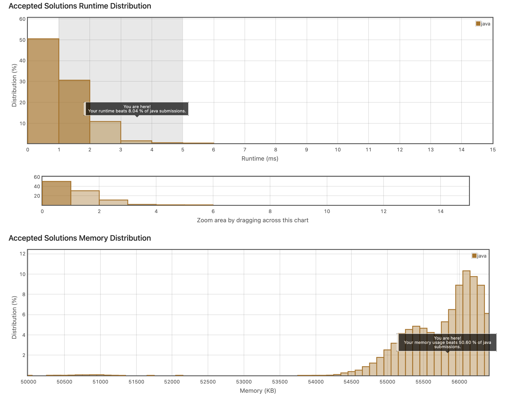

## 3. Rotate Array
https://leetcode.com/explore/item/646

이 문제는, k번째로 배열을 오른쪽으로 회전했을 때, 원 배열을 보여주어야한다. 
문제를 처음 보았을 때의 생각은 그냥 끝에서 k만큼을 잘라서 그를 배열 앞으로 붙여주면 안되나? 였는데, 
그렇게 되면 이 문제에서 원하는 과정은 아니라는 생각이 들었다. 우선 그 배열 자체에서 작업해달라는 지시가 있었기 때문이다. 

그래서, 생각한 방법은 일단 전체 배열을 뒤집은 뒤에, 앞의 k-1개까지 서로 뒤집고, 뒤의 k ~ 끝까지 서로 뒤집는 것이었다. 


```java
class Solution {
    public void rotate(int[] nums, int k) {
        int needToSlice = k % nums.length;
        int reverseInt = nums.length / 2;
        int temp;
        for(int i=0; i<reverseInt;i++){
            temp =nums[i];
            nums[i] = nums[nums.length - 1-i];
            nums[nums.length -1-i] = temp;
        }
        
        for(int i=0; i<needToSlice/2;i++){
            temp = nums[i];
            nums[i] = nums[needToSlice-i-1];
            nums[needToSlice-i-1] = temp;
        }
        for(int i=0; i<(nums.length-needToSlice)/2;i++){
            temp = nums[i+needToSlice];
            nums[i+needToSlice] = nums[nums.length-i- 1];
            nums[nums.length-i- 1] = temp;
        }
        
    }
}
```
내 코드는 이러하였고, 굳이 필요없이 변수를 더 할당한 것 같다는 생각이 들었다. 아니나 다를까 결과가 그리 좋지는 않았다. 


변수 할당을 줄이고, 좀 더 빠른 코드를 만들 수 있을 것 같았다.
```java
class Solution {
    public void rotate(int[] nums, int k) {
        int l;
        if( k > nums.length){
            l = k % nums.length;
        }
        else{
            l = k;
        }

        int n = nums.length;

        reverse(nums,0,n-1);
        reverse(nums,0,l-1);
        reverse(nums,l,n-1);
    }

    private void reverse(int[] nums,int left,int right){
        while(left <= right){
            swap(nums,left,right);
            left++;
            right--;
        }
    }
    private void swap(int[] nums, int l,int r){
        int temp = nums[l];
        nums[l] = nums[r];
        nums[r] = temp;
    }
}
```

위의 코드가 시간을 획기적으로 줄인 코드인데, (0ms 정도다.)
일단 k를 분기처리해서 불필요한 과정을 줄였다.

또한 그 외에 reverse 코드도, 불필요한 연산을 줄였다는 판단이 들었다. 