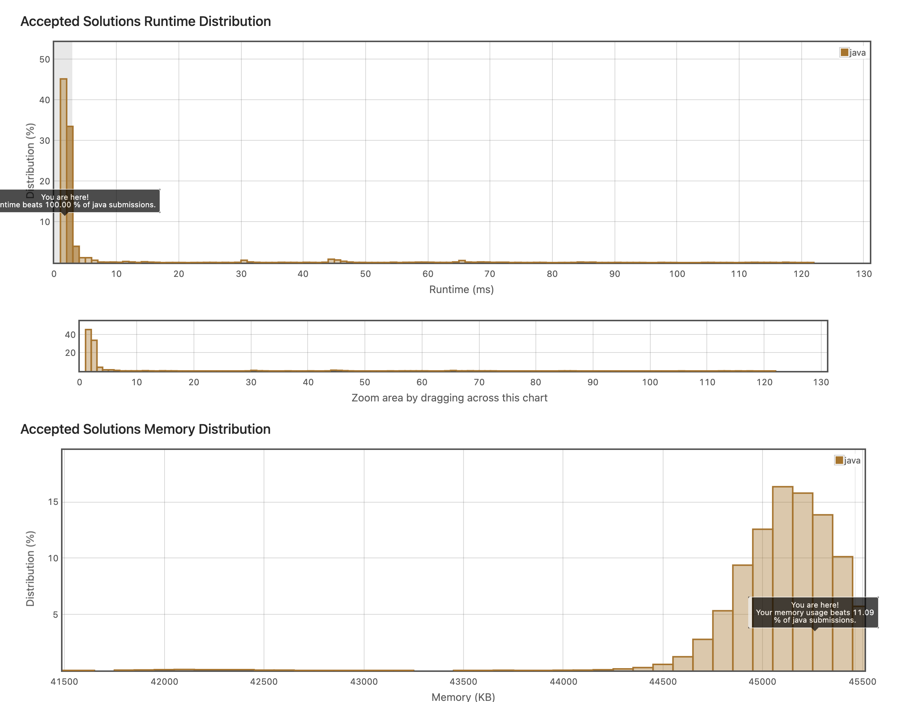

## 8. Move Zeroes
배열 속에서 0을 제일 뒤로 옮기는 코드를 짜야한다. 

이를 위해 생각해본 과정은
1. 0이 아닌 수를 만날 때까지 배열을 탐색한다. 
2. 0이 아닌 수를 만나면, i자리에 해당 수를 삽입한다.
3. i++ 하고, 다시 배열을 탐색한다. 
4. 배열 끝까지 탐색하면, 이제 i 자리 남은 공간에 0을 삽입한다.

```java
class Solution {
    public void moveZeroes(int[] nums) {
        int i;
        int j;
	    int maxIdx;
	    int temp;

	for(i=0; i<nums.length-1; i++)
	{
		if(nums[i]>0){
            continue;
        }
        maxIdx = i;   
        
		for(j=i+1; j<nums.length; j++)  
		{
			if(nums[maxIdx] == 0 && nums[j] > 0)
            {
				temp = nums[j];
		        nums[j] = nums[maxIdx];
		        nums[maxIdx] = temp;
                maxIdx = j;
            }
		}

	
	}
    }
    
}
```
처음에는 합성 정렬 방식으로 풀려고 했는데, Unknown error가 떴다. 뭔가 코드가 잘못된 것이다. 내가 봐도 너무 복잡하게 풀려고 했던 것 같다. 그래서..

```java
class Solution {
    public void moveZeroes(int[] nums) {
        int i;
        int j=0;
	    for(i=0; i<nums.length; i++){
            if(nums[i] != 0){
                nums[j] = nums[i];
                j++;
            }
        }
        for(i=j; i<nums.length; i++){
            nums[i] = 0;
        }
    }
    
}
```



결과는 메모리는 좀 많이 사용하게 되지만, 시간 복잡도는 몹시 좋은 상태로 진행할 수 있었다. O(N)이기 때문이다.
```java
class Solution {
    public void moveZeroes(int[] nums) {
        if (nums.length < 2) {
            return;
        }

        int i = 0;
        int j = 1;

        while (j < nums.length) {
            if (nums[i] == 0 && nums[j] != 0) {
                swap(nums, i++, j++);
            } else if (nums[i] == 0 && nums[j] == 0) {
                j++;
            } else {
                i++;
                j++;
            }
        }
    }

    public void swap(int[] nums, int i, int j) {
        if (i < nums.length && j < nums.length) {
            int temp = nums[i];
            nums[i] = nums[j];
            nums[j] = temp;
        }
    }
}
```

첫번째 방법으로 풀려고 계속 노력한다면, 위와 같이 개선해도 좋을 것 같다는 생각이 들었다.

