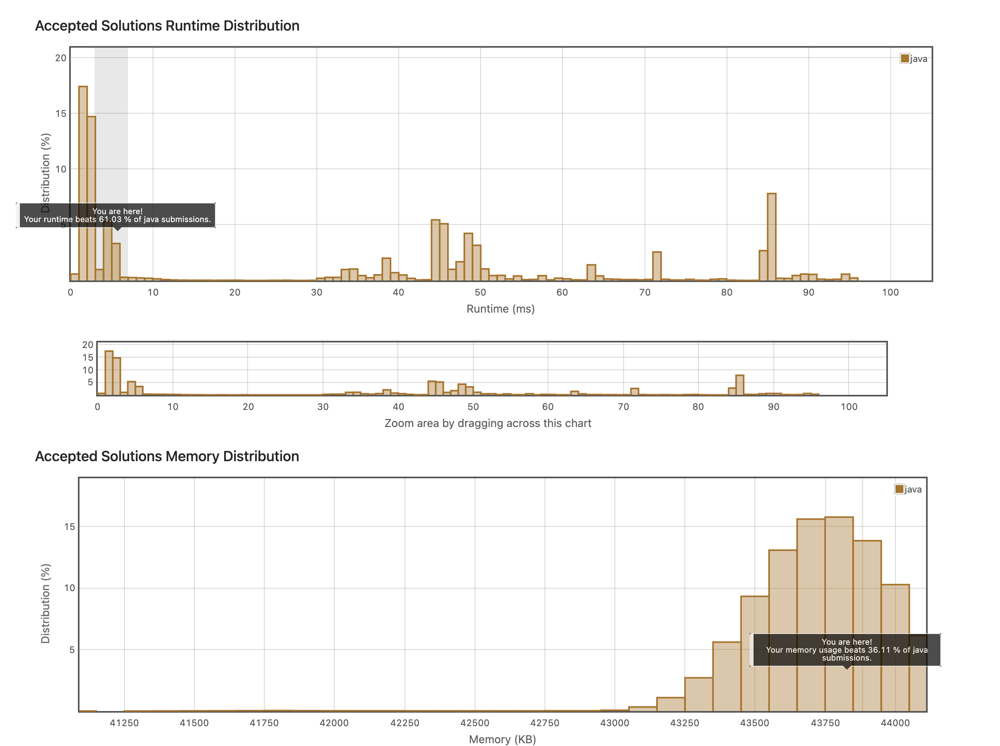

## 9. Two Sum
https://leetcode.com/explore/interview/card/top-interview-questions-easy/92/array/546/

숫자 배열과 target이 되는 정수가 주어졌을 때, 두 수를 합쳐 타겟이 될만한 인덱스 두개를 리턴하는 문제다. 

이 문제를 풀기 위해 두번 For문을 돌리는 대신, 해시맵에 원하는 값과 현재 인덱스를 저장시켜서 그에 대한 Key를 찾을 수 있는지를 검사해 리턴하는 코드를 작성했다.


```java
class Solution {
    public int[] twoSum(int[] nums, int target) {
        HashMap<Integer,Integer> map = new HashMap<Integer, Integer>();
        int[] result = new int[2];
        for(int i = 0; i<nums.length; i++)
        {
            if(!map.containsKey(nums[i])){
                
                map.put(target-nums[i], i);
                
            }else{
                
                result[0] = i;
                result[1] = map.get(nums[i]);
                
            }
        }
        return result;
    }
}
```


O(N)으로 작성했다 생각했음에도, 다른 사람들보다 느린 코드ㅠㅠ에 마음이 아팠지만 다른 사람들의 코드를 보고 또 학습해보기로 했다.

```java
// 0ms
class Solution {
    public int[] twoSum(int[] nums, int target) {
        for(int i = 0; i < nums.length - 1; i++){
            if(nums[i] + nums[i + 1] == target) return (new int[]{i, i + 1});
        }

        for(int i = 0; i < nums.length; i++){
            int temp = target - nums[i];

            for(int j = i + 1; j < nums.length; j++){
                if(temp == nums[j]) return (new int[]{i, j});
            }
        }

        return (new int[]{-1, -1});
    }
}
// 1ms
class Solution {
    public int[] twoSum(int[] nums, int target) {
        Map<Integer, Integer> map = new HashMap<>();
        for(int i = 0; i < nums.length; i++) {
            int diff = target - nums[i];
            if(map.containsKey(diff))
                return new int[]{i, map.get(diff)};
            map.put(nums[i], i);
        }
        return new int[2];
    }
}
```

둘 다 나와 비슷한데, diff와 같은 변수를 써서 그런건가? 뭐가 다른지는 잘 모르겠다.

