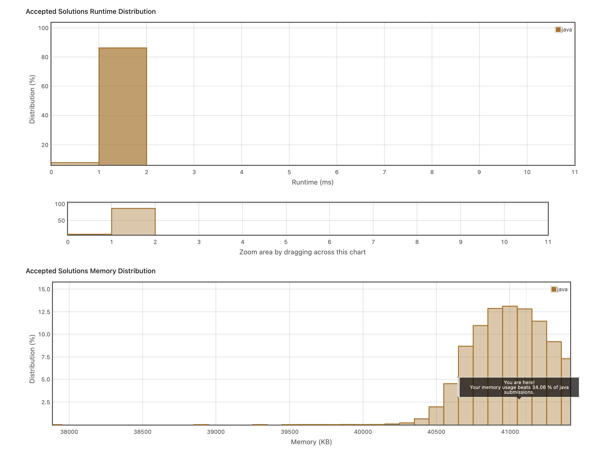

# 2. Pascal's Triangle
직관적으로 풀었더니 영 속도가 빠르지않다. 
https://leetcode.com/explore/item/601
```java
class Solution {
    public List<List<Integer>> generate(int numRows) {
        List<List<Integer>> result = new ArrayList<>();
        List<Integer> prev = new ArrayList<>();
        
        for(int i = 0; i < numRows; i++){
            List<Integer> midResult = new ArrayList<>();
            for(int j = 0; j <= i; j++){
                
                if(j==0 || j == i){
                    midResult.add(j, 1);
                }else{
                    midResult.add(j, prev.get(j-1)+prev.get(j));
                }
                System.out.println(j);
            }
            
            prev = midResult;
            result.add(midResult);
        }
        return result;
    }
}
```

```java
class Solution {
    public List<List<Integer>> generate(int n) {
        List<List<Integer>> ans=new ArrayList<>();
        for(int i=1;i<=n;i++){
            List<Integer> ll=new ArrayList<>();
            ncr(i,ll);
            ans.add(ll);

        }
        return ans;
    }
    public void ncr(int i,List<Integer> ll){
           int icj=1; 
           ll.add(icj);
           for(int j=1;j<i;j++){
               icj=icj*(i-j);
               icj=icj/(j);
               ll.add(icj);
           }
    }
}
```
수학적 공식을 이용한 계산이다. prev를 둘 필요가 없어서 빠른듯 하다.