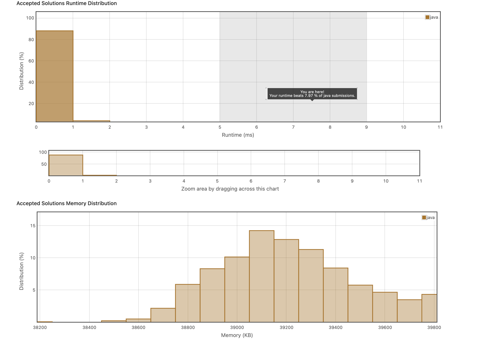

## 3. Hamming Distance
https://leetcode.com/explore/item/762



```java
class Solution {
    public int hammingDistance(int x, int y) {
        double xs = Math.log(x)/Math.log(2);
        double ys = Math.log(y)/Math.log(2);
       int s = x^y;
       int count = 0;
        double left = Math.max(xs, ys);
        
        for(int i = (int)Math.ceil(left); i>=0; i--){
            if(s == 0){
                break;
            }
            if( s >= Math.pow(2, i)){
                count++;
                s -= Math.pow(2, i);
                System.out.println(s);
            }else{
                continue;
            }
        }
        return count;
    }
}
```
일단 서로 다른 비트 찾는 데 XOR 연산 후 1을 찾는다.
근데 저렇게 일일이 제곱후에 수에서 빼는 방법이 아니라, 아래와 같이 작업하면 훨씬 빠르다. & 연산과 비트 연산을 깜빡했다. 
```java
class Solution {
    public int hammingDistance(int x, int y) {
        int count = 0;
       int n = x^y;
       while(n>0){
           if((n&1)==1){
               count++;
           }
           n= n>>1;
       }
        return count;
    }
}
```

