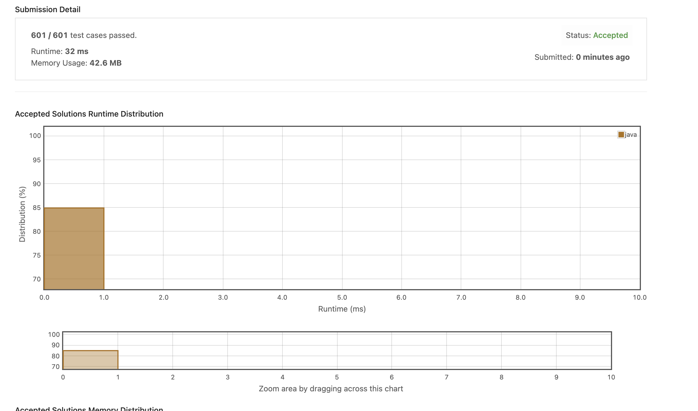

# 4. Number Of 1 Bits
bit 수를 세는 문제. 
https://leetcode.com/explore/item/565

내 알고리즘은 시간이 너무 느렸다.

```java
public class Solution {
    // you need to treat n as an unsigned value
    public int hammingWeight(int n) {
        int count = 0;
        int i = 0;
        while(i<32){
            System.out.println(n);            
            if((n&1) == 1){
                count++;
            }
            n=n>>1;
            i++;
        }
        return count;
    }
}
```
아래와 같이 n-1과 &연산을 통해서 차근차근 1을 줄여갈 수가 있다. 
```java

public class Solution {
    // you need to treat n as an unsigned value
    public int hammingWeight(int n) {
        int sum = 0;
        while(n != 0){
            sum++;
            n = n&(n-1); // For bit, & will get 0 if 0,0 or 0,1, will get 1 if 1,1
                         // n-1 will turn the last 1 in the number to 0 and the 0 after it to 1. 
                         // 11100 1000 -> 11100 0111, then after & will be 11100 0000. 
                         // Add one 1 to sum. 
        }
        return sum;
    }
}
```