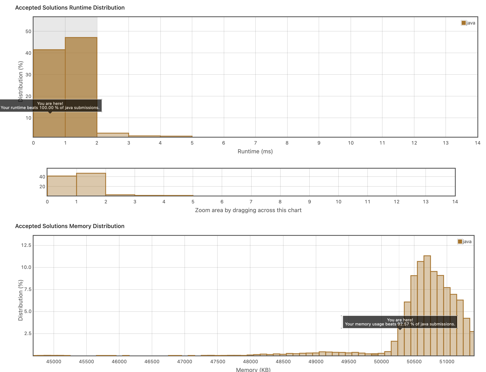

## 1. Reverse String

쉬운 문제였다. 그냥 배열 돌면서 서로 위치를 바꾸는 문제였다.

```java
class Solution {
    public void reverseString(char[] s) {
        char temp;
        int left = 0;
        
        int right = s.length-1;
        while(left<right){
            temp = s[left];
            s[left] = s[right];
            s[right] = temp;
            left++;
            right--;
        }
    }
}
```

