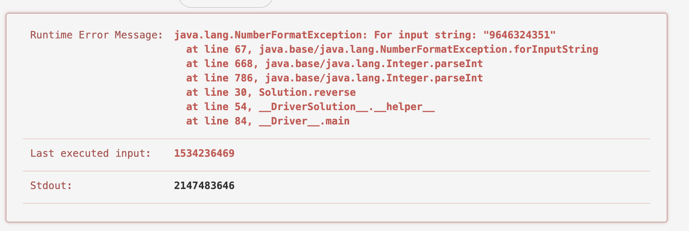

## 2. Reverse Integer

숫자를 뒤집는 것이다. 처음에는 그냥 배열로 만들어서 거꾸로 만든 뒤 다시 숫자로 만들면 안되는가 하는 생각에 아래와 같은 코드를 작성했는데,
큰 숫자가 되는 순간 돌아가지를 않았다.

뭔가 잘못됐다 싶어서, 다른 방향으로 틀었다.

```java
class Solution {
    public int reverse(int x) {
        System.out.println((int) Math.pow(2, 31)-1);
        if(x >Integer.MAX_VALUE || x<Integer.MIN_VALUE){
            return 0;
        }
        char[] chars = String.valueOf(x).toCharArray();
        int start = 0;
        int end = chars.length - 1;
        char temp;
        int result = 0;
        char[] copy = Arrays.copyOfRange(chars, 0, chars.length - 1);
        if(chars[end] == '0' && chars.length != 1){
            chars = copy;
            end = chars.length - 1;
        }

        while(start < end)
        {
            if(chars[start] == '-'){
                start++;
                continue;
            }
            temp = chars[end];
            chars[end] = chars[start];
            chars[start] = temp;
            start++;
            end--;
        }
        return Integer.parseInt(String.valueOf(chars));

    }
}
```



아래와 같이 숫자를 10씩 나눠서 다른 변수에 그를 더해주었다. 


```java
class Solution {
    public int reverse(int x) {
        long result = 0;
        while(x != 0){
            int left = x % 10;
            result = result * 10 + left;
            if(result >Integer.MAX_VALUE || result<Integer.MIN_VALUE){ // 이 코드 유무에 따라 소요 시간이 다르다.
                return 0;
            }
            x = x/10;

        }
        if(result >Integer.MAX_VALUE || result<Integer.MIN_VALUE){
            return 0;
        }
        System.out.println(flag);

        return (int)result;

    }
}
```


