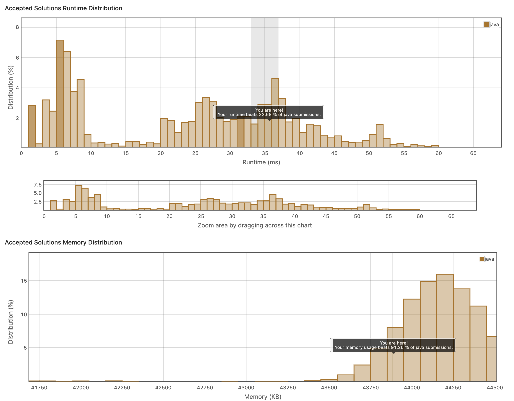

# 3.
https://leetcode.com/explore/item/881
어렵지는 않은 문제인데, 잘 풀기는 어렵다.
1. 글자를 key로 하고, 그것이 나온 횟수를 저장하는 해시맵을 만들고
2. 그 해시맵에서 value값이 1인 경우 최소 인덱스 값을 알아낸다. 

간단하게 풀기는 했지만, 더 좋은 방법이 있을 것 같았다.

```java
class Solution {
    public int firstUniqChar(String s) {
        Map<Character, Integer> map = new HashMap<>();
        int result = Integer.MAX_VALUE;
        for(int i = 0; i<s.length(); i++)
        {
            if(map.containsKey(s.charAt(i))){
                map.put(s.charAt(i), map.get(s.charAt(i))+1);
            }else {
                map.put(s.charAt(i), 1);
            }
        }
        for(Character strKey : map.keySet()){
            if(map.get(strKey) == 1){
                if(s.indexOf(strKey) < result){
                    result = s.indexOf(strKey);
                }
            }
        }
        
        if(result == Integer.MAX_VALUE){
            return -1;
        }
            return result;
        
    }
}
```

이와같이 시간도 오래걸렸다.
```java
class Solution {
    public int firstUniqChar(String s) {
        
        int ans=Integer.MAX_VALUE;
        for(char i = 'a'; i<='z'; i++){
            int index = s.indexOf(i);
            if(index != -1 && index==s.lastIndexOf(i))
            ans=Math.min(ans,index);
        }
        return ans==Integer.MAX_VALUE ? -1: ans;
    }
}
```
이렇게 풀면 되는 것을 너무 복잡하게 푼 것 같다. 

