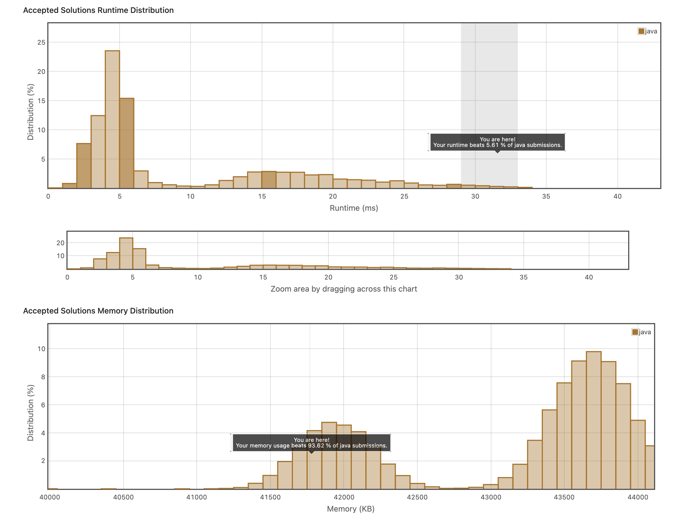

## 4. Valid Anagram
https://leetcode.com/explore/item/882

풀어야할 과제는 주어진 string 2개가 서로 같은 알파벳과 그 알파벳당 개수를 가지고 있는지를 판별하는 것이다.

나는 Hashmap 자료구조에 한 단어를 넣고 map이 특정 단어를 가지고 있으면 +1, 아니면 해당 단어에 1을 설정하고, 다른 단어를 함께 돌리며 특정 단어를 map에서 발견하면 -1, 없으면 해당 단어에 -1을 설정하는 방식으로 문제를 해결했다.

빨리 풀기는 했는데 시간이 빠른 것은 아니었다. 
```java
class Solution {
    public boolean isAnagram(String s, String t) {
        if(s.length()!= t.length())
            return false;
        
        Map<Character, Integer> map = new HashMap<>();
        for(int i = 0; i< s.length();i++){
            if(map.containsKey(s.charAt(i))){
                map.put(s.charAt(i), map.get(s.charAt(i))+1);
            }else{
                map.put(s.charAt(i), 1);
            }
            if(map.containsKey(t.charAt(i))){
                map.put(t.charAt(i), map.get(t.charAt(i))-1);
            }else{
                map.put(t.charAt(i), -1);
            }
            
        }
        for( Character strKey : map.keySet() ){
	        int vlue = map.get(strKey);
            if(vlue != 0){
                return false;
            }
        }
        return true;
    }
}
```

처참한 내 위치..

다른 방법들은 저렇게 따로 해시맵을 만든 것이 아니라, 알파벳 개수로 배열을 만들어두고, 
string.toCharArray()를 하여서 그걸 하나하나 돌리며 ++array[character - 'a']를 진행했다.

다른 단어는 --array[character - 'a']를 진행했다.

```java
class Solution {
    public boolean isAnagram(String s, String t) {
        if (s.length() != t.length()) {
            return false;
        }
        
        int[] charCount = new int[26];
        
        for (char c : s.toCharArray()) {
            charCount[c - 'a']++;
        }
        
        for (char c : t.toCharArray()) {
            charCount[c - 'a']--;
        }
        
        for (int count : charCount) {
            if (count != 0) {
                return false;
            }
        }
        
        return true;
     
    }
}
```