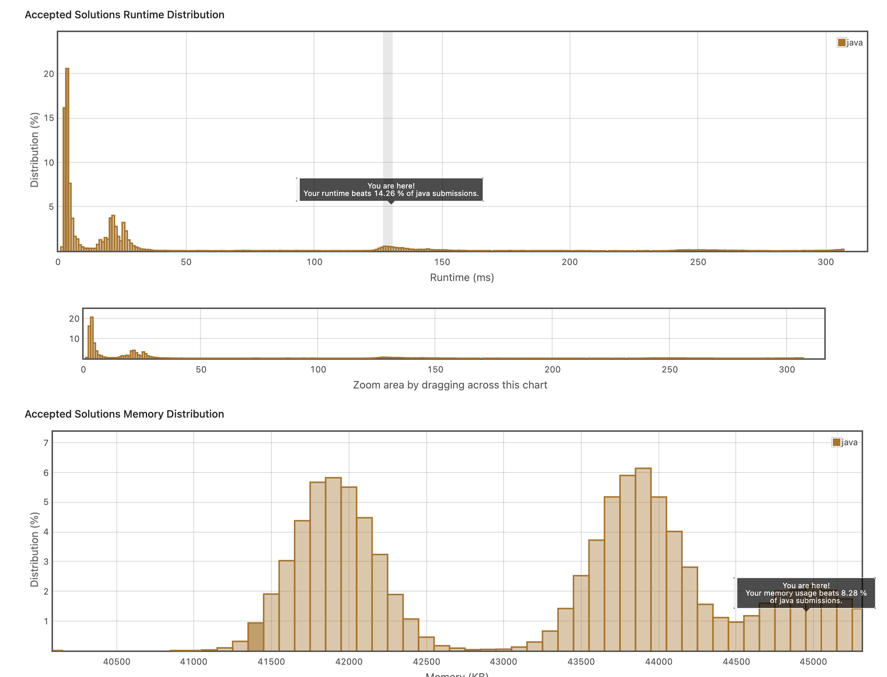

## 5. Valid Palindrome

https://leetcode.com/explore/item/883

앞과 뒤가 똑같은 단어를 찾는 코드를 작성해야한다. 

우선 나는 단어를 파싱한 뒤, 그를 앞뒤로 탐색하며 같은지를 검사했다.

그런데 다른 코드에 비하여 또 느렸다.! 


```java
class Solution {
    public boolean isPalindrome(String s) {
        ArrayList<Character> list = new ArrayList<Character>();
        if(s == " ")
            return true;
        for(int i=0; i<s.length(); i++)
        {
            
            if((s.charAt(i) >= 'A' && s.charAt(i)<='Z') || Character.isDigit(s.charAt(i))|| (s.charAt(i) >= 'a' && s.charAt(i)<='z')){
                System.out.println(s.charAt(i));
                list.add(Character.toLowerCase(s.charAt(i)));
            }else{
                continue;
            }
        }
        
        char[] arr = new char[list.size()];
        int size = 0;
        for(Character temp : list){
            arr[size++] = temp;

        }
        int left=0;
        int right=list.size()-1;
        
        
        while(left<right)
        {
            
            if(arr[left] == arr[right]){
                left++;
                right--;
            }else{
                return false;
            }
            
        }
        return true;
    }
}
```

```java
class Solution {
    public boolean isPalindrome(String s) {
                s = s.toLowerCase();

        int i = 0;
        int j = s.length()-1;

        while (i < j){
            char left = s.charAt(i);
            if (!Character.isAlphabetic(left) && !Character.isDigit(left)){
                i++;
                continue;
            }
            char right = s.charAt(j);
            if (!Character.isAlphabetic(right) && !Character.isDigit(right)){
                j--;
                continue;
            }
            if (left != right) return false;
            i++;
            j--;
        }

        return true;
    }
}
```

그냥 파싱할 필요없이 바로 비교하면 된다.
그럼 더 빠르다. 

